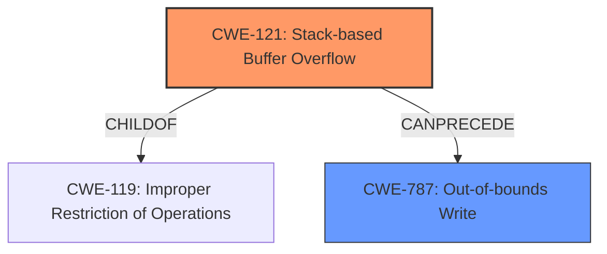

# Raw Analyzer Response for CVE-2024-48712

# Summary
| CWE ID | CWE Name | Confidence | CWE Abstraction Level | CWE Vulnerability Mapping Label | CWE-Vulnerability Mapping Notes |
|---|---|---|---|---|---|
| CWE-121 | Stack-based Buffer Overflow | 1.0 | Variant | Primary | Allowed |
| CWE-787 | Out-of-bounds Write | 0.7 | Base | Secondary | Allowed |

## Evidence and Confidence

*   **Confidence Score:** 0.9
*   **Evidence Strength:** MEDIUM

## Relationship Analysis
The primary CWE is CWE-121, which is a variant of the more general CWE-119 (Improper Restriction of Operations Within the Bounds of a Memory Buffer). CWE-121 is more specific as it identifies the buffer is allocated on the stack. CWE-787 (Out-of-bounds Write) can result from a stack-based buffer overflow.

## Vulnerability Chain
The vulnerability chain starts with the **improper handling** of the string name parameter within the `rtRuleJsonToBin` function, **lacking proper bounds checking**. This **lack of validation** leads to a **stack-based buffer overflow (CWE-121)**, which subsequently allows an attacker to perform an **out-of-bounds write (CWE-787)**, potentially leading to arbitrary code execution.

## Summary of Analysis
The vulnerability description clearly states that the `rtRuleJsonToBin` function in TP-Link TL-WDR7660 1.0 **does not check** the parameter string name, resulting in a **stack overflow**. The primary weakness is CWE-121 (Stack-based Buffer Overflow), as it accurately describes the **root cause**. The retriever results also list CWE-121 as the top candidate. CWE-787 is a likely consequence of CWE-121 and is included as a secondary weakness.

Relevant CWE Information:

# Enhanced Context (25 CWEs)
The following CWEs were identified as potentially relevant to this vulnerability:

## CWE-121: Stack-based Buffer Overflow
**Abstraction Level**: Variant
**Similarity Score**: 0.69
**Source**: dense

**Description**:
A stack-based buffer overflow condition is a condition where the buffer being overwritten is allocated on the stack (i.e., is a local variable or, rarely, a parameter to a function).

**Mapping Guidance**:
- Usage: Allowed
- Rationale: This CWE entry is at the Variant level of abstraction, which is a preferred level of abstraction for mapping to the root causes of vulnerabilities.
**EVIDENCE:** The vulnerability description specifically mentions a "stack overflow", aligning perfectly with CWE-121's description. The **root cause** is **improper handling of a string name without checking it**, leading to this overflow.

## CWE-787: Out-of-bounds Write
**Abstraction Level**: base
**Similarity Score**: 3.89
**Source**: graph

**Description**:
CWE-787: Out-of-bounds Write

**Mapping Guidance**:
- Usage: Allowed
- Rationale: This CWE entry is at the Base level of abstraction, which is a preferred level of abstraction for mapping to the root causes of vulnerabilities.
**EVIDENCE:** CWE-787 can be a consequence of the stack-based buffer overflow, as overflowing a buffer on the stack leads to writing beyond the intended memory region.

## Other CWEs Considered and Rejected

*   CWE-190 (Integer Overflow or Wraparound): While integer overflows can sometimes lead to buffer overflows, there's no explicit evidence of integer manipulation in the vulnerability description.
*   CWE-120 (Buffer Copy without Checking Size of Input ('Classic Buffer Overflow')): This CWE is relevant to buffer overflows, but it's less specific than CWE-121 because the buffer in question is on the stack.
*   CWE-1284 (Improper Validation of Specified Quantity in Input): This could be related since the size of the string name parameter is not being validated, but it doesn't directly capture the stack overflow aspect.
*   CWE-125 (Out-of-bounds Read): This is not the primary issue, which is a write operation causing the overflow.
*   CWE-78 (Improper Neutralization of Special Elements used in an OS Command ('OS Command Injection')): This is related to command injection vulnerabilities and not directly relevant to the described stack overflow.