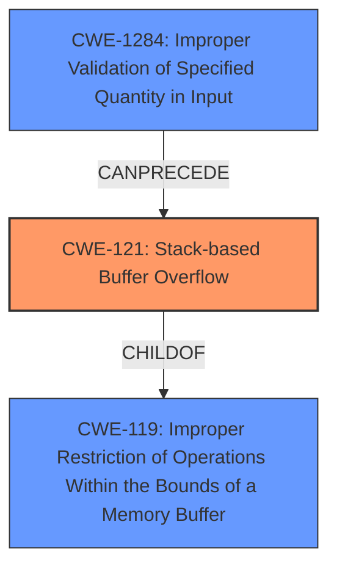

# Raw Analyzer Response for CVE-2024-48713

# Summary
| CWE ID | CWE Name | Confidence | CWE Abstraction Level | CWE Vulnerability Mapping Label | CWE-Vulnerability Mapping Notes |
|---|---|---|---|---|---|
| CWE-121 | Stack-based Buffer Overflow | 1.0 | Variant | Primary | Allowed |
| CWE-1284 | Improper Validation of Specified Quantity in Input | 0.5 | Base | Secondary | Allowed |

## Evidence and Confidence

*   **Confidence Score:** 0.8
*   **Evidence Strength:** HIGH

## Relationship Analysis
The primary CWE is CWE-121, which is a variant of buffer overflows. The secondary CWE is CWE-1284, which indicates a failure to validate input quantity. CWE-121 is a child of CWE-119 (Improper Restriction of Operations Within the Bounds of a Memory Buffer), representing a more specific type of buffer overflow occurring on the stack. CWE-1284 can precede CWE-121, as improper validation can lead to a buffer overflow.

## Vulnerability Chain
The vulnerability chain starts with **improper validation** of the input 'name' parameter size (CWE-1284), leading to a **stack-based buffer overflow** (CWE-121). The overflow can then lead to a crash of the router's server, rendering the device unusable.

## Summary of Analysis
The initial assessment strongly points to CWE-121, Stack-based Buffer Overflow, due to the vulnerability description explicitly mentioning a **stack overflow** in the `wacWhitelistJsonToBin` function when handling the 'name' parameter. The CVE reference links content summary further supports this by stating that the root cause is the `wacWhitelistJsonToBin` function not performing proper bounds checking on the 'name' parameter, leading to a stack buffer overflow. This is direct evidence.

CWE-1284 is considered as a secondary weakness because the root cause includes **improper validation** on the size of the 'name' parameter, which is a specified quantity in input. The absence of proper validation directly contributes to the overflow.

The graph relationships also influenced the selection, showing how CWE-1284 can precede CWE-121.

The selected CWEs are at the optimal level of specificity because CWE-121 is a variant that accurately describes the type of buffer overflow (stack-based), while CWE-1284 captures the **improper validation** aspect.

Relevant CWE Information:

# Enhanced Context (25 CWEs)
The following CWEs were identified as potentially relevant to this vulnerability:

## CWE-121: Stack-based Buffer Overflow
**Abstraction Level**: Variant
**Similarity Score**: 0.70
**Source**: dense

**Description**:
A stack-based buffer overflow condition is a condition where the buffer being overwritten is allocated on the stack (i.e., is a local variable or, rarely, a parameter to a function).

**Mapping Guidance**:
- Usage: Allowed
- Rationale: This CWE entry is at the Variant level of abstraction, which is a preferred level of abstraction for mapping to the root causes of vulnerabilities.

**Justification:** This CWE perfectly matches the **stack overflow** vulnerability described.

## CWE-134: Use of Externally-Controlled Format String
**Abstraction Level**: Base
**Similarity Score**: 0.70
**Source**: dense

**Description**:
The product uses a function that accepts a format string as an argument, but the format string originates from an external source.

**Mapping Guidance**:
- Usage: Allowed
- Rationale: This CWE entry is at the Base level of abstraction, which is a preferred level of abstraction for mapping to the root causes of vulnerabilities.

**Justification:** This CWE is not relevant as the vulnerability is not related to format string usage.

## CWE-790: Improper Filtering of Special Elements
**Abstraction Level**: Class
**Similarity Score**: 0.69
**Source**: dense

**Description**:
The product receives data from an upstream component, but does not filter or incorrectly filters special elements before sending it to a downstream component.

**Mapping Guidance**:
- Usage: Allowed-with-Review
- Rationale: This CWE entry is a Class and might have Base-level children that would be more appropriate

**Justification:** This CWE is not relevant as the vulnerability is not related to special element filtering.

## CWE-131: Incorrect Calculation of Buffer Size
**Abstraction Level**: Base
**Similarity Score**: 0.69
**Source**: dense

**Description**:
The product does not correctly calculate the size to be used when allocating a buffer, which could lead to a buffer overflow.

**Mapping Guidance**:
- Usage: Allowed
- Rationale: This CWE entry is at the Base level of abstraction, which is a preferred level of abstraction for mapping to the root causes of vulnerabilities.

**Justification:** While this could be related, the primary issue is the lack of validation of the input size, not necessarily an incorrect calculation.

## CWE-193: Off-by-one Error
**Abstraction Level**: Base
**Similarity Score**: 0.68
**Source**: dense

**Description**:
A product calculates or uses an incorrect maximum or minimum value that is 1 more, or 1 less, than the correct value.

**Mapping Guidance**:
- Usage: Allowed
- Rationale: This CWE entry is at the Base level of abstraction, which is a preferred level of abstraction for mapping to the root causes of vulnerabilities.

**Justification:** This CWE is not relevant as the vulnerability is not an off-by-one error.

## CWE-191: Integer Underflow (Wrap or Wraparound)
**Abstraction Level**: Base
**Similarity Score**: 0.68
**Source**: dense

**Description**:
The product subtracts one value from another, such that the result is less than the minimum allowable integer value, which produces a value that is not equal to the correct result.

**Mapping Guidance**:
- Usage: Allowed
- Rationale: This CWE entry is at the Base level of abstraction, which is a preferred level of abstraction for mapping to the root causes of vulnerabilities.

**Justification:** This CWE is not relevant as the vulnerability is not an integer underflow.

## CWE-824: Access of Uninitialized Pointer
**Abstraction Level**: Base
**Similarity Score**: 0.68
**Source**: dense

**Description**:
The product accesses or uses a pointer that has not been initialized.

**Mapping Guidance**:
- Usage: Allowed
- Rationale: This CWE entry is at the Base level of abstraction, which is a preferred level of abstraction for mapping to the root causes of vulnerabilities.

**Justification:** This CWE is not relevant as the vulnerability is not related to uninitialized pointers.

## CWE-805: Buffer Access with Incorrect Length Value
**Abstraction Level**: Base
**Similarity Score**: 0.68
**Source**: dense

**Description**:
The product uses a sequential operation to read or write a buffer, but it uses an incorrect length value that causes it to access memory that is outside of the bounds of the buffer.

**Mapping Guidance**:
- Usage: Allowed
- Rationale: This CWE entry is at the Base level of abstraction, which is a preferred level of abstraction for mapping to the root causes of vulnerabilities.

**Justification:** While related to buffer access, the root cause is the missing input validation, not the use of an incorrect length value during access.

## CWE-912: Hidden Functionality
**Abstraction Level**: Class
**Similarity Score**: 0.67
**Source**: dense

**Description**:
The product contains functionality that is not documented, not part of the specification, and not accessible through an interface or command sequence that is obvious to the product's users or administrators.

**Mapping Guidance**:
- Usage: Allowed-with-Review
- Rationale: This CWE entry is a Class and might have Base-level children that would be more appropriate

**Justification:** This CWE is not relevant as the vulnerability is not related to hidden functionality.

## CWE-755: Improper Handling of Exceptional Conditions
**Abstraction Level**: Class
**Similarity Score**: 0.67
**Source**: dense

**Description**:
The product does not handle or incorrectly handles an exceptional condition.

**Mapping Guidance**:
- Usage: Discouraged
- Rationale: This CWE entry is a level-1 Class (i.e., a child of a Pillar). It might have lower-level children that would be more appropriate

**Justification:** This CWE is too general; the more specific cause is a lack of input