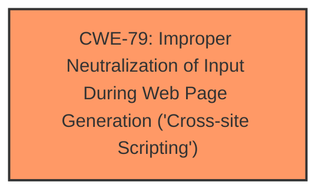

# Enhanced Analysis for CVE-2024-48744

# Summary
| CWE ID | CWE Name | Confidence | CWE Abstraction Level | CWE Vulnerability Mapping Label | CWE-Vulnerability Mapping Notes |
|---|---|---|---|---|---|
| CWE-79 | Improper Neutralization of Input During Web Page Generation ('Cross-site Scripting') | 1.0 | Base | Allowed | Primary CWE |

## Evidence and Confidence

*   **Confidence Score:** 1.0
*   **Evidence Strength:** HIGH

## Relationship Analysis
The primary relationship that influenced the decision was the direct match of the vulnerability description to the characteristics of CWE-79. The other CWEs listed had weaker associations based on the description.



## Vulnerability Chain
The vulnerability chain starts with the **improper neutralization** of input, leading directly to cross-site scripting. There are no other evident weaknesses in the chain.

## Summary of Analysis
The vulnerability description clearly states a Reflected Cross Site Scripting (XSS) vulnerability in PHPGurukul Teachers Record Management System v2.1, specifically due to **improper neutralization** in `/trms/listed-teachers.php` via the `searchinput` POST parameter.

The primary indicator is the **weakness:** **cross-site scripting** which aligns perfectly with CWE-79.

CWE-79 (Improper Neutralization of Input During Web Page Generation ('Cross-site Scripting')) is the most appropriate because the vulnerability description explicitly mentions "Cross Site Scripting (XSS)" and the root cause involves **improper neutralization** of input. The description of CWE-79 states: "The product does not neutralize or incorrectly neutralizes user-controllable input before it is placed in output that is used as a web page that is served to other users." This aligns directly with the vulnerability.

The retriever results also support this, with CWE-79 being the top-ranked CWE.

Other CWEs were considered but deemed less suitable. CWE-80 (Improper Neutralization of Script-Related HTML Tags in a Web Page (Basic XSS)) is a variant of XSS, but the description doesn't specify that the **improper neutralization** is specifically related to HTML tags. CWE-352 (Cross-Site Request Forgery (CSRF)) is a different type of web vulnerability. CWE-89 (Improper Neutralization of Special Elements used in an SQL Command ('SQL Injection')) relates to SQL injection, which is not mentioned in the description.


## CWE Relationship Analysis

Current CWEs represent these abstraction levels: .


### Vulnerability Chain Analysis

**Chain starting from CWE-352:**
- 352 (Cross-Site Request Forgery (CSRF)) - ROOT


**Chain starting from CWE-79:**
- 79 (Improper Neutralization of Input During Web Page Generation ('Cross-site Scripting')) - ROOT


### CWE Relationship Diagram

```mermaid
graph TD
    classDef primary fill:#f96,stroke:#333,stroke-width:2px
    classDef secondary fill:#69f,stroke:#333
    classDef tertiary fill:#9e9,stroke:#333
```