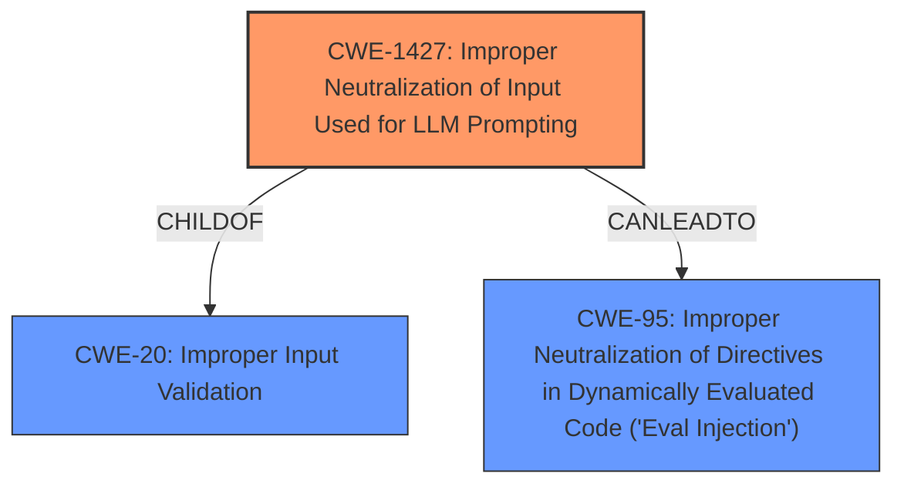

# Raw Analyzer Response for CVE-2024-48746

# Summary

| CWE ID  | CWE Name                                                                 | Confidence | CWE Abstraction Level | CWE Vulnerability Mapping Label | CWE-Vulnerability Mapping Notes |
| :-------- | :----------------------------------------------------------------------- | :--------- | :---------------------- | :------------------------------ | :------------------------------ |
| CWE-1427 | Improper Neutralization of Input Used for LLM Prompting             | 0.9        | Base                    | Primary                         | Allowed                       |
| CWE-95    | Improper Neutralization of Directives in Dynamically Evaluated Code ('Eval Injection') | 0.75      | Variant                   | Secondary                         | Allowed                       |
| CWE-20   | Improper Input Validation                                                               | 0.6        | Class                     | Secondary                         | Discouraged                    |

## Evidence and Confidence

*   **Confidence Score:** 0.8
*   **Evidence Strength:** HIGH

## Relationship Analysis
The primary weakness is the **improper neutralization of input used for LLM prompting (CWE-1427)**, which can lead to the execution of arbitrary code. **Improper Input Validation (CWE-20)** is a broader class that encompasses this vulnerability, but **CWE-1427** is more specific to the LLM context. The **'Eval Injection' (CWE-95)** weakness is present as the code being executed is dynamically evaluated and can be influenced by attacker controlled prompts. The relationship between these CWEs is that **CWE-1427** can lead to **CWE-95** and is a specific type of **CWE-20**.

## Vulnerability Chain
The vulnerability chain starts with **improper input validation (CWE-20)** and **improper neutralization of input for LLM prompting (CWE-1427)**, leading to the ability to inject code. This injected code is then dynamically evaluated, resulting in **'Eval Injection' (CWE-95)**, which leads to arbitrary code execution on the system.

## Summary of Analysis
The primary CWE is **CWE-1427**, as it accurately describes the root cause of the vulnerability. The vulnerability description and CVE details both confirm that **improper input handling** and **lack of input validation** in the NLP component allow for malicious code injection.
The evidence to support this is:
- "The root cause is insufficient input validation and client-side control mechanisms within the Lens Visual Power BI integration's natural language processing component. This allows for prompt injection attacks."
- "**Prompt Injection (LLM01):**  The system is vulnerable to prompt injection attacks due to lack of proper input sanitization. Attackers can manipulate the language model's behavior by injecting malicious instructions."
- "Absence of adequate input validation and sanitization allows for malicious code injection via user input fields."
**CWE-95** is included as a secondary CWE since the injected input is then dynamically evaluated.

The retriever results suggested **CWE-20**, **CWE-1336**, and **CWE-78**. **CWE-20** is too broad, and **CWE-1336** is for template engines, which does not fit the vulnerability details. **CWE-78** is for OS command injection, which is a potential impact, but not the root cause.

Relevant CWE Information:

# Enhanced Context (25 CWEs)
The following CWEs were identified as potentially relevant to this vulnerability:

## CWE-184: Incomplete List of Disallowed Inputs
**Abstraction Level**: Base
**Similarity Score**: 0.73
**Source**: dense

**Description**:
The product implements a protection mechanism that relies on a list of inputs (or properties of inputs) that are not allowed by policy or otherwise require other action to neutralize before additional processing takes place, but the list is incomplete.

**Mapping Guidance**:
- Usage: Allowed
- Rationale: This CWE entry is at the Base level of abstraction, which is a preferred level of abstraction for mapping to the root causes of vulnerabilities.

## CWE-116: Improper Encoding or Escaping of Output
**Abstraction Level**: Class
**Similarity Score**: 0.73
**Source**: dense

**Description**:
The product prepares a structured message for communication with another component, but encoding or escaping of the data is either missing or done incorrectly. As a result, the intended structure of the message is not preserved.

**Mapping Guidance**:
- Usage: Allowed-with-Review
- Rationale: This CWE entry is a Class and might have Base-level children that would be more appropriate

## CWE-74: Improper Neutralization of Special Elements in Output Used by a Downstream Component ('Injection')
**Abstraction Level**: Class
**Similarity Score**: 0.73
**Source**: dense

**Description**:
The product constructs all or part of a command, data structure, or record using externally-influenced input from an upstream component, but it does not neutralize or incorrectly neutralizes special elements that could modify how it is parsed or interpreted when it is sent to a downstream component.

**Mapping Guidance**:
- Usage: Discouraged
- Rationale: CWE-74 is high-level and often misused when lower-level weaknesses are more appropriate.

## CWE-1286: Improper Validation of Syntactic Correctness of Input
**Abstraction Level**: Base
**Similarity Score**: 0.72
**Source**: dense

**Description**:
The product receives input that is expected to be well-formed - i.e., to comply with a certain syntax - but it does not validate or incorrectly validates that the input complies with the syntax.

**Mapping Guidance**:
- Usage: Allowed
- Rationale: This CWE entry is at the Base level of abstraction, which is a preferred level of abstraction for mapping to the root causes of vulnerabilities.

## CWE-138: Improper Neutralization of Special Elements
**Abstraction Level**: Class
**Similarity Score**: 0.72
**Source**: dense

**Description**:
The product receives input from an upstream component, but it does not neutralize or incorrectly neutralizes special elements that could be interpreted as control elements or syntactic markers when they are sent to a downstream component.

**Mapping Guidance**:
- Usage: Discouraged
- Rationale: This CWE entry is a level-1 Class (i.e., a child of a Pillar). It might have lower-level children that would be more appropriate

## CWE-472: External Control of Assumed-Immutable Web Parameter
**Abstraction Level**: Base
**Similarity Score**: 0.72
**Source**: dense

**Description**:
The web application does not sufficiently verify inputs that are assumed to be immutable but are actually externally controllable, such as hidden form fields.

**Mapping Guidance**:
- Usage: Allowed
- Rationale: This CWE entry is at the Base level of abstraction, which is a preferred level of abstraction for mapping to the root causes of vulnerabilities.

## CWE-346: Origin Validation Error
**Abstraction Level**: Class
**Similarity Score**: 0.72
**Source**: dense

**Description**:
The product does not properly verify that the source of data or communication is valid.

**Mapping Guidance**:
- Usage: Allowed-with-Review
- Rationale: This CWE entry is a Class and might have Base-level children that would be more appropriate

## CWE-95: Improper Neutralization of Directives in Dynamically Evaluated Code ('Eval Injection')
**Abstraction Level**: Variant
**Similarity Score**: 0.72
**Source**: dense

**Description**:
The product receives input from an upstream component, but it does not neutralize or incorrectly neutralizes code syntax before using the input in a dynamic evaluation call (e.g. "eval").

**Mapping Guidance**:
- Usage: Allowed
- Rationale: This CWE entry is at the Variant level of abstraction, which is a preferred level of abstraction for mapping to the root causes of vulnerabilities.

## CWE-497: Exposure of Sensitive System Information to an Unauthorized Control Sphere
**Abstraction Level**: Base
**Similarity Score**: 0.72
**Source**: dense

**Description**:
The product does not properly prevent sensitive system-level information from being accessed by unauthorized actors who do not have the same level of access to the underlying system as the product does.

**Mapping Guidance**:
- Usage: Allowed
- Rationale: This CWE entry is at the Base level of abstraction, which is a preferred level of abstraction for mapping to the root causes of vulnerabilities.

## CWE-425: Direct Request