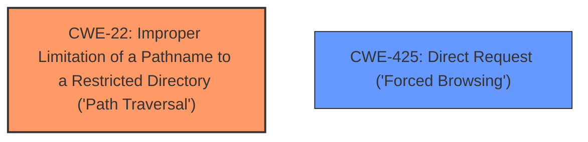

# Analysis for CVE-2024-48766

# Summary
| CWE ID | CWE Name | Confidence | CWE Abstraction Level | CWE Vulnerability Mapping Label | CWE-Vulnerability Mapping Notes |
|---|---|---|---|---|---|
| CWE-22 | Improper Limitation of a Pathname to a Restricted Directory ('Path Traversal') | 1.0 | Base | Allowed | Primary CWE. The vulnerability is a path traversal issue where an attacker can access files outside the intended directory. |
| CWE-425 | Direct Request ('Forced Browsing') | 0.7 | Base | Allowed | Secondary CWE. The issue is also caused by the logs.php endpoint not requiring authentication. |

## Evidence and Confidence

*   **Confidence Score:** 0.9
*   **Evidence Strength:** HIGH

## Relationship Analysis
The primary weakness is CWE-22, which describes a path traversal vulnerability. CWE-425, Direct Request ('Forced Browsing'), is also related because the affected endpoint lacks proper authentication, exacerbating the path traversal. CWE-22 is a base-level CWE, making it a suitable choice for describing the **directory traversal** vulnerability. CWE-425 is a base level CWE and describes how authentication is not required to access certain files.

## Vulnerability Chain
The vulnerability chain starts with the lack of authentication on the `logs.php` endpoint (CWE-425). This allows an attacker to make requests to the endpoint. The endpoint is vulnerable to **directory traversal** (CWE-22), allowing an attacker to read arbitrary files.

## Summary of Analysis
The vulnerability description clearly states a **directory traversal** issue that allows unauthenticated file reading. The CVE Reference Links Content Summary confirms that the `logs.php` endpoint does not require authentication and is vulnerable to path traversal.

CWE-22 (Improper Limitation of a Pathname to a Restricted Directory ('Path Traversal')) is the most appropriate primary CWE because it directly addresses the **directory traversal** vulnerability. The retriever results also list CWE-22 as the top result.

CWE-425 (Direct Request ('Forced Browsing')) is included as a secondary CWE because the vulnerability is also due to the lack of authentication on the `logs.php` endpoint.

CWE-23 (Relative Path Traversal) was considered but not selected as the primary CWE because CWE-22 is a more general case of path traversal. CWE-23 specifically refers to relative path traversal using sequences like "..", while CWE-22 covers any improper limitation of a pathname to a restricted directory.

The selected CWEs are at the optimal level of specificity because they are base-level CWEs that accurately describe the root cause of the vulnerability.