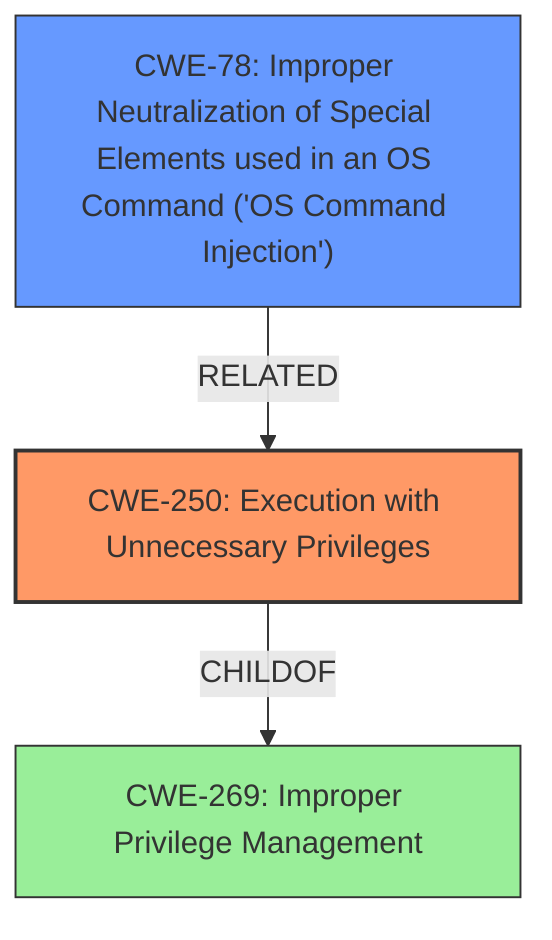

# Enhanced Analysis for CVE-2024-4884

# Summary
| CWE ID | CWE Name | Confidence | CWE Abstraction Level | CWE Vulnerability Mapping Label | CWE-Vulnerability Mapping Notes |
|---|---|---|---|---|---|
| CWE-250 | Execution with Unnecessary Privileges | 0.8 | Base | Allowed | Primary CWE |
| CWE-78 | Improper Neutralization of Special Elements used in an OS Command ('OS Command Injection') | 0.6 | Base | Allowed | Secondary Candidate |

## Evidence and Confidence

*   **Confidence Score:** 0.7
*   **Evidence Strength:** MEDIUM

## Relationship Analysis
The primary relationship that impacted my decision was the parent-child relationship. CWE-250 (Execution with Unnecessary Privileges) is a base CWE, while CWE-269 (Improper Privilege Management) is a class CWE and is too high level. The description states that the `CommunityController` allows execution of commands with `iisapppool\nmconsole` privileges. The key is the unnecessary privileges.



## Vulnerability Chain
The vulnerability chain begins with the **root cause**: `Apm.UI.Areas.APM.Controllers.CommunityController` allows execution of commands with `iisapppool\nmconsole` privileges (CWE-250 Execution with Unnecessary Privileges). This leads to the **impact**: an unauthenticated attacker can achieve Remote Code Execution.
- Root Cause: CWE-250 Execution with Unnecessary Privileges
- Impact: Unauthenticated Remote Code Execution. This might be achievable via an OS Command Injection.

## Summary of Analysis
My assessment relies heavily on the provided vulnerability description and the supporting CWE specifications. The description clearly states that the `CommunityController` allows execution of commands with elevated privileges. This aligns well with CWE-250 (Execution with Unnecessary Privileges).

The graph relationships confirm that CWE-250 is a more specific (base) CWE compared to the class-level CWE-269 (Improper Privilege Management). This specificity is preferred for accurate vulnerability classification.

The selection of CWE-250 is at the optimal level of specificity because it directly addresses the root cause of the vulnerability: the execution of commands with unnecessary privileges.
The evidence for CWE-250 is, "The Apm.UI.Areas.APM.Controllers.CommunityController allows execution of commands with iisapppool\nmconsole privileges."

Relevant CWE Information:

# Enhanced Context (25 CWEs)
The following CWEs were identified as potentially relevant to this vulnerability:

## CWE-250: Execution with Unnecessary Privileges
**Abstraction Level**: Base
**Similarity Score**: 0.507
**Source**: dense

**Description**:
The software component performs its actions with a higher level of privilege than it requires.

**Mapping Guidance**:
- Usage: Allowed
- Rationale: This CWE entry is at the Base level of abstraction, which is a preferred level of abstraction for mapping to the root causes of vulnerabilities.

**Why CWE-78 was considered**:
It is possible that the elevated privileges allow an attacker to inject OS commands. If the input isn't properly neutralized, it could lead to Remote Code Execution.
# Complete CWE Specifications

CWE-918: Server-Side Request Forgery (SSRF) - Not relevant. The description doesn't indicate any server-side request manipulation.

CWE-248: Uncaught Exception - Not relevant. The description doesn't indicate any uncaught exceptions.

CWE-78: Improper Neutralization of Special Elements used in an OS Command ('OS Command Injection') - Possibly relevant. The elevated privileges could allow an attacker to inject OS commands if the input isn't properly neutralized, leading to Remote Code Execution.

CWE-120: Buffer Copy without Checking Size of Input ('Classic Buffer Overflow') - Not relevant. The description doesn't indicate any buffer overflow issues.

CWE-269: Improper Privilege Management - Not specific enough. This is a high-level class that doesn't capture the root cause as precisely as CWE-250.

CWE-20: Improper Input Validation - Not specific enough. While input validation might be missing, the primary issue is the unnecessary privileges.

CWE-126: Buffer Over-read - Not relevant. The description doesn't indicate any buffer over-read issues.

CWE-94: Improper Control of Generation of Code ('Code Injection') - Not directly relevant. While code injection might be a consequence, the root cause is the unnecessary privileges.

CWE-250: Execution with Unnecessary Privileges - **Best match**. The description clearly states that the `CommunityController` allows execution of commands with `iisapppool\nmconsole` privileges, which is unnecessary.

CWE-123: Write-what-where Condition - Not relevant. The description doesn't indicate any write-what-where condition issues.


## CWE Relationship Analysis

Current CWEs represent these abstraction levels: .


### Vulnerability Chain Analysis

**Chain starting from CWE-123:**
- 123 (Write-what-where Condition) - ROOT


**Chain starting from CWE-94:**
- 94 (Improper Control of Generation of Code ('Code Injection')) - ROOT


### CWE Relationship Diagram

```mermaid
graph TD
    classDef primary fill:#f96,stroke:#333,stroke-width:2px
    classDef secondary fill:#69f,stroke:#333
    classDef tertiary fill:#9e9,stroke:#333
```