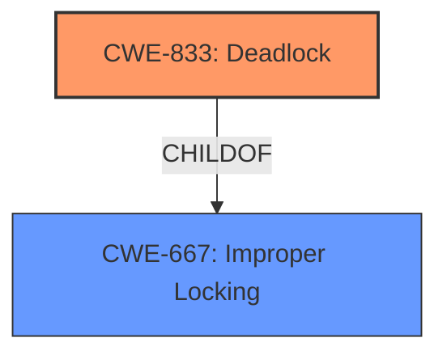

# Analysis Report for CVE-2024-48875

# Vulnerability Analysis Report: CVE-2024-48875

## Description

In the Linux kernel, the following vulnerability has been resolved btrfs dont take dev_replace rwsem on task already holding it Running fstests btrfs/011 with MKFS_OPTIONS=-O rst to force the usage of the RAID stripe-tree, we get the following splat from lockdep BTRFS info (device sdd) dev_replace from /dev/sdd (devid 1) to /dev/sdb started ============================================ WARNING possible recursive locking detected 6.11.0-rc3-btrfs-for-next #599 Not tainted -------------------------------------------- btrfs/2326 is trying to acquire lock ffff88810f215c98 (&fs_info->dev_replace.rwsem){++++}-{33}, at btrfs_map_block+0x39f/0x2250 but task is already holding lock ffff88810f215c98 (&fs_info->dev_replace.rwsem){++++}-{33}, at btrfs_map_block+0x39f/0x2250 other info that might help us debug this Possible unsafe locking scenario CPU0 ---- lock(&fs_info->dev_replace.rwsem) lock(&fs_info->dev_replace.rwsem) *** DEADLOCK *** May be due to missing lock nesting notation 1 lock held by btrfs/2326 #0 ffff88810f215c98 (&fs_info->dev_replace.rwsem){++++}-{33}, at btrfs_map_block+0x39f/0x2250 stack backtrace CPU 1 UID 0 PID 2326 Comm btrfs Not tainted 6.11.0-rc3-btrfs-for-next #599 Hardware name Bochs Bochs, BIOS Bochs 01/01/2011 Call Trace dump_stack_lvl+0x5b/0x80 __lock_acquire+0x2798/0x69d0 ? __pfx___lock_acquire+0x10/0x10 ? __pfx___lock_acquire+0x10/0x10 lock_acquire+0x19d/0x4a0 ? btrfs_map_block+0x39f/0x2250 ? __pfx_lock_acquire+0x10/0x10 ? find_held_lock+0x2d/0x110 ? lock_is_held_type+0x8f/0x100 down_read+0x8e/0x440 ? btrfs_map_block+0x39f/0x2250 ? __pfx_down_read+0x10/0x10 ? do_raw_read_unlock+0x44/0x70 ? _raw_read_unlock+0x23/0x40 btrfs_map_block+0x39f/0x2250 ? btrfs_dev_replace_by_ioctl+0xd69/0x1d00 ? btrfs_bio_counter_inc_blocked+0xd9/0x2e0 ? __kasan_slab_alloc+0x6e/0x70 ? __pfx_btrfs_map_block+0x10/0x10 ? __pfx_btrfs_bio_counter_inc_blocked+0x10/0x10 ? kmem_cache_alloc_noprof+0x1f2/0x300 ? mempool_alloc_noprof+0xed/0x2b0 btrfs_submit_chunk+0x28d/0x17e0 ? __pfx_btrfs_submit_chunk+0x10/0x10 ? bvec_alloc+0xd7/0x1b0 ? bio_add_folio+0x171/0x270 ? __pfx_bio_add_folio+0x10/0x10 ? __kasan_check_read+0x20/0x20 btrfs_submit_bio+0x37/0x80 read_extent_buffer_pages+0x3df/0x6c0 btrfs_read_extent_buffer+0x13e/0x5f0 read_tree_block+0x81/0xe0 read_block_for_search+0x4bd/0x7a0 ? __pfx_read_block_for_search+0x10/0x10 btrfs_search_slot+0x78d/0x2720 ? __pfx_btrfs_search_slot+0x10/0x10 ? lock_is_held_type+0x8f/0x100 ? kasan_save_track+0x14/0x30 ? __kasan_slab_alloc+0x6e/0x70 ? kmem_cache_alloc_noprof+0x1f2/0x300 btrfs_get_raid_extent_offset+0x181/0x820 ? __pfx_lock_acquire+0x10/0x10 ? __pfx_btrfs_get_raid_extent_offset+0x10/0x10 ? down_read+0x194/0x440 ? __pfx_down_read+0x10/0x10 ? do_raw_read_unlock+0x44/0x70 ? _raw_read_unlock+0x23/0x40 btrfs_map_block+0x5b5/0x2250 ? __pfx_btrfs_map_block+0x10/0x10 scrub_submit_initial_read+0x8fe/0x11b0 ? __pfx_scrub_submit_initial_read+0x10/0x10 submit_initial_group_read+0x161/0x3a0 ? lock_release+0x20e/0x710 ? __pfx_submit_initial_group_read+0x10/0x10 ? __pfx_lock_release+0x10/0x10 scrub_simple_mirror.isra.0+0x3eb/0x580 scrub_stripe+0xe4d/0x1440 ? lock_release+0x20e/0x710 ? __pfx_scrub_stripe+0x10/0x10 ? __pfx_lock_release+0x10/0x10 ? do_raw_read_unlock+0x44/0x70 ? _raw_read_unlock+0x23/0x40 scrub_chunk+0x257/0x4a0 scrub_enumerate_chunks+0x64c/0xf70 ? __mutex_unlock_slowpath+0x147/0x5f0 ? __pfx_scrub_enumerate_chunks+0x10/0x10 ? bit_wait_timeout+0xb0/0x170 ? __up_read+0x189/0x700 ? scrub_workers_get+0x231/0x300 ? up_write+0x490/0x4f0 btrfs_scrub_dev+0x52e/0xcd0 ? create_pending_snapshots+0x230/0x250 ? __pfx_btrfs_scrub_dev+0x10/0x10 btrfs_dev_replace_by_ioctl+0xd69/0x1d00 ? lock_acquire+0x19d/0x4a0 ? __pfx_btrfs_dev_replace_by_ioctl+0x10/0x10 ? ---truncated---

## Vulnerability Description Key Phrases

- **Product:** Linux kernel
- **Version:** 6.11.0-rc3-btrfs-for-next

## Analysis (with Relationship Data)

# Summary
| CWE ID | CWE Name | Confidence | CWE Abstraction Level | CWE Vulnerability Mapping Label | CWE-Vulnerability Mapping Notes |
|---|---|---|---|---|---|
| CWE-833 | Deadlock | 1.0 | Base | Primary CWE | Allowed |
| CWE-667 | Improper Locking | 0.7 | Class | Secondary Candidate | Allowed-with-Review |

## Evidence and Confidence

*   **Confidence Score:** 0.9
*   **Evidence Strength:** HIGH

## Relationship Analysis
The primary relationship that influenced the selection was the parent-child relationship between CWE-667 (Improper Locking) and CWE-833 (Deadlock). Since the vulnerability description clearly indicates a deadlock scenario, CWE-833 was chosen as the primary CWE due to its greater specificity.



## Vulnerability Chain
The vulnerability chain starts with **improper locking**, which leads directly to a **deadlock** condition.
  - Root Cause: **Improper Locking**
  - Impact: **Deadlock**

## Summary of Analysis
The analysis strongly suggests CWE-833 (Deadlock) as the primary CWE. The vulnerability description explicitly states that a **deadlock** is occurring due to recursive locking, confirming the direct match with CWE-833's definition. The call trace also indicates the **recursive locking** that results in the **deadlock**. CWE-667 (Improper Locking) is a related Class-level CWE, but Deadlock is the more specific Base level CWE that accurately describes the core issue.

Relevant CWE Information:

# Enhanced Context (25 CWEs)
The following CWEs were identified as potentially relevant to this vulnerability:

## CWE-667: Improper Locking
**Abstraction Level**: Class
**Similarity Score**: 0.80
**Source**: dense

**Description**:
The product does not properly acquire or release a lock on a resource, leading to unexpected resource state changes and behaviors.

**Mapping Guidance**:
- Usage: Allowed-with-Review
- Rationale: This CWE entry is a Class and might have Base-level children that would be more appropriate

## CWE-833: Deadlock
**Abstraction Level**: Base
**Similarity Score**: 0.75
**Source**: dense

**Description**:
The product contains multiple threads or executable segments that are waiting for each other to release a necessary lock, resulting in deadlock.

**Mapping Guidance**:
- Usage: Allowed
- Rationale: This CWE entry is at the Base level of abstraction, which is a preferred level of abstraction for mapping to the root causes of vulnerabilities.

## CWE-362: Concurrent Execution using Shared Resource with Improper Synchronization ('Race Condition')
**Abstraction Level**: Class
**Similarity Score**: 0.74
**Source**: dense

**Description**:
The product contains a concurrent code sequence that requires temporary, exclusive access to a shared resource, but a timing window exists in which the shared resource can be modified by another code sequence operating concurrently.

**Mapping Guidance**:
- Usage: Allowed-with-Review
- Rationale: This CWE entry is a Class and might have Base-level children that would be more appropriate

## CWE-404: Improper Resource Shutdown or Release
**Abstraction Level**: Class
**Similarity Score**: 0.74
**Source**: dense

**Description**:
The product does not release or incorrectly releases a resource before it is made available for re-use.

**Mapping Guidance**:
- Usage: Allowed-with-Review
- Rationale: This CWE entry is a Class and might have Base-level children that would be more appropriate

## CWE-367: Time-of-check Time-of-use (TOCTOU) Race Condition
**Abstraction Level**: Base
**Similarity Score**: 0.73
**Source**: dense

**Description**:
The product checks the state of a resource before using that resource, but the resource's state can change between the check and the use in a way that invalidates the results of the check. This can cause the product to perform invalid actions when the resource is in an unexpected state.

**Mapping Guidance**:
- Usage: Allowed
- Rationale: This CWE entry is at the Base level of abstraction, which is a preferred level of abstraction for mapping to the root causes of vulnerabilities.

## CWE-252: Unchecked Return Value
**Abstraction Level**: Base
**Similarity Score**: 0.73
**Source**: dense

**Description**:
The product does not check the return value from a method or function, which can prevent it from detecting unexpected states and conditions.

**Mapping Guidance**:
- Usage: Allowed
- Rationale: This CWE entry is at the Base level of abstraction, which is a preferred level of abstraction for mapping to the root causes of vulnerabilities.

## CWE-755: Improper Handling of Exceptional Conditions
**Abstraction Level**: Class
**Similarity Score**: 0.73
**Source**: dense

**Description**:
The product does not handle or incorrectly handles an exceptional condition.

**Mapping Guidance**:
- Usage: Discouraged
- Rationale: This CWE entry is a level-1 Class (i.e., a child of a Pillar). It might have lower-level children that would be more appropriate

## CWE-909: Missing Initialization of Resource
**Abstraction Level**: Class
**Similarity Score**: 0.73
**Source**: dense

**Description**:
The product does not initialize a critical resource.

**Mapping Guidance**:
- Usage: Allowed-with-Review
- Rationale: This CWE entry is a Class and might have Base-level children that would be more appropriate

## CWE-754: Improper Check for Unusual or Exceptional Conditions
**Abstraction Level**: Class
**Similarity Score**: 0.73
**Source**: dense

**Description**:
The product does not check or incorrectly checks for unusual or exceptional conditions that are not expected to occur frequently during day to day operation of the product.

**Mapping Guidance**:
- Usage: Allowed-with-Review
- Rationale: This CWE entry is a Class and might have Base-level children that would be more appropriate

## CWE-665: Improper Initialization
**Abstraction Level**: Class
**Similarity Score**: 0.73
**Source**: dense

**Description**:
The product does not initialize or incorrectly initializes a resource, which might leave the resource in an unexpected state when it is accessed or used.

**Mapping Guidance**:
- Usage: Discouraged
- Rationale: This CWE entry is a level-1 Class (i.e., a child of a Pillar). It might have lower-level children that would be more appropriate

## CWE-667: Improper Locking
**Abstraction Level**: Class
**Similarity Score**: 545.75
**Source**: sparse

**Description**:
The product does not properly acquire or release a lock on a resource, leading to unexpected resource state changes and behaviors.

**Mapping Guidance**:
- Usage: Allowed-with-Review
- Rationale: This CWE entry is a Class and might have Base-level children that would be more appropriate

## CWE-833: Deadlock
**Abstraction Level**: Base
**Similarity Score**: 453.55
**Source**: sparse

**Description**:
The product contains multiple threads or executable segments that are waiting for each other to release a necessary lock, resulting in deadlock.

**Mapping Guidance**:
- Usage: Allowed
- Rationale: This CWE entry is at the Base level of abstraction, which is a preferred level of abstraction for mapping to the root causes of vulnerabilities.

## CWE-362: Concurrent Execution using Shared Resource with Improper Synchronization ('Race Condition')
**Abstraction Level**: Class
**Similarity Score**: 416.18
**Source**: sparse

**Description**:
The product contains a concurrent code sequence that requires temporary, exclusive access to a shared resource, but a timing window exists in which the shared resource can be modified by another code sequence operating concurrently.

**Mapping Guidance**:
- Usage: Allowed-with-Review
- Rationale: This CWE entry is a Class and might have Base-level children that would be more appropriate

## CWE-770: Allocation of Resources Without Limits or Throttling
**Abstraction Level**: Base
**Similarity Score**: 391.70
**Source**: sparse

**Description**:
The product allocates a reusable resource or group of resources on behalf of an actor without imposing any restrictions on the size or number of resources that can be allocated, in violation of the intended security policy for that actor.

**Mapping Guidance**:
- Usage: Allowed
- Rationale: This CWE entry is at the Base level of abstraction, which is a preferred level of abstraction for mapping to the root causes of vulnerabilities.

## CWE-662: Improper Synchronization
**Abstraction Level**: Class
**Similarity Score**: 373.87
**Source**: sparse

**


## CWE Relationship Analysis

Current CWEs represent these abstraction levels: .


### Vulnerability Chain Analysis

**Chain starting from CWE-665:**
- 665 (Improper Initialization) - ROOT


**Chain starting from CWE-662:**
- 662 (Improper Synchronization) - ROOT


### CWE Relationship Diagram

```mermaid
graph TD
    classDef primary fill:#f96,stroke:#333,stroke-width:2px
    classDef secondary fill:#69f,stroke:#333
    classDef tertiary fill:#9e9,stroke:#333
```


*Report generated on 2025-07-13 18:59:17*
