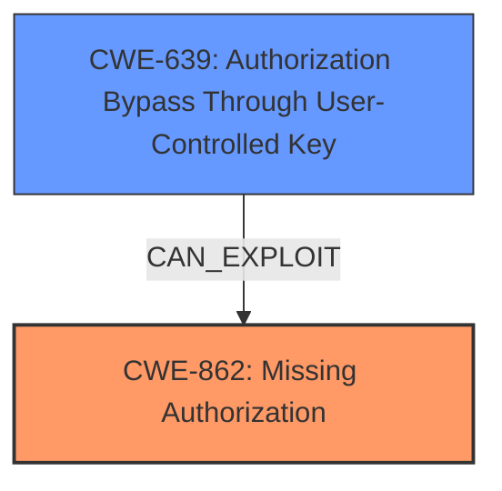

# Enhanced Analysis for CVE-2024-48901

# Summary
| CWE ID | CWE Name | Confidence | CWE Abstraction Level | CWE Vulnerability Mapping Label | CWE-Vulnerability Mapping Notes |
|---|---|---|---|---|---|
| CWE-862 | Missing Authorization | 0.9 | Class | Allowed-with-Review | Primary CWE: The product does not perform an authorization check when an actor attempts to access a resource or perform an action. |
| CWE-639 | Authorization Bypass Through User-Controlled Key | 0.7 | Base | Allowed | Secondary Candidate: The system's authorization functionality does not prevent one user from gaining access to another user's data or record by modifying the key value identifying the data. |

## Evidence and Confidence

*   **Confidence Score:** 0.8
*   **Evidence Strength:** MEDIUM

## Relationship Analysis
The primary weakness is CWE-862 [CWE-862: Missing Authorization], which falls under the broader category of authorization issues. Since the description highlights a lack of access control checks, CWE-862 is a relevant Class-level weakness. The secondary candidate, CWE-639 [CWE-639: Authorization Bypass Through User-Controlled Key], represents a more specific type of authorization bypass where user-controlled keys are used to access unauthorized data. This is a Base-level weakness and a potential way that the Missing Authorization is exploited.



## Vulnerability Chain
The vulnerability chain starts with a **missing authorization** check (CWE-862) when accessing report schedules. An attacker can then exploit this by potentially using **user-controlled keys** (CWE-639) to bypass the intended access restrictions, ultimately leading to **information disclosure** as the impact.

## Summary of Analysis
Initially, several CWEs were considered, including CWE-863 [CWE-863: Incorrect Authorization] and CWE-285 [CWE-285: Improper Authorization]. However, the description emphasizes a *lack* of access control checks rather than an incorrect implementation, making CWE-862 [CWE-862: Missing Authorization] the more appropriate primary classification.

The evidence for CWE-862 is present in the "CVE Reference Links Content Summary" section:
>The vulnerability stems from a **lack of sufficient access control checks** within Moodle when fetching report schedules.

The "Vulnerability Description" also supports this:
>Additional checks are required to ensure users can only access the schedule of a report if they have permission to edit that report.

CWE-639 [CWE-639: Authorization Bypass Through User-Controlled Key] was considered as a secondary factor because the "CVE Reference Links Content Summary" section mentions:
>Direct Request Manipulation: The vulnerability likely involves a direct request to fetch a report schedule. An attacker could manipulate parameters in the request to access schedules for reports they are not authorized to see.

This suggests a user-controlled key aspect.

The final selected CWEs are at the optimal level of specificity, with CWE-862 representing the general **missing authorization** and CWE-639 specifying how an attacker might exploit this **missing authorization** by manipulating user-controlled keys.


## CWE Relationship Analysis

Current CWEs represent these abstraction levels: .


### Vulnerability Chain Analysis

**Chain starting from CWE-863:**
- 863 (Incorrect Authorization) - ROOT


**Chain starting from CWE-285:**
- 285 (Improper Authorization) - ROOT


### CWE Relationship Diagram

```mermaid
graph TD
    classDef primary fill:#f96,stroke:#333,stroke-width:2px
    classDef secondary fill:#69f,stroke:#333
    classDef tertiary fill:#9e9,stroke:#333
```