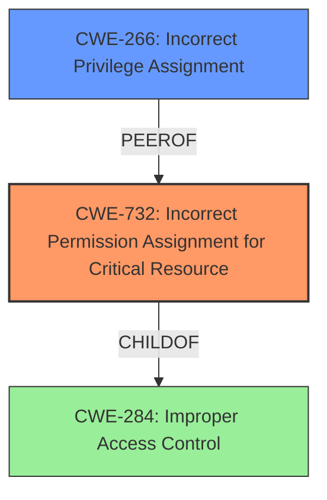

# Analysis for CVE-2024-48903

# Summary
| CWE ID  | CWE Name                                                        | Confidence | CWE Abstraction Level | CWE Vulnerability Mapping Label | CWE-Vulnerability Mapping Notes |
| :-------- | :-------------------------------------------------------------- | :--------- | :-------------------- | :------------------------------ | :------------------------------ |
| CWE-732 | Incorrect Permission Assignment for Critical Resource | 0.90      | Class               | Primary CWE                     | Allowed-with-Review             |
| CWE-266 | Incorrect Privilege Assignment                                     | 0.70       | Base                  | Secondary Candidate             | Allowed                         |

## Evidence and Confidence

*   **Confidence Score:** 0.80
*   **Evidence Strength:** HIGH

## Relationship Analysis
The primary relationship that influenced my decision was the hierarchical one. CWE-732 is a Class-level CWE that describes incorrect permission assignments for critical resources, which aligns with the description of the vulnerability. While CWE-266 (Incorrect Privilege Assignment) was also considered due to the privilege escalation aspect, the vulnerability's root cause is more accurately described as an incorrect permission assignment on a critical resource, making CWE-732 a more fitting primary classification. The CWE guidance advises to prefer the most specific applicable CWE, and CWE-732 addresses the "what" i.e. a critical resource.

## Vulnerability Chain
The vulnerability chain starts with the **improper access control** (likely due to **incorrect permission assignment**) on a sensitive folder. This allows a local attacker with low-privileged code execution capabilities to escalate their privileges to SYSTEM, leading to arbitrary code execution.

Root Cause: **Incorrect permission assignment** on a critical resource.
Weakness: **Improper Access Control**
Impact: Privilege Escalation, Arbitrary Code Execution

## Summary of Analysis
The primary CWE selection is based on the clear description of **improper access control** due to **incorrect permission assignment** on a sensitive folder. The "CVE Reference Links Content Summary" states: "Insufficient access control on a sensitive folder within the Anti-Malware Solution Platform of Trend Micro Deep Security Agent," and "The vulnerability stems from inadequate permissions on a specific folder, allowing unauthorized access." This clearly points to a permission-related issue on a critical resource.

CWE-732 (Incorrect Permission Assignment for Critical Resource) is at the Class level, but it is the most specific and appropriate CWE given the available information. It directly addresses the core issue of incorrect permissions leading to unauthorized access. The retriever results also list it as a potential candidate. CWE-266 (Incorrect Privilege Assignment) was considered, but it focuses more on the assignment of privileges to an actor, whereas the vulnerability is centered on incorrect permissions for a resource, as such it is a secondary candidate. CWE-284 (Improper Access Control) is a higher-level category and less descriptive than CWE-732.

Relevant CWE Information:

# Enhanced Context (25 CWEs)
The following CWEs were identified as potentially relevant to this vulnerability:

## CWE-266: Incorrect Privilege Assignment
**Abstraction Level**: Base
**Similarity Score**: 0.75
**Source**: dense

**Description**:
A product incorrectly assigns a privilege to a particular actor, creating an unintended sphere of control for that actor.

**Mapping Guidance**:
- Usage: Allowed
- Rationale: This CWE entry is at the Base level of abstraction, which is a preferred level of abstraction for mapping to the root causes of vulnerabilities.

## CWE-732: Incorrect Permission Assignment for Critical Resource
**Abstraction Level**: Class
**Similarity Score**: 2336.62
**Source**: sparse

**Description**:
The product specifies permissions for a security-critical resource in a way that allows that resource to be read or modified by unintended actors.

**Mapping Guidance**:
- Usage: Allowed-with-Review
- Rationale: While the name itself indicates an assignment of permissions for resources, this is often misused for vulnerabilities in which "permissions" are not checked, which is an "authorization" weakness (CWE-285 or descendants) within CWE's model [REF-1287].

# Complete CWE Specifications

CWE-250: Execution with Unnecessary Privileges
CWE-732: Incorrect Permission Assignment for Critical Resource
CWE-284: Improper Access Control
CWE-59: Improper Link Resolution Before File Access ('Link Following')
CWE-269: Improper Privilege Management
CWE-367: Time-of-check Time-of-use (TOCTOU) Race Condition
CWE-20: Improper Input Validation
CWE-94: Improper Control of Generation of Code ('Code Injection')
CWE-276: Incorrect Default Permissions
CWE-363: Race Condition Enabling Link Following

CWE-250 (Execution with Unnecessary Privileges): This was considered but is more applicable when a process runs with higher privileges than necessary. In this case, the root cause is the **incorrect permission assignment**, not the unnecessary execution with privileges.

CWE-284 (Improper Access Control): This is a very general CWE and less specific than CWE-732, so it was not selected as the primary CWE.

CWE-59 (Improper Link Resolution Before File Access ('Link Following')): This is not relevant as the vulnerability doesn't involve symbolic links or shortcuts.

CWE-269 (Improper Privilege Management): While privilege escalation is the impact, the root cause is the **incorrect permission assignment**, not improper privilege management in general.

CWE-367 (Time-of-check Time-of-use (TOCTOU) Race Condition) and CWE-363 (Race Condition Enabling Link Following): These are not relevant as the vulnerability is not related to race conditions.

CWE-20 (Improper Input Validation) and CWE-94 (Improper Control of Generation of Code ('Code Injection')): These are not relevant as the vulnerability doesn't involve input validation or code injection.

CWE-276 (Incorrect Default Permissions): While the **incorrect permission assignment** could be due to **incorrect default permissions**, the provided information does not explicitly state this. Therefore, CWE-732 is more accurate.