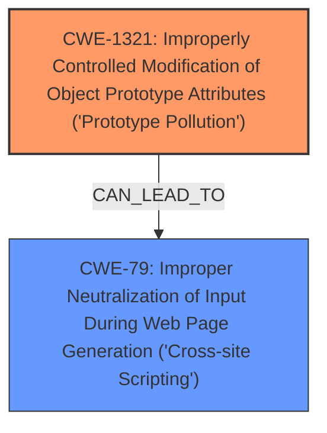

# Enhanced Analysis for CVE-2024-48910

# Summary
| CWE ID   | CWE Name                                                                                                | Confidence | CWE Abstraction Level | CWE Vulnerability Mapping Label | CWE-Vulnerability Mapping Notes |
| :-------- | :------------------------------------------------------------------------------------------------------ | :--------- | :---------------------- | :------------------------------ | :------------------------------ |
| CWE-1321 | Improperly Controlled Modification of Object Prototype Attributes ('Prototype Pollution') | 1.0        | Variant                 | Primary                       | Allowed                       |
| CWE-79  | Improper Neutralization of Input During Web Page Generation ('Cross-site Scripting')             | 0.75       | Base                    | Secondary                     | Allowed                       |

## Evidence and Confidence

*   **Confidence Score:** 0.9
*   **Evidence Strength:** HIGH

## Relationship Analysis
The primary CWE is CWE-1321, which directly reflects the **prototype pollution** vulnerability. CWE-79 is a potential consequence (secondary) due to the bypass of sanitization leading to **XSS**. There isn't a direct parent-child relationship between CWE-1321 and CWE-79, but CWE-1321 can lead to other vulnerabilities such as CWE-79. Both CWE-1321 and CWE-79 are at preferred levels of abstraction (Variant and Base, respectively).



## Vulnerability Chain
The vulnerability chain starts with the **improperly controlled modification of object prototype attributes (CWE-1321)**, which allows attackers to modify the prototype of JavaScript objects. This, in turn, can lead to a bypass of DOMPurify's sanitization mechanisms, potentially resulting in cross-site scripting (**XSS**, CWE-79) if the attacker can control the input processed by the library.

## Summary of Analysis
The analysis is primarily based on the provided vulnerability description and CVE reference. The key evidence is the identification of **prototype pollution** as the root cause and the potential for resulting **XSS**.

The "Vulnerability Description Key Phrases" section explicitly identifies "**prototype pollution**" as the **rootcause** and "**XSS**" as a **weakness**.

The "CVE Reference Links Content Summary" section confirms the **prototype pollution** issue and its potential to bypass DOMPurify's sanitization, leading to **XSS** attacks. "The vulnerability allows an attacker to modify the prototype of JavaScript objects, potentially leading to unexpected behavior or code execution...The vulnerability could lead to a bypass of DOMPurify's sanitization, potentially leading to cross-site scripting (XSS) attacks if an attacker can control the input that is processed by the library."

CWE-1321 is selected as the primary CWE because it directly addresses the **root cause** of the vulnerability, i.e., the **improperly controlled modification of object prototype attributes**. CWE-79 is included as a secondary CWE because it represents a potential consequence of the vulnerability, i.e., the bypass of sanitization leading to cross-site scripting. Both CWEs are at appropriate levels of specificity (Variant and Base, respectively).

CWE-843, CWE-1188, CWE-1333, CWE-116, CWE-138, CWE-184, CWE-80 and CWE-494 were considered, but not selected. They do not accurately represent the **root cause** of the vulnerability, which is **prototype pollution**. While some of these CWEs might be related to the impact or consequences of the vulnerability, they do not address the underlying weakness.


## CWE Relationship Analysis

Current CWEs represent these abstraction levels: .


### Vulnerability Chain Analysis

**Chain starting from CWE-1321:**
- 1321 (Improperly Controlled Modification of Object Prototype Attributes ('Prototype Pollution')) - ROOT


**Chain starting from CWE-116:**
- 116 (Improper Encoding or Escaping of Output) - ROOT


### CWE Relationship Diagram

```mermaid
graph TD
    classDef primary fill:#f96,stroke:#333,stroke-width:2px
    classDef secondary fill:#69f,stroke:#333
    classDef tertiary fill:#9e9,stroke:#333
```