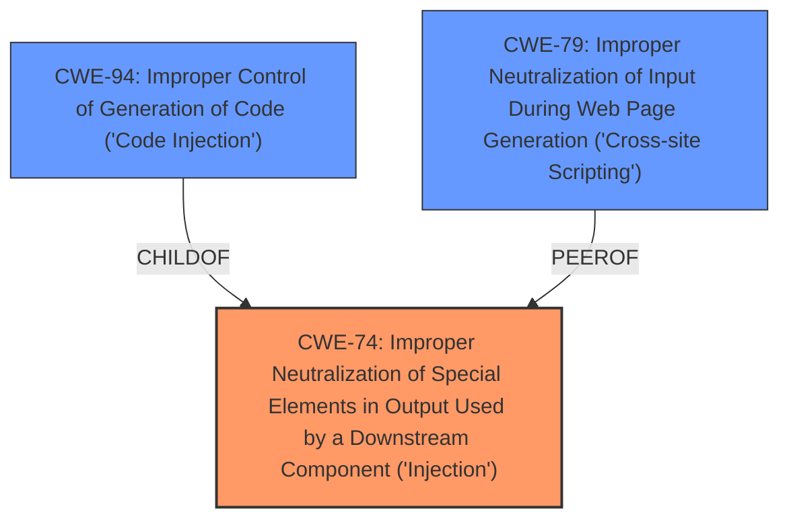

# Analysis Report for CVE-2024-48919

# Vulnerability Analysis Report: CVE-2024-48919

## Description

Cursor is a code editor built for programming with AI. Prior to Sep 27, 2024, if a user generated a terminal command via Cursors Terminal Cmd-K/Ctrl-K feature and if the user explicitly imported a malicious web page into the Terminal Cmd-K prompt, an attacker with control over the referenced web page could have a significant chance of influencing a language model to output arbitrary commands for execution in the users terminal. This scenario would require the user explicitly opt-in to including the contents of a compromised webpage, and it would require that the attacker display prompt injection text in the the contents of the compromised webpage. A server-side patch to not stream back newlines or control characters was released on September 27, 2024, within two hours of the issue being reported. Additionally, Cursor 0.42 includes client-side mitigations to prevent any newline or control character from being streamed into the terminal directly. It also contains a new setting, `cursor.terminal.usePreviewBox`, which, if set to true, streams the response into a preview box whose contents then have to be manually accepted before being inserted into the terminal. This setting is useful if youre working in a shell environment where commands can be executed without pressing enter or any control character. The patch has been applied server-side, so no additional action is needed, even on older versions of Cursor. Separately, Cursors maintainers also recommend, as best practice

## Vulnerability Description Key Phrases

- **Impact:** arbitrary command execution
- **Vector:** malicious webpage
- **Attacker:** attacker
- **Product:** Cursor
- **Version:** prior to Sep 27, 2024
- **Component:** Terminal Cmd-K/Ctrl-K feature

## Analysis (with Relationship Data)

# Summary
| CWE ID | CWE Name | Confidence | CWE Abstraction Level | CWE Vulnerability Mapping Label | CWE-Vulnerability Mapping Notes |
|---|---|---|---|---|---|
| CWE-74 | Improper Neutralization of Special Elements in Output Used by a Downstream Component ('Injection') | 0.8 | Class | Primary | Allowed-with-Review |
| CWE-94 | Improper Control of Generation of Code ('Code Injection') | 0.7 | Base | Secondary | Allowed-with-Review |
| CWE-79 | Improper Neutralization of Input During Web Page Generation ('Cross-site Scripting') | 0.6 | Base | Secondary | Allowed |

## Evidence and Confidence

*   **Confidence Score:** 0.8
*   **Evidence Strength:** MEDIUM

## Relationship Analysis
The primary weakness is CWE-74, a Class-level CWE that encompasses injection vulnerabilities where special elements are not properly neutralized before being used by a downstream component. The more specific CWE-94, a Base-level CWE representing Code Injection, is considered as a likely secondary weakness given the potential for arbitrary code execution. CWE-79 is another related Base-level CWE because the injection happens via a webpage.



## Vulnerability Chain
The vulnerability chain starts with the **lack of input sanitization** in Cursor's Terminal Cmd-K feature, allowing an attacker to inject malicious prompts via a compromised webpage. This leads to the language model generating arbitrary commands which are then streamed directly into the user's terminal due to **unfiltered output streaming**. The chain culminates in **arbitrary command execution** on the user's machine, enabling potential data exfiltration or system manipulation.
  - **Root Cause:** Lack of Input Sanitization
  - **Weakness 1:** CWE-74 Improper Neutralization of Special Elements in Output Used by a Downstream Component ('Injection')
  - **Weakness 2:** Unfiltered output streaming
  - **Impact:** Arbitrary command execution

## Summary of Analysis
The analysis is based on the provided vulnerability description and the CVE reference links content summary. The key evidence supporting this classification includes the prompt injection vulnerability in Cursor's Terminal Cmd-K feature, the **lack of input sanitization**, the **unfiltered output streaming**, and the potential for **arbitrary command execution**.

The primary CWE selected is CWE-74 Improper Neutralization of Special Elements in Output Used by a Downstream Component ('Injection'), because the injected prompts lead to the language model generating arbitrary commands which are then streamed directly into the user's terminal. This is the best fit to the vulnerability description.

CWE-94 Improper Control of Generation of Code ('Code Injection') is a secondary CWE because the vulnerability leads to arbitrary command execution.

CWE-79 Improper Neutralization of Input During Web Page Generation ('Cross-site Scripting') is a secondary CWE because the injection happens via a webpage.

Other CWEs Considered:

*   CWE-184 Incomplete List of Disallowed Inputs: While an incomplete list of disallowed inputs could be a contributing factor, the core issue is the improper handling of special elements in the output used by a downstream component.
*   CWE-1336 Improper Neutralization of Special Elements Used in a Template Engine: This CWE is less relevant as the vulnerability doesn't directly involve a template engine.
*   CWE-116 Improper Encoding or Escaping of Output: While encoding/escaping issues might be present, the primary concern is the lack of neutralization of special elements leading to injection.

Relevant CWE Information:

# Enhanced Context (25 CWEs)
The following CWEs were identified as potentially relevant to this vulnerability:

## CWE-451: User Interface (UI) Misrepresentation of Critical Information
**Abstraction Level**: Class
**Similarity Score**: 0.74
**Source**: dense

**Description**:
The user interface (UI) does not properly represent critical information to the user, allowing the information - or its source - to be obscured or spoofed. This is often a component in phishing attacks.

**Mapping Guidance**:
- Usage: Allowed-with-Review
- Rationale: This CWE entry is a Class and might have Base-level children that would be more appropriate

## CWE-116: Improper Encoding or Escaping of Output
**Abstraction Level**: Class
**Similarity Score**: 0.74
**Source**: dense

**Description**:
The product prepares a structured message for communication with another component, but encoding or escaping of the data is either missing or done incorrectly. As a result, the intended structure of the message is not preserved.

**Mapping Guidance**:
- Usage: Allowed-with-Review
- Rationale: This CWE entry is a Class and might have Base-level children that would be more appropriate

## CWE-184: Incomplete List of Disallowed Inputs
**Abstraction Level**: Base
**Similarity Score**: 0.74
**Source**: dense

**Description**:
The product implements a protection mechanism that relies on a list of inputs (or properties of inputs) that are not allowed by policy or otherwise require other action to neutralize before additional processing takes place, but the list is incomplete.

**Mapping Guidance**:
- Usage: Allowed
- Rationale: This CWE entry is at the Base level of abstraction, which is a preferred level of abstraction for mapping to the root causes of vulnerabilities.

## CWE-93: Improper Neutralization of CRLF Sequences ('CRLF Injection')
**Abstraction Level**: Base
**Similarity Score**: 0.73
**Source**: dense

**Description**:
The product uses CRLF (carriage return line feeds) as a special element, e.g. to separate lines or records, but it does not neutralize or incorrectly neutralizes CRLF sequences from inputs.

**Mapping Guidance**:
- Usage: Allowed
- Rationale: This CWE entry is at the Base level of abstraction, which is a preferred level of abstraction for mapping to the root causes of vulnerabilities.

## CWE-138: Improper Neutralization of Special Elements
**Abstraction Level**: Class
**Similarity Score**: 0.73
**Source**: dense

**Description**:
The product receives input from an upstream component, but it does not neutralize or incorrectly neutralizes special elements that could be interpreted as control elements or syntactic markers when they are sent to a downstream component.

**Mapping Guidance**:
- Usage: Discouraged
- Rationale: This CWE entry is a level-1 Class (i.e., a child of a Pillar). It might have lower-level children that would be more appropriate

## CWE-80: Improper Neutralization of Script-Related HTML Tags in a Web Page (Basic XSS)
**Abstraction Level**: Variant
**Similarity Score**: 0.72
**Source**: dense

**Description**:
The product receives input from an upstream component, but it does not neutralize or incorrectly neutralizes special characters such as "<", ">", and "&" that could be interpreted as web-scripting elements when they are sent to a downstream component that processes web pages.

**Mapping Guidance**:
- Usage: Allowed
- Rationale: This CWE entry is at the Variant level of abstraction, which is a preferred level of abstraction for mapping to the root causes of vulnerabilities.

## CWE-212: Improper Removal of Sensitive Information Before Storage or Transfer
**Abstraction Level**: Base
**Similarity Score**: 0.72
**Source**: dense

**Description**:
The product stores, transfers, or shares a resource that contains sensitive information, but it does not properly remove that information before the product makes the resource available to unauthorized actors.

**Mapping Guidance**:
- Usage: Allowed
- Rationale: This CWE entry is at the Base level of abstraction, which is a preferred level of abstraction for mapping to the root causes of vulnerabilities.

## CWE-74: Improper Neutralization of Special Elements in Output Used by a Downstream Component ('Injection')
**Abstraction Level**: Class
**Similarity Score**: 0.72
**Source**: dense

**Description**:
The product constructs all or part of a command, data structure, or record using externally-influenced input from an upstream component, but it does not neutralize or incorrectly neutralizes special elements that could modify how it is parsed or interpreted when it is sent to a downstream component.

**Mapping Guidance**:
- Usage: Discouraged
- Rationale: CWE-74 is high-level and often misused when lower-level weaknesses are more appropriate.

## CWE-923: Improper Restriction of Communication Channel to Intended Endpoints
**Abstraction Level**: Class
**Similarity Score**: 0.71
**Source**: dense

**Description**:


## CWE Relationship Analysis

Current CWEs represent these abstraction levels: .


### Vulnerability Chain Analysis

**Chain starting from CWE-94:**
- 94 (Improper Control of Generation of Code ('Code Injection')) - ROOT


**Chain starting from CWE-116:**
- 116 (Improper Encoding or Escaping of Output) - ROOT


### CWE Relationship Diagram

```mermaid
graph TD
    classDef primary fill:#f96,stroke:#333,stroke-width:2px
    classDef secondary fill:#69f,stroke:#333
    classDef tertiary fill:#9e9,stroke:#333
```


*Report generated on 2025-07-13 19:03:26*
