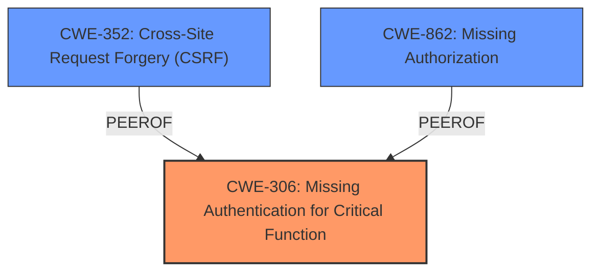

# Analysis for CVE-2024-48950

# Summary
| CWE ID | CWE Name | Confidence | CWE Abstraction Level | CWE Vulnerability Mapping Label | CWE-Vulnerability Mapping Notes |
|---|---|---|---|---|---|
| CWE-306 | Missing Authentication for Critical Function | 0.9 | Base | Primary | Allowed |
| CWE-352 | Cross-Site Request Forgery (CSRF) | 0.8 | Compound | Secondary | Allowed |
| CWE-862 | Missing Authorization | 0.6 | Base | Secondary | Allowed |

## Evidence and Confidence

*   **Confidence Score:** 0.8
*   **Evidence Strength:** HIGH

## Relationship Analysis
The primary weakness is **CWE-306 [Missing Authentication for Critical Function]**, because the endpoint was exposed without authentication. **CWE-352 [Cross-Site Request Forgery (CSRF)]** is a secondary weakness because the endpoint also lacked CSRF protection. **CWE-862 [Missing Authorization]** is also considered as a secondary weakness because once authentication is bypassed, there is no authorization check.

## Vulnerability Chain
The vulnerability chain starts with the **missing authentication (CWE-306 [Missing Authentication for Critical Function])** on the endpoint. This allows unauthenticated attackers to bypass CSRF protections (**CWE-352 [Cross-Site Request Forgery (CSRF)]**) and, ultimately, authorization (**CWE-862 [Missing Authorization]**), gaining unauthorized access to the system.

## Summary of Analysis
The primary weakness is **CWE-306 [Missing Authentication for Critical Function]** because the root cause is the absence of authentication on the exposed endpoint. The content summary states: "An endpoint used in Distributed Logpoint setup was exposed without proper authentication and CSRF protection." The vulnerability description also highlights that "an endpoint used by Distributed Logpoint Setup was exposed, allowing unauthenticated attackers to bypass CSRF protections and authentication". This directly supports the selection of **CWE-306 [Missing Authentication for Critical Function]**.

Secondary weaknesses are **CWE-352 [Cross-Site Request Forgery (CSRF)]** and **CWE-862 [Missing Authorization]**. The endpoint lacked CSRF protection, as stated in the content summary and vulnerability description. The lack of authentication directly leads to authorization bypass (**CWE-862 [Missing Authorization]**).

The retriever results also list **CWE-306 [Missing Authentication for Critical Function]** as the top candidate. The CWE guidance clearly distinguishes between authentication and authorization, further solidifying the choice of **CWE-306 [Missing Authentication for Critical Function]** as the primary weakness when no identity validation is present.

Other CWEs considered but not chosen:

*   **CWE-285 [Improper Authorization]** and **CWE-863 [Incorrect Authorization]**: These were not selected because the primary issue is the absence of authentication, not an incorrect authorization implementation.
*   **CWE-350 [Reliance on Reverse DNS Resolution for a Security-Critical Action]**: This is not relevant as there is no mention of reverse DNS resolution in the vulnerability description.
*   **CWE-79 [Improper Neutralization of Input During Web Page Generation ('Cross-site Scripting')]**: This is not relevant as there is no mention of web page generation or input neutralization.
*   **CWE-93 [Improper Neutralization of CRLF Sequences ('CRLF Injection')]**: This is not relevant as there is no mention of CRLF injection.
*   **CWE-226 [Sensitive Information in Resource Not Removed Before Reuse]**: This is not relevant as there is no mention of sensitive information being reused.
*   **CWE-471 [Modification of Assumed-Immutable Data (MAID)]**: This is not relevant as there is no mention of immutable data being modified.
*   **CWE-420 [Unprotected Alternate Channel]**: This is not relevant as there is no mention of an alternate channel.
*   **CWE-201 [Insertion of Sensitive Information Into Sent Data]**: This is not relevant as there is no mention of sensitive information being inserted into sent data.
*   **CWE-1275 [Sensitive Cookie with Improper SameSite Attribute]**: This is not relevant as there is no mention of cookies.
*   **CWE-322 [Key Exchange without Entity Authentication]**: This is not relevant as there is no key exchange issue mentioned in the vulnerability description.
*   **CWE-117 [Improper Output Neutralization for Logs]**: This is not relevant as there is no logging issue mentioned in the vulnerability description.
*   **CWE-1390 [Weak Authentication]**: While related to authentication, the primary issue is the complete absence of authentication (**CWE-306 [Missing Authentication for Critical Function]**) rather than a weak authentication mechanism.
*   **CWE-425 [Direct Request ('Forced Browsing')]**: This is not specific enough, as the root cause is the lack of authentication, not just the ability to directly request resources.
*   **CWE-288 [Authentication Bypass Using an Alternate Path or Channel]**: While the reference links mention this, the primary issue is the lack of authentication on the main endpoint, which makes **CWE-306 [Missing Authentication for Critical Function]** a more accurate classification.

The selected CWEs are at the optimal level of specificity, with **CWE-306 [Missing Authentication for Critical Function]** being a Base CWE that accurately describes the root cause of the vulnerability.