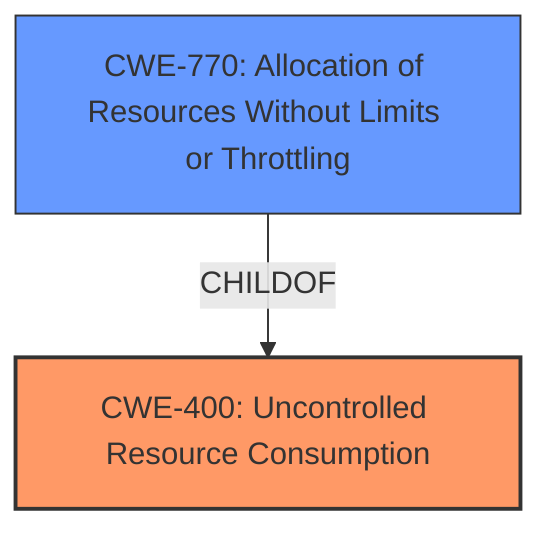

# Analysis Report for CVE-2024-48989

# Vulnerability Analysis Report: CVE-2024-48989

## Description

A vulnerability in the PROFINET stack implementation of the IndraDrive (all versions) of Bosch Rexroth allows an attacker to cause a denial of service, rendering the device unresponsive by sending arbitrary UDP messages.

## Vulnerability Description Key Phrases

- **Impact:** denial of service
- **Vector:** arbitrary UDP messages
- **Attacker:** attacker
- **Product:** Bosch Rexroth IndraDrive
- **Version:** all versions
- **Component:** PROFINET stack

## Analysis (with Relationship Data)

# Summary
| CWE ID | CWE Name | Confidence | CWE Abstraction Level | CWE Vulnerability Mapping Label | CWE-Vulnerability Mapping Notes |
|---|---|---|---|---|---|
| CWE-400 | Uncontrolled Resource Consumption | 0.9 | Class | Primary | Allowed-with-Review |
| CWE-770 | Allocation of Resources Without Limits or Throttling | 0.7 | Base | Secondary | Allowed |

## Evidence and Confidence

*   **Confidence Score:** 0.8
*   **Evidence Strength:** MEDIUM

## Relationship Analysis
The primary relationship considered was the parent-child relationship between CWE-400 and CWE-770. CWE-770 is a child of CWE-400, offering a more specific classification related to resource allocation. I selected CWE-400 as the primary because the vulnerability description indicates a general **uncontrolled resource consumption**, while CWE-770 is more specific to resource allocation. Both CWEs are related to resource management issues leading to denial of service.



## Vulnerability Chain
The vulnerability chain begins with the **uncontrolled resource consumption** due to the processing of arbitrary UDP messages (CWE-400). This leads to a denial-of-service condition, rendering the device unresponsive.

## Summary of Analysis
The analysis is based on the vulnerability description provided, focusing on the root cause and impact. The evidence supports the classification of CWE-400 as the primary weakness, with CWE-770 as a potential secondary weakness. The retriever results also support these classifications, particularly with CWE-400 having a relatively high score. The graph relationships influenced the selection by highlighting the hierarchical structure between CWE-400 and CWE-770. I am classifying the high-level CWE-400 as the primary because the specific underlying mechanics are not further detailed in the vulnerability report.

Relevant CWE Information:

# Enhanced Context (25 CWEs)
The following CWEs were identified as potentially relevant to this vulnerability:

## CWE-400: Uncontrolled Resource Consumption
**Abstraction Level**: Class
**Similarity Score**: 0.71
**Source**: dense

**Description**:
The product does not properly control the allocation and maintenance of a limited resource, thereby enabling an actor to influence the amount of resources consumed, eventually leading to the exhaustion of available resources.

**Mapping Guidance**:
- Usage: Discouraged
- Rationale: CWE-400 is intended for incorrect behaviors in which the product is expected to track and restrict how many resources it consumes, but CWE-400 is often misused because it is conflated with the "technical impact" of vulnerabilities in which resource consumption occurs. It is sometimes used for low-information vulnerability reports. It is a level-1 Class (i.e., a child of a Pillar).

**Technical Explanation for CWE-400:**
The vulnerability in the PROFINET stack implementation allows an attacker to cause a denial of service by sending arbitrary UDP messages. This fits the characteristics of CWE-400 because the device does not properly control the allocation and maintenance of resources when processing these messages, leading to resource exhaustion and unresponsiveness. The security implication is a denial of service, impacting the availability of the device and potentially disrupting critical operations. It's a high-level Class weakness that captures the general issue of **uncontrolled resource consumption**.

**Technical Explanation for CWE-770:**
CWE-770 is relevant because the device is allocating resources (memory, processing power, etc.) to handle incoming UDP messages without proper limits or throttling. This allows an attacker to exhaust the available resources by sending a large number of arbitrary UDP messages. The relationship to CWE-400 is that CWE-770 is a specific type of **uncontrolled resource consumption** related to resource allocation. The security implication is denial of service.

**CWEs Considered But Not Used:**

*   CWE-789 (Memory Allocation with Excessive Size Value): Considered but not used because the vulnerability description does not explicitly mention memory allocation with excessive size values.
*   CWE-835 (Loop with Unreachable Exit Condition ('Infinite Loop')): Considered but not used because there is no evidence of an infinite loop being the root cause.
* CWE-119 (Improper Restriction of Operations within the Bounds of a Memory Buffer): Considered but not used because the vulnerability description does not explicitly mention operations outside the bounds of a memory buffer.
* CWE-20 (Improper Input Validation): Considered but not used as a primary CWE because the description focuses more on the lack of resource control rather than input validation.
* CWE-755 (Improper Handling of Exceptional Conditions): Discouraged because it is a class level and there isn't enough information to know the specifics of what exceptional condition is not handled.


## CWE Relationship Analysis

Current CWEs represent these abstraction levels: .


### Vulnerability Chain Analysis

**Chain starting from CWE-400:**
- 400 (Uncontrolled Resource Consumption) - ROOT


**Chain starting from CWE-770:**
- 770 (Allocation of Resources Without Limits or Throttling) - ROOT


### CWE Relationship Diagram

```mermaid
graph TD
    classDef primary fill:#f96,stroke:#333,stroke-width:2px
    classDef secondary fill:#69f,stroke:#333
    classDef tertiary fill:#9e9,stroke:#333
```


*Report generated on 2025-07-13 19:08:58*
