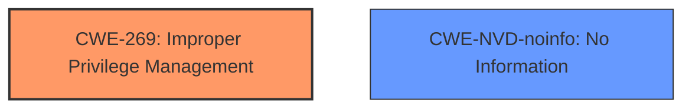

# Analysis for CVE-2024-49068

# Summary
| CWE ID        | CWE Name                                                                       | Confidence | CWE Abstraction Level | CWE Vulnerability Mapping Label | CWE-Vulnerability Mapping Notes |
| ------------- | ------------------------------------------------------------------------------ | ---------- | --------------------- | ------------------------------- | ------------------------------- |
| **CWE-269**   | Improper Privilege Management                                                   | 0.6        | Class                  | Primary                         | Discouraged                    |
| CWE-NVD-noinfo | No Information                                                        | 0.3        | NVD                  | Secondary                         | NVD                    |

## Evidence and Confidence

*   **Confidence Score:** 0.6
*   **Evidence Strength:** LOW

## Relationship Analysis
The primary relationship that influenced my decision was the parent-child relationship between CWE-269 (Improper Privilege Management) and its potential child CWEs, as well as the privilege vs permission guidance. While CWE-269 is a class-level CWE and discouraged, the lack of detailed information prevents a more specific mapping.

## Vulnerability Chain
The vulnerability chain for this vulnerability is short and lacks detail. The **root cause** appears to be an issue related to privilege management, leading to the **impact** of elevation of privilege. Due to the limited information, it is difficult to establish a complete and precise chain of weaknesses.

## Summary of Analysis
My analysis is heavily constrained by the limited information available in the vulnerability description and the "CVE Reference Links Content Summary" stating "UNRELATED". The description indicates an "Elevation of Privilege" vulnerability in "Microsoft SharePoint," suggesting a problem with how privileges are managed.

The primary CWE match from similar CVE descriptions is CWE-NVD-noinfo, followed by CWE-269 (Improper Privilege Management). The retriever results also list CWE-269 with a high score. Due to the lack of specific root cause details, I am choosing CWE-269 as the primary CWE. While it is a Class-level CWE and discouraged, it is the most descriptive option available given the limited evidence. CWE-NVD-noinfo is added as a secondary CWE because the vulnerability details are sparse.

Relevant CWE Information:

# Enhanced Context (25 CWEs)
The following CWEs were identified as potentially relevant to this vulnerability:

## CWE-269: Improper Privilege Management
**Abstraction Level**: Class
**Similarity Score**: 1231.50
**Source**: sparse

**Description**:
The product does not properly assign, modify, track, or check privileges for an actor, creating an unintended sphere of control for that actor.

**Mapping Guidance**:
- Usage: Discouraged
- Rationale: CWE-269 is commonly misused. It can be conflated with "privilege escalation," which is a technical impact that is listed in many low-information vulnerability reports [REF-1287]. It is not useful for trend analysis.