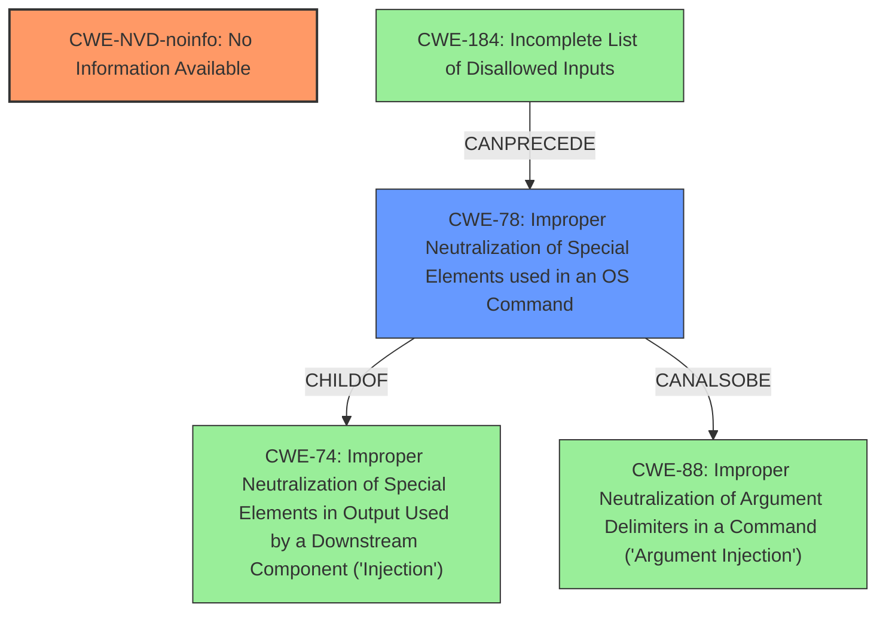

# Analysis Report for CVE-2024-49105

# Vulnerability Analysis Report: CVE-2024-49105

## Description

Remote Desktop Client Remote Code Execution Vulnerability

## Vulnerability Description Key Phrases

- **Impact:** Remote Code Execution
- **Component:** Remote Desktop Client

## Analysis (with Relationship Data)

# Summary
| CWE ID    | CWE Name                                                                     | Confidence | CWE Abstraction Level | CWE Vulnerability Mapping Label | CWE-Vulnerability Mapping Notes |
| :--------- | :--------------------------------------------------------------------------- | :--------- | :---------------------- | :------------------------------ | :------------------------------ |
| CWE-NVD-noinfo | No Information Available                                       | 0.7       | N/A                       | Primary                         | Allowed                        |
| CWE-78     | Improper Neutralization of Special Elements used in an OS Command ('OS Command Injection') | 0.3         | Base                      | Secondary                         | Allowed                        |

## Evidence and Confidence

*   **Confidence Score:** 0.7
*   **Evidence Strength:** LOW

## Relationship Analysis
The primary identified CWE is CWE-NVD-noinfo due to lack of information. There isn't sufficient detail to pinpoint a specific root cause.

CWE-78, while a potential candidate given the "Remote Code Execution" impact, lacks direct evidence in the description. The graph relationships show it is related to other injection flaws (CWE-88, CWE-74) and can be preceded by an incomplete list of disallowed inputs (CWE-184).



## Vulnerability Chain
The chain is incomplete due to lack of root cause information.

*   The vulnerability description only indicates the impact which is **Remote Code Execution**.
*   Without more details, the root cause is unknown.

## Summary of Analysis
My assessment is heavily based on the limited evidence provided. The primary indicator is the impact: "Remote Code Execution." However, without more details on the root cause, the best match is CWE-NVD-noinfo.

The retriever results suggest CWE-78 as a potential candidate. If the **Remote Code Execution** is achieved via command injection, then it would be a more appropriate mapping. However, there is not enough evidence to support that.

CWE-NVD-noinfo is used because the vulnerability description provides insufficient information to determine the root cause. The other CWEs considered, while potentially relevant, lack direct supporting evidence in the vulnerability description.


## CWE Relationship Analysis

Current CWEs represent these abstraction levels: .


### Vulnerability Chain Analysis

**Chain starting from CWE-184:**
- 184 (Incomplete List of Disallowed Inputs) - ROOT


**Chain starting from CWE-88:**
- 88 (Improper Neutralization of Argument Delimiters in a Command ('Argument Injection')) - ROOT


### CWE Relationship Diagram

```mermaid
graph TD
    classDef primary fill:#f96,stroke:#333,stroke-width:2px
    classDef secondary fill:#69f,stroke:#333
    classDef tertiary fill:#9e9,stroke:#333
```


*Report generated on 2025-07-13 19:14:09*
