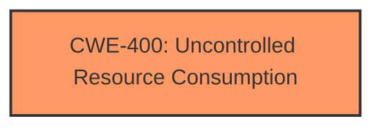

# Analysis for CVE-2024-49129

# Summary
| CWE ID        | CWE Name                                                                                             | Confidence | CWE Abstraction Level | CWE Vulnerability Mapping Label | CWE-Vulnerability Mapping Notes |
|---------------|------------------------------------------------------------------------------------------------------|------------|-----------------------|---------------------------------|-----------------------------------|
| CWE-400       | Uncontrolled Resource Consumption                                                                 | 0.7        | Class                 |                                 | Discouraged                       |

## Evidence and Confidence

*   **Confidence Score:** 0.7
*   **Evidence Strength:** LOW

## Relationship Analysis
The primary relationship considered was that CWE-400 is a Class-level CWE, and while it broadly fits the Denial of Service impact, there might be more specific Base or Variant level CWEs. However, without more information, it's difficult to pinpoint a more specific root cause.

## Vulnerability Chain
The vulnerability chain is simple: A weakness leads to a Denial of Service **impact**. The root cause is **uncontrolled resource consumption**, but the specifics of what resource and how it's consumed are unknown.

## Summary of Analysis
The analysis is heavily based on the provided evidence, which is minimal. The vulnerability description mentions "Denial of Service" and "Windows Remote Desktop Gateway." The "CWE for similar CVE Descriptions" section suggests CWE-NVD-noinfo as the primary match, indicating a lack of specific CWE information from the NVD. The top CWEs listed include CWE-NVD-noinfo, CWE-125, and CWE-400.

Given the limited information, the most applicable CWE is CWE-400 [Uncontrolled Resource Consumption] because the vulnerability results in a denial of service, which often stems from a service consuming excessive resources.

Other CWEs were considered but rejected:
*   CWE-78 [Improper Neutralization of Special Elements used in an OS Command ('OS Command Injection')], CWE-917 [Improper Neutralization of Special Elements used in an Expression Language Statement ('Expression Language Injection')], and CWE-1336 [Improper Neutralization of Special Elements Used in a Template Engine] were not selected because there is no evidence of injection.
*   CWE-347 [Improper Verification of Cryptographic Signature] and CWE-649 [Reliance on Obfuscation or Encryption of Security-Relevant Inputs without Integrity Checking] were not selected because there is no evidence of cryptographic issues.
*   CWE-184 [Incomplete List of Disallowed Inputs] was not selected because there is no evidence about input validation or sanitization.
*   CWE-284 [Improper Access Control], CWE-269 [Improper Privilege Management], CWE-346 [Origin Validation Error], CWE-522 [Insufficiently Protected Credentials] were not selected because there is no information about authentication and authorization issues.
*   CWE-1188 [Initialization of a Resource with an Insecure Default] was not selected because the description doesn't mention insecure default initialization.

The selection of CWE-400 [Uncontrolled Resource Consumption] is at a Class level because the evidence is insufficient to determine the specific type of resource consumption or the underlying cause. The evidence to support a more specific Base or Variant level CWE is lacking.