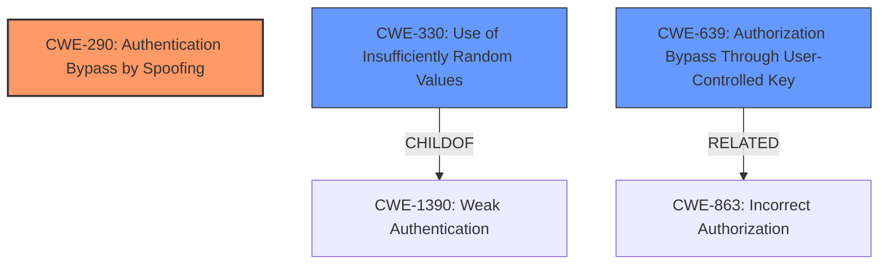

# Analysis for CVE-2024-49193

# Summary
| CWE ID | CWE Name | Confidence | CWE Abstraction Level | CWE Vulnerability Mapping Label | CWE-Vulnerability Mapping Notes |
|---|---|---|---|---|---|
| CWE-290 | Authentication Bypass by Spoofing | 0.9 | Base |  | Allowed |
| CWE-330 | Use of Insufficiently Random Values | 0.4 | Class |  | Discouraged |
| CWE-639 | Authorization Bypass Through User-Controlled Key | 0.4 | Base |  | Allowed |

## Evidence and Confidence

*   **Confidence Score:** 0.9
*   **Evidence Strength:** HIGH

## Relationship Analysis
The primary CWE is CWE-290, which relates to bypassing authentication by spoofing. This is directly supported by the vulnerability description, which mentions "e-mail spoofing" as the primary attack vector. CWE-330 and CWE-639 were also considered due to their relevance to related aspects of the vulnerability but ultimately were not selected as primary due to lack of direct causation.

## Vulnerability Chain
The vulnerability chain starts with **insufficient mechanism for detecting spoofed e-mail messages**, leading to **email spoofing**. This allows attackers to **read ticket history** by gaining unauthorized access to support tickets and associated sensitive information. A secondary path involves predictable ticket IDs, potentially exacerbating the email spoofing attack.

## Summary of Analysis
The initial analysis identified email spoofing as the core issue, supported by the vulnerability description and CVE reference. The final selection of CWE-290 is based on the direct evidence of email spoofing being used to bypass authentication and access ticket history. Other CWEs like CWE-330 (related to predictable ticket IDs) and CWE-639 (authorization bypass) were considered but not selected as primary because they were secondary factors or consequences of the primary authentication bypass. The chosen CWE is at the optimal level of specificity, directly addressing the root cause weakness.

Relevant CWE Information:

# Enhanced Context (25 CWEs)
The following CWEs were identified as potentially relevant to this vulnerability:

## CWE-290: Authentication Bypass by Spoofing
**Abstraction Level**: Base
**Similarity Score**: 0.74
**Source**: dense

**Description**:
This attack-focused weakness is caused by incorrectly implemented authentication schemes that are subject to spoofing attacks.

**Mapping Guidance**:
- Usage: Allowed
- Rationale: This CWE entry is at the Base level of abstraction, which is a preferred level of abstraction for mapping to the root causes of vulnerabilities.

## Technical Explanation for Selected CWEs:

*   **CWE-290: Authentication Bypass by Spoofing**
    *   **Explanation:** Zendesk's **insufficient mechanism for detecting spoofed e-mail messages** allows attackers to bypass authentication by impersonating legitimate users. The system trusts the "From" email address without proper validation, enabling unauthorized access to ticket histories.
    *   **Security Implications:** This weakness can lead to unauthorized access to sensitive customer data, potential data breaches, and compromise of internal systems.
    *   **Relationships:** This is the primary CWE, directly addressing the root cause.
    *   **Mapping Guidance Influence:** The "Allowed" usage and the base level of abstraction align with the evidence of direct spoofing.
    *   **Confidence:** 0.9
*   **CWE-330: Use of Insufficiently Random Values**
    *   **Explanation:** The vulnerability mentions predictable ticket IDs, which suggests that the system's method of generating these IDs might not be sufficiently random.
    *   **Security Implications:** Predictable ticket IDs, combined with email spoofing, make it easier for attackers to target specific tickets and gain unauthorized access.
    *   **Relationships:** This CWE is related to the vulnerability's attack surface, as predictable IDs facilitate the email spoofing attack.
    *   **Mapping Guidance Influence:** Usage is discouraged due to the existence of more specific child CWEs, but this one is related.
    *   **Confidence:** 0.4
*   **CWE-639: Authorization Bypass Through User-Controlled Key**
    *   **Explanation:** The vulnerability allows unauthorized access to tickets because Zendesk trusts the CC field in emails. By adding attacker-controlled email to CC, they can bypass authorization checks for ticket viewing.
    *   **Security Implications:** This can lead to unauthorized access to support ticket histories, including potentially sensitive information.
    *   **Relationships:** Authorization Bypass is possible via manipulation of email address fields.
    *   **Mapping Guidance Influence:** The "Allowed" usage and the base level of abstraction align with the evidence.
    *   **Confidence:** 0.4

## Other CWEs Considered But Not Used:

*   **CWE-863: Incorrect Authorization, CWE-285: Improper Authorization, CWE-306: Missing Authentication for Critical Function, CWE-862: Missing Authorization, CWE-284: Improper Access Control:** While authorization issues are involved, the root cause is more directly related to the initial authentication bypass via email spoofing. These authorization-related CWEs describe what happens after the bypass.
*   **CWE-472: External Control of Assumed-Immutable Web Parameter**: While the email address could be seen as an external control, it is more directly related to the spoofing aspect.
*   **CWE-807: Reliance on Untrusted Inputs in a Security Decision:** This is also related to the trusting of email addresses, but CWE-290 is the direct method of attack.