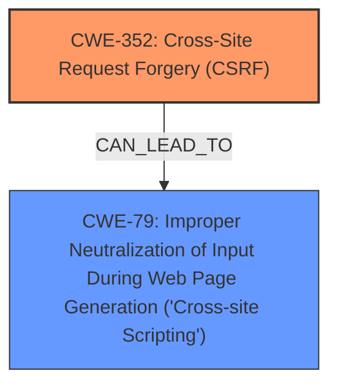

# Enhanced Analysis for CVE-2024-49223

# Summary
| CWE ID | CWE Name | Confidence | CWE Abstraction Level | CWE Vulnerability Mapping Label | CWE-Vulnerability Mapping Notes |
|---|---|---|---|---|---|
| CWE-352 | Cross-Site Request Forgery (CSRF) | 1.0 | Compound | Primary | Allowed |
| CWE-79 | Improper Neutralization of Input During Web Page Generation ('Cross-site Scripting') | 1.0 | Base | Secondary | Allowed |

## Evidence and Confidence

*   **Confidence Score:** 1.0
*   **Evidence Strength:** HIGH

## Relationship Analysis
The primary weakness is identified as **CWE-352: Cross-Site Request Forgery (CSRF)**, which can lead to other vulnerabilities such as **CWE-79: Improper Neutralization of Input During Web Page Generation ('Cross-site Scripting')**. The CSRF allows an attacker to induce users to perform actions they do not intend to, such as modifying data or exploiting XSS vulnerabilities. **CWE-352** is a compound weakness, while **CWE-79** is a base weakness. There is no parent-child relationship between the two.



## Vulnerability Chain
The vulnerability chain starts with a **lack of CSRF protection (CWE-352)**, which allows for the injection of malicious scripts due to **Improper Neutralization of Input During Web Page Generation (CWE-79)**, ultimately resulting in Stored **XSS**.
  - **CWE-352**: Root cause - **Lack of CSRF protection** allows unauthorized requests.
  - **CWE-79**: Impact - **Improper Neutralization of Input** leads to Stored **XSS**.

## Summary of Analysis
The analysis is based on the provided vulnerability description, which explicitly mentions the **lack of CSRF protection** as a root cause and Stored **XSS** as a consequence.
The vulnerability description states: "Cross-Site Request Forgery (CSRF) vulnerability in Shibu Lijack a.K.A CyberJack CJ Change Howdy allows Stored **XSS**."
The **lack of CSRF protection** directly contributes to the possibility of injecting malicious scripts into the application. This leads to Stored **XSS** because the injected script is then stored and executed by other users.

The selection of **CWE-352** and **CWE-79** is based on the evidence provided and the relationship between them. **CWE-352** is the root cause, and **CWE-79** is the direct consequence in this specific case. Both are at the appropriate level of specificity, with **CWE-352** being a Compound and **CWE-79** being a Base.

The other CWEs were considered but deemed less relevant. For example, **CWE-116: Improper Encoding or Escaping of Output** was considered due to its high score, but it is not the primary issue. The core of the problem is the **lack of CSRF protection**, which allows the **XSS** to occur in the first place.


## CWE Relationship Analysis

Current CWEs represent these abstraction levels: .


### Vulnerability Chain Analysis

**Chain starting from CWE-352:**
- 352 (Cross-Site Request Forgery (CSRF)) - ROOT


**Chain starting from CWE-79:**
- 79 (Improper Neutralization of Input During Web Page Generation ('Cross-site Scripting')) - ROOT


### CWE Relationship Diagram

```mermaid
graph TD
    classDef primary fill:#f96,stroke:#333,stroke-width:2px
    classDef secondary fill:#69f,stroke:#333
    classDef tertiary fill:#9e9,stroke:#333
```