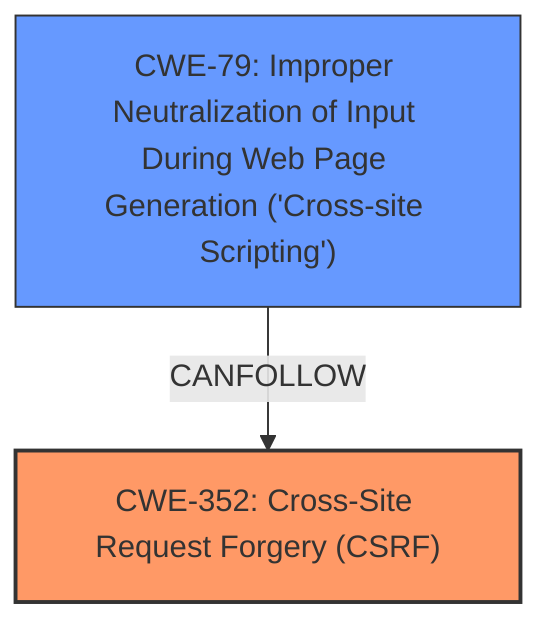

# Analysis Report for CVE-2024-49229

# Vulnerability Analysis Report: CVE-2024-49229

## Description

Cross-Site Request Forgery (CSRF) vulnerability in Arif Nezami Better Author Bio allows Cross-Site Scripting (XSS).This issue affects Better Author Bio from n/a through 2.7.10.11.

## Vulnerability Description Key Phrases

- **Rootcause:** lack of CSRF protection
- **Weakness:** cross-site scripting
- **Product:** Arif Nezami Better Author Bio
- **Version:** n/a through 2.7.10.11

## Analysis (with Relationship Data)

# Summary
| CWE ID | CWE Name | Confidence | CWE Abstraction Level | CWE Vulnerability Mapping Label | CWE-Vulnerability Mapping Notes |
|---|---|---|---|---|---|
| CWE-352 | Cross-Site Request Forgery (CSRF) | 1.0 | Compound | Primary | Allowed |
| CWE-79 | Improper Neutralization of Input During Web Page Generation ('Cross-site Scripting') | 1.0 | Base | Secondary | Allowed |

## Evidence and Confidence

*   **Confidence Score:** 1.0
*   **Evidence Strength:** HIGH

## Relationship Analysis
The primary weakness is the **lack of CSRF protection** which allows for other vulnerabilities to be exploited. In this case, it enables Cross-Site Scripting (XSS). CWE-352 is a compound weakness that represents the **lack of CSRF protection**. CWE-79 represents the **cross-site scripting** that is a result of the lack of CSRF protection.



## Vulnerability Chain
The vulnerability chain starts with the **lack of CSRF protection (CWE-352)**, which allows an attacker to forge requests on behalf of a user. This **leads to cross-site scripting (CWE-79)** because the forged requests can inject malicious scripts into the web page.

## Summary of Analysis
The analysis is based on the vulnerability description, which clearly states that the root cause is the **lack of CSRF protection** and that the weakness leads to cross-site scripting.

The vulnerability description includes these key phrases:
- **rootcause:** **lack of CSRF protection**
- **weakness:** **cross-site scripting**

The CVE Reference Links Content Summary includes the following:

*   **Root cause of vulnerability:** The Better Author Bio WordPress plugin (versions <= 2.7.10.11) is vulnerable to Cross-Site Request Forgery (CSRF).
*   **Weaknesses/vulnerabilities present:**  The plugin lacks proper CSRF protection, allowing attackers to forge requests.

CWE-352 is a compound weakness, but it accurately represents the **lack of CSRF protection**, which is the root cause. CWE-79 is a base weakness and represents the cross-site scripting that is a result of the lack of CSRF protection. The selected CWEs are at the optimal level of specificity because they directly correspond to the root cause and the resulting weakness.

CWE-73, CWE-89, CWE-94, CWE-116, CWE-184, CWE-425, CWE-434, CWE-471, CWE-494, CWE-918 were considered but not used. These CWEs did not accurately represent the specific vulnerability described in the vulnerability description.


## CWE Relationship Analysis

Current CWEs represent these abstraction levels: .


### Vulnerability Chain Analysis

**Chain starting from CWE-89:**
- 89 (Improper Neutralization of Special Elements used in an SQL Command ('SQL Injection')) - ROOT


**Chain starting from CWE-471:**
- 471 (Modification of Assumed-Immutable Data (MAID)) - ROOT


### CWE Relationship Diagram

```mermaid
graph TD
    classDef primary fill:#f96,stroke:#333,stroke-width:2px
    classDef secondary fill:#69f,stroke:#333
    classDef tertiary fill:#9e9,stroke:#333
```


*Report generated on 2025-07-13 19:16:39*
