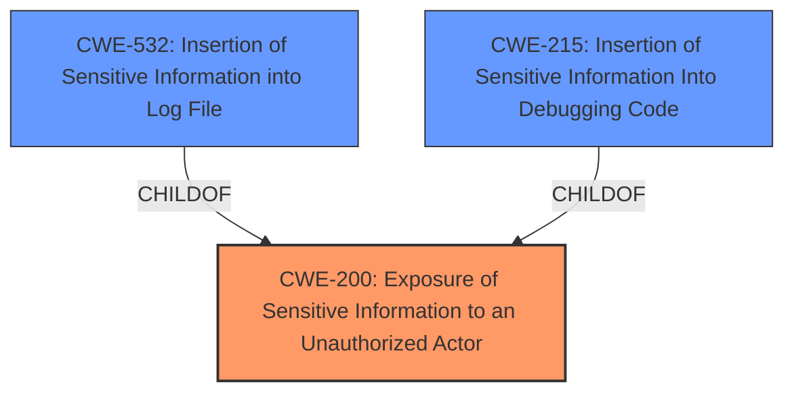

# Analysis Report for CVE-2024-49284

# Vulnerability Analysis Report: CVE-2024-49284

## Description

Exposure of Sensitive Information to an Unauthorized Actor vulnerability in BogdanFix WP SendFox allows Retrieve Embedded Sensitive Data.This issue affects WP SendFox from n/a through 1.3.1.

## Vulnerability Description Key Phrases

- **Impact:** Exposure of Sensitive Information to an Unauthorized Actor
- **Vector:** Retrieve Embedded Sensitive Data
- **Product:** BogdanFix WP SendFox
- **Version:** n/a through 1.3.1

## Analysis (with Relationship Data)

# Summary

| CWE ID | CWE Name | Confidence | CWE Abstraction Level | CWE Vulnerability Mapping Label | CWE-Vulnerability Mapping Notes |
|---|---|---|---|---|---|
| CWE-200 | Exposure of Sensitive Information to an Unauthorized Actor | 0.9 | Class | Primary | Allowed-with-Review |

## Evidence and Confidence

*   **Confidence Score:** 0.9
*   **Evidence Strength:** HIGH

## Relationship Analysis
The primary relationship that impacted my decision was the parent-child relationship. CWE-200 is a class-level CWE, and while it is generally discouraged, it serves as a suitable starting point given the available information. There are more specific child CWEs of CWE-200 (like CWE-532 and CWE-215) that could be considered with more detailed evidence.



## Vulnerability Chain
The vulnerability chain is relatively simple: a **lack of proper access control** leads directly to the **exposure of sensitive information**.

## Summary of Analysis
The vulnerability description clearly states "Exposure of Sensitive Information to an Unauthorized Actor vulnerability...allows Retrieve Embedded Sensitive Data." The CVE Reference Links Content Summary also highlights "**Sensitive Data Exposure**" as a key weakness. The description and summary both point towards a problem where sensitive information is being exposed.

The Retriever Results list CWE-200, "Exposure of Sensitive Information to an Unauthorized Actor", as the top candidate. While CWE-200 is a Class-level CWE and is generally discouraged, the provided information doesn't give enough specifics to select a more detailed Base or Variant CWE. It's a reasonable starting point for classification.

I considered other CWEs like CWE-532 (Insertion of Sensitive Information into Log File) and CWE-215 (Insertion of Sensitive Information Into Debugging Code), but there's no specific evidence to suggest that the sensitive information is being exposed through log files or debugging code. Thus, I am selecting CWE-200 as the primary CWE, as it accurately reflects the vulnerability based on the available information.


## CWE Relationship Analysis

Current CWEs represent these abstraction levels: .


### Vulnerability Chain Analysis

**Chain starting from CWE-215:**
- 215 (Insertion of Sensitive Information Into Debugging Code) - ROOT


**Chain starting from CWE-200:**
- 200 (Exposure of Sensitive Information to an Unauthorized Actor) - ROOT


### CWE Relationship Diagram

```mermaid
graph TD
    classDef primary fill:#f96,stroke:#333,stroke-width:2px
    classDef secondary fill:#69f,stroke:#333
    classDef tertiary fill:#9e9,stroke:#333
```


*Report generated on 2025-07-13 19:17:43*
