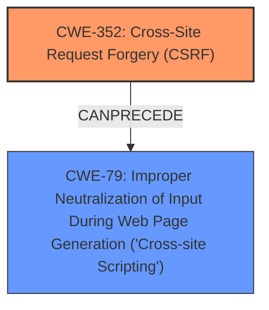

# Analysis for CVE-2024-49304

```markdown
# Summary
| CWE ID | CWE Name | Confidence | CWE Abstraction Level | CWE Vulnerability Mapping Label | CWE-Vulnerability Mapping Notes |
|---|---|---|---|---|---|
| CWE-352 | Cross-Site Request Forgery (CSRF) | 0.9 | Compound | Primary | Allowed |
| CWE-79 | Improper Neutralization of Input During Web Page Generation ('Cross-site Scripting') | 0.8 | Base | Secondary | Allowed |

## Evidence and Confidence

*   **Confidence Score:** 0.85
*   **Evidence Strength:** MEDIUM

## Relationship Analysis
The primary weakness is **CWE-352 [Cross-Site Request Forgery (CSRF)]**, which involves the application's inability to verify if a request was intentionally provided by the user. The secondary weakness, **CWE-79 [Improper Neutralization of Input During Web Page Generation ('Cross-site Scripting')]**, arises because the application does not properly neutralize user-controllable input, leading to stored XSS. These two CWEs are related because a successful CSRF attack can be used to inject malicious code, which then manifests as stored XSS due to the improper neutralization.



## Vulnerability Chain
The vulnerability chain starts with **CWE-352 [Cross-Site Request Forgery (CSRF)]**, where the application fails to verify the origin of the request. An attacker can then use this to inject malicious input. This input is not properly neutralized by the application, leading to **CWE-79 [Improper Neutralization of Input During Web Page Generation ('Cross-site Scripting')]**, and resulting in Stored XSS.

CWE-352 (Root Cause) -> CWE-79 (Impact)

## Summary of Analysis
The analysis is based on the provided vulnerability description, which explicitly mentions **Cross-Site Request Forgery** and Stored **XSS**. The description highlights that the application "does not sufficiently verify whether a well-formed, valid, consistent request was intentionally provided by the user" which directly aligns with the definition of **CWE-352 [Cross-Site Request Forgery (CSRF)]**. Furthermore, the **XSS** portion is explained by the lack of neutralization, leading to **CWE-79 [Improper Neutralization of Input During Web Page Generation ('Cross-site Scripting')]**.

The relationship between **CWE-352 [Cross-Site Request Forgery (CSRF)]** and **CWE-79 [Improper Neutralization of Input During Web Page Generation ('Cross-site Scripting')]** influenced the final selection, as the CSRF allows for the injection of malicious code, which is then executed due to the lack of proper neutralization. The selected CWEs are at the optimal level of specificity, as they directly address the root cause and the resulting impact of the vulnerability.
```