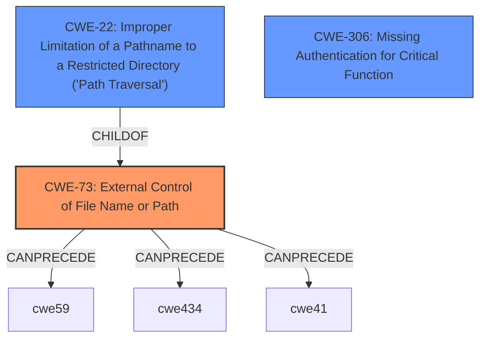

# Analysis for CVE-2024-49381

# Summary
| CWE ID | CWE Name | Confidence | CWE Abstraction Level | CWE Vulnerability Mapping Label | CWE-Vulnerability Mapping Notes |
|---|---|---|---|---|---|
| CWE-73 | External Control of File Name or Path | 1.0 | Base | Allowed | Primary CWE. The product uses external input to construct a pathname that is then used to delete a file. |
| CWE-22 | Improper Limitation of a Pathname to a Restricted Directory ('Path Traversal') | 0.7 | Base | Allowed | Secondary CWE. The file path is not properly restricted, allowing deletion of files outside the intended directory. |
| CWE-306 | Missing Authentication for Critical Function | 0.6 | Base | Allowed | Secondary CWE. No authentication is required to access the `/postLocal` endpoint. |

## Evidence and Confidence

*   **Confidence Score:** 0.8
*   **Evidence Strength:** HIGH

## Relationship Analysis
The primary weakness is CWE-73, as the file path is externally controlled. CWE-22 is a child of CWE-73 and represents a more specific case of path traversal, where the external control allows access outside a restricted directory. CWE-306 is related, as the absence of authentication allows anyone to trigger the file deletion. These relationships help to understand the vulnerability chain and the level of specificity required for each CWE.

## Vulnerability Chain
The vulnerability chain starts with **CWE-306: Missing Authentication for Critical Function**, allowing an attacker to access the `/postLocal` endpoint. Then, **CWE-73: External Control of File Name or Path** allows the attacker to specify the file path to be deleted. Finally, **CWE-22: Improper Limitation of a Pathname to a Restricted Directory ('Path Traversal')** allows the attacker to delete files outside the intended directory, leading to information loss.

## Summary of Analysis
The initial analysis identified the **arbitrary file write deletion** vulnerability as the root cause. The retriever results suggested several CWEs, including CWE-23, CWE-22, CWE-59, and CWE-434. After reviewing the CWE specifications and considering the vulnerability details, CWE-73 was chosen as the primary CWE because it directly addresses the external control of the file path.

The evidence from the CVE Reference Links Content Summary supports this selection: "Specifically, the code processes a 'delete' action from a JSON payload without proper sanitization or checks on the file path... It uses `filepath.Join(currentDir, change.File)` but since `change.File` can be set by the user, it can point to any file in the current directory or any sub-directories." This clearly demonstrates that the file path is controlled by external input.

CWE-22 was considered as a secondary CWE because the external control of the file path allows traversal outside the intended directory. CWE-306 was also considered because there is no authentication required to access the vulnerable endpoint.

The selected CWEs are at the optimal level of specificity because they accurately represent the **weakness** and its contributing factors. CWE-73 captures the root cause, while CWE-22 and CWE-306 provide additional context.

Relevant CWE Information:
- CWE-73: External Control of File Name or Path
- CWE-22: Improper Limitation of a Pathname to a Restricted Directory ('Path Traversal')
- CWE-306: Missing Authentication for Critical Function