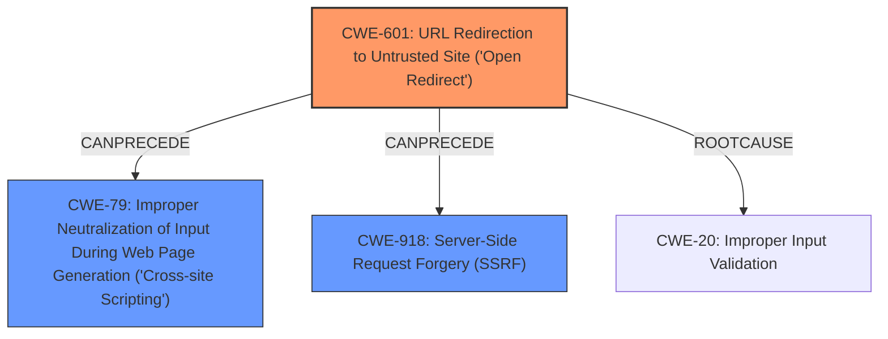

# Enhanced Analysis for CVE-2024-4940

# Summary
| CWE ID | CWE Name | Confidence | CWE Abstraction Level | CWE Vulnerability Mapping Label | CWE-Vulnerability Mapping Notes |
|---|---|---|---|---|---|
| CWE-601 | URL Redirection to Untrusted Site ('Open Redirect') | 1.0 | Base | Primary | Allowed |
| CWE-79 | Improper Neutralization of Input During Web Page Generation ('Cross-site Scripting') | 0.7 | Base | Secondary | Allowed |
| CWE-918 | Server-Side Request Forgery (SSRF) | 0.6 | Base | Secondary | Allowed |

## Evidence and Confidence

*   **Confidence Score:** 0.9
*   **Evidence Strength:** HIGH

## Relationship Analysis
The primary CWE is CWE-601, which directly addresses the **open redirect** vulnerability. Secondary CWEs like CWE-79 and CWE-918 are potential consequences of the **open redirect**, as an attacker can redirect users to malicious sites that execute scripts or initiate server-side requests. These secondary weaknesses are related to the initial **improper input validation** that allows the **open redirect** in the first place.



## Vulnerability Chain
1.  **Root Cause:** **Improper Input Validation** allows for the manipulation of URLs.
2.  **Primary Weakness:** **Open Redirect** (CWE-601) due to the lack of proper validation of user-supplied input in the handling of URLs.
3.  **Potential Impacts:**
    *   **Cross-site Scripting** (CWE-79) if the redirected URL contains malicious scripts.
    *   **Server-Side Request Forgery** (CWE-918) if the redirected URL triggers requests to internal resources.
    *   Phishing attacks.

The vulnerability chain starts with **improper input validation**, leading to an **open redirect**, which can then be leveraged for **cross-site scripting**, **server-side request forgery**, or phishing attacks.

## Summary of Analysis
The analysis identifies CWE-601 as the primary weakness because the vulnerability description explicitly states that the application allows an attacker to redirect users to arbitrary websites due to **improper validation** of user-supplied input. This aligns perfectly with the CWE-601 description: "The web application accepts a user-controlled input that specifies a link to an external site, and uses that link in a redirect."

Secondary weaknesses, such as CWE-79 and CWE-918, are potential consequences of the **open redirect**. If an attacker redirects a user to a malicious site, they could potentially inject scripts (CWE-79) or trigger server-side requests (CWE-918). However, these are downstream effects and not the primary weakness.

CWE-20 (**Improper Input Validation**) is a high-level class that describes the root cause. However, CWE-601 is more specific and accurately reflects the vulnerability.

The retriever scores support the selection of CWE-601, CWE-79, and CWE-918 as relevant to the vulnerability.

The selection of CWE-601 as the primary CWE is at the optimal level of specificity, as it directly addresses the **open redirect** vulnerability described in the report.

Relevant CWE Information:

# Enhanced Context (25 CWEs)
The following CWEs were identified as potentially relevant to this vulnerability:

## CWE-74: Improper Neutralization of Special Elements in Output Used by a Downstream Component ('Injection')
**Abstraction Level**: Class
**Similarity Score**: 0.74
**Source**: dense

**Description**:
The product constructs all or part of a command, data structure, or record using externally-influenced input from an upstream component, but it does not neutralize or incorrectly neutralizes special elements that could modify how it is parsed or interpreted when it is sent to a downstream component.

**Mapping Guidance**:
- Usage: Discouraged
- Rationale: CWE-74 is high-level and often misused when lower-level weaknesses are more appropriate.

*Not Used:* While injection is a potential consequence, the primary issue is the **open redirect**, making CWE-601 a more appropriate choice.

## CWE-451: User Interface (UI) Misrepresentation of Critical Information
**Abstraction Level**: Class
**Similarity Score**: 0.74
**Source**: dense

**Description**:
The user interface (UI) does not properly represent critical information to the user, allowing the information - or its source - to be obscured or spoofed. This is often a component in phishing attacks.

**Mapping Guidance**:
- Usage: Allowed-with-Review
- Rationale: This CWE entry is a Class and might have Base-level children that would be more appropriate

*Not Used:* While related to phishing, the core issue is the **open redirect**, not a UI misrepresentation.

## CWE-138: Improper Neutralization of Special Elements
**Abstraction Level**: Class
**Similarity Score**: 0.73
**Source**: dense

**Description**:
The product receives input from an upstream component, but it does not neutralize or incorrectly neutralizes special elements that could be interpreted as control elements or syntactic markers when they are sent to a downstream component.

**Mapping Guidance**:
- Usage: Discouraged
- Rationale: This CWE entry is a level-1 Class (i.e., a child of a Pillar). It might have lower-level children that would be more appropriate

*Not Used:* This is a general class, and CWE-601 is more specific to the **open redirect** vulnerability.

## CWE-80: Improper Neutralization of Script-Related HTML Tags in a Web Page (Basic XSS)
**Abstraction Level**: Variant
**Similarity Score**: 0.73
**Source**: dense

**Description**:
The product receives input from an upstream component, but it does not neutralize or incorrectly neutralizes special characters such as "<", ">", and "&" that could be interpreted as web-scripting elements when they are sent to a downstream component that processes web pages.

**Mapping Guidance**:
- Usage: Allowed
- Rationale: This CWE entry is at the Variant level of abstraction, which is a preferred level of abstraction for mapping to the root causes of vulnerabilities.

*Not Used:* While XSS is a potential consequence, it's not the primary weakness.

## CWE-116: Improper Encoding or Escaping of Output
**Abstraction Level**: Class
**Similarity Score**: 0.72
**Source**: dense

**Description**:
The product prepares a structured message for communication with another component, but encoding or escaping of the data is either missing or done incorrectly. As a result, the intended structure of the message is not preserved.

**Mapping Guidance**:
- Usage: Allowed-with-Review
- Rationale: This CWE entry is a Class and might have Base-level children that would be more appropriate

*Not Used:* The vulnerability is not related to improper encoding or escaping of output.

## CWE-941: Incorrectly Specified Destination in a Communication Channel
**Abstraction Level**: Base
**Similarity Score**: 0.72
**Source**: dense

**Description**:
The product creates a communication channel to initiate an outgoing request to an actor, but it does not correctly specify the intended destination for that actor.

**Mapping Guidance**:
- Usage: Allowed
- Rationale: This CWE entry is at the Base level of abstraction, which is a preferred level of abstraction for mapping to the root causes of vulnerabilities.

*Not Used:* Not directly related to the **open redirect**.

## CWE-346: Origin Validation Error
**Abstraction Level**: Class
**Similarity Score**: 0.72
**Source**: dense

**Description**:
The product does not properly verify that the source of data or communication is valid.

**Mapping Guidance**:
- Usage: Allowed-with-Review
- Rationale: This CWE entry is a Class and might have Base-level children that would be more appropriate

*Not Used:* While origin validation is a type of input validation, CWE-601 is more specific to the **open redirect**.

## CWE-668: Exposure of Resource to Wrong Sphere
**Abstraction Level**: Class
**Similarity Score**: 0.72
**Source**: dense

**Description**:
The product exposes a resource to the wrong control sphere, providing unintended actors with inappropriate access to the resource.

**Mapping


## CWE Relationship Analysis

Current CWEs represent these abstraction levels: .


### Vulnerability Chain Analysis

**Chain starting from CWE-116:**
- 116 (Improper Encoding or Escaping of Output) - ROOT


**Chain starting from CWE-80:**
- 80 (Improper Neutralization of Script-Related HTML Tags in a Web Page (Basic XSS)) - ROOT


### CWE Relationship Diagram

```mermaid
graph TD
    classDef primary fill:#f96,stroke:#333,stroke-width:2px
    classDef secondary fill:#69f,stroke:#333
    classDef tertiary fill:#9e9,stroke:#333
```