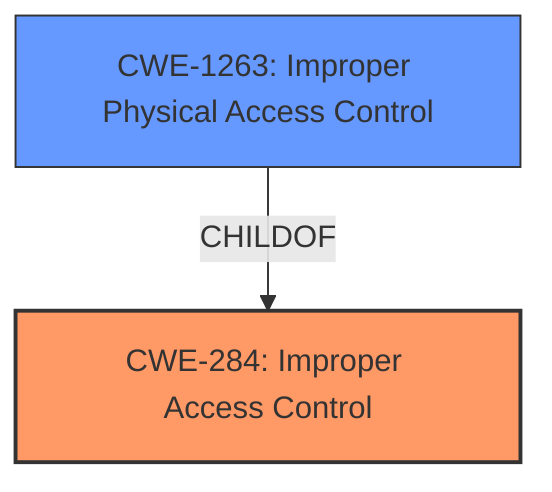

# Enhanced Analysis for CVE-2024-49403

# Summary
| CWE ID | CWE Name | Confidence | CWE Abstraction Level | CWE Vulnerability Mapping Label | CWE-Vulnerability Mapping Notes |
|---|---|---|---|---|---|
| CWE-284 | Improper Access Control | 1.0 | Pillar | Primary | Allowed |
| CWE-1263 | Improper Physical Access Control | 0.7 | Class | Secondary | Allowed-with-Review |

## Evidence and Confidence

*   **Confidence Score:** 0.9
*   **Evidence Strength:** HIGH

## Relationship Analysis
The primary CWE is CWE-284, which is a high-level category. However, the evidence points to a specific type of access control issue (physical access), so CWE-1263 is considered a more specific refinement. CWE-284 is a parent of many other CWEs, including those related to authentication and authorization, but these are not as relevant as physical access control in this case. The relationship between CWE-284 and CWE-1263 is that CWE-1263 provides more specific details.



## Vulnerability Chain
The vulnerability chain begins with **improper access control**, leading to unauthorized physical attackers being able to access recording files on the lock screen.

Improper Access Control -> Unauthorized Physical Access -> Access to Recording Files

## Summary of Analysis
The initial analysis identifies **improper access control** as the root cause of the vulnerability. The vulnerability description states "**Improper access control** in Samsung Voice Recorder prior to version 21.5.40.37 allows physical attackers to access recording files on the lock screen."

The Retriever Results identify CWE-284 (Improper Access Control) as the top candidate. Given the context of physical attackers gaining access, CWE-1263 (Improper Physical Access Control) is a more specific and relevant classification. While CWE-284 is a high-level category, it serves as a suitable starting point, with CWE-1263 providing greater granularity. The relationship analysis indicates that CWE-1263 is a child of CWE-284, reinforcing its suitability as a refinement.

The evidence directly supports the selection of CWE-284 as the primary CWE. The context of physical access further supports the inclusion of CWE-1263 as a secondary, more specific CWE.

Relevant CWE Information:

# Enhanced Context (25 CWEs)
The following CWEs were identified as potentially relevant to this vulnerability:

## CWE-284: Improper Access Control
**Abstraction Level**: Pillar
**Similarity Score**: 0.160
**Source**: sparse

**Description**:
The software does not restrict access to resources (files, data, memory, services, etc.) to only those authorized users or programs that are allowed to have such access.

**Mapping Guidance**:
- Usage: Discouraged
- Rationale: This is a very general category. It is better to select a more specific child.

## CWE-1263: Improper Physical Access Control
**Abstraction Level**: Class
**Similarity Score**: 0.145
**Source**: sparse

**Description**:
The physical security mechanisms used to control access to resources are either missing or ineffective.

**Mapping Guidance**:
- Usage: Allowed-with-Review
- Rationale: This CWE entry is a Class and might have Base-level children that would be more appropriate

## Technical Explanation for CWE-284: Improper Access Control
*   **How the vulnerability's details match the CWE's characteristics:** The Samsung Voice Recorder does not properly restrict access to recording files, allowing unauthorized physical access.
*   **The security implications and potential impact:** Physical attackers can access sensitive recording files.
*   **Any parent-child relationships or chain patterns that influenced your mapping:** CWE-284 is a high-level category, but the specific context allows for a more detailed child CWE.
*   **Whether the weakness is primary or secondary in the vulnerability:** Primary.
*   **How the official MITRE mapping guidance influenced your decision:** The guidance suggests selecting a more specific child, which leads to the consideration of CWE-1263.

## Technical Explanation for CWE-1263: Improper Physical Access Control
*   **How the vulnerability's details match the CWE's characteristics:** The vulnerability specifically involves physical access to the device.
*   **The security implications and potential impact:** Physical attackers can bypass the lock screen to access recording files.
*   **Any parent-child relationships or chain patterns that influenced your mapping:** CWE-1263 is a child of CWE-284.
*   **Whether the weakness is primary or secondary in the vulnerability:** Secondary.
*   **How the official MITRE mapping guidance influenced your decision:** The retriever results identify CWE-1263 for consideration.

## CWEs Considered But Not Used:
*   CWE-287 (Improper Authentication), CWE-285 (Improper Authorization): These are related to authentication and authorization issues, but the primary issue is **improper access control**, specifically related to physical access. The problem is not about authenticating a user or authorizing their actions after authentication.
*   CWE-200 (Exposure of Sensitive Information to an Unauthorized Actor): While sensitive information is exposed, the root cause is the **improper access control** that allows the exposure to occur in the first place.
*   CWE-306 (Missing Authentication for Critical Function): There is no indication that authentication is missing, just that the access control is not working as intended.


## CWE Relationship Analysis

Current CWEs represent these abstraction levels: .


### Vulnerability Chain Analysis

**Chain starting from CWE-306:**
- 306 (Missing Authentication for Critical Function) - ROOT


**Chain starting from CWE-285:**
- 285 (Improper Authorization) - ROOT


### CWE Relationship Diagram

```mermaid
graph TD
    classDef primary fill:#f96,stroke:#333,stroke-width:2px
    classDef secondary fill:#69f,stroke:#333
    classDef tertiary fill:#9e9,stroke:#333
```