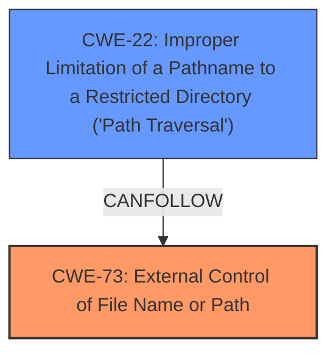

# Raw Analyzer Response for CVE-2024-4941

# Summary
| CWE ID    | CWE Name                                                                  | Confidence | CWE Abstraction Level | CWE Vulnerability Mapping Label | CWE-Vulnerability Mapping Notes |
| :---------- | :------------------------------------------------------------------------ | :--------- | :---------------------- | :------------------------------ | :------------------------------ |
| CWE-73      | External Control of File Name or Path                                     | 0.9        | Base                    | Primary                         | Allowed                         |
| CWE-22      | Improper Limitation of a Pathname to a Restricted Directory ('Path Traversal') | 0.7       | Base                    | Secondary                       | Allowed                         |

## Evidence and Confidence

*   **Confidence Score:** 0.8
*   **Evidence Strength:** HIGH

## Relationship Analysis
The primary CWE is CWE-73, which indicates that the vulnerability stems from allowing user input to control file names or paths. CWE-22 is a related CWE because path traversal could be a way to exploit the external control of the file name or path. However, the description does not explicitly state path traversal is occurring, thus CWE-22 is a secondary mapping. Both CWEs are at the Base level of abstraction, which is preferred.

## Vulnerability Chain
The vulnerability chain starts with **improper input validation**, which leads to **external control of the file name or path**, resulting in a **local file inclusion vulnerability** where an attacker can **read files on the remote system**.

## Summary of Analysis
The analysis is based on the provided evidence, particularly the **Vulnerability Description Key Phrases**. The **root cause** is identified as "**improper input validation**" and "**local file inclusion vulnerability**", which allows external control of file paths.

The vulnerability description states: "A **local file inclusion vulnerability** exists in the JSON component of gradio-app/gradio version 4.25. The vulnerability arises from **improper input validation** in the `postprocess()` function within `gradio/components/json_component.py`, where a user-controlled string is parsed as JSON. If the parsed JSON object contains a `path` key, the specified file is moved to a temporary directory, making it possible to retrieve it later via the `/file=..` endpoint."

Given that the user-controlled string is parsed as JSON and if it contains a `path` key, the file is moved to a temporary directory, making it possible to retrieve it later. This aligns with CWE-73: External Control of File Name or Path, because user-controlled input directly influences the file path. While path traversal (CWE-22) is possible, it is not explicitly mentioned. Therefore, CWE-73 is the primary CWE and CWE-22 is secondary.

The selected CWEs are at the optimal level of specificity as they are Base-level CWEs that accurately represent the weakness described in the vulnerability description.

Relevant CWE Information:

# Enhanced Context (25 CWEs)
The following CWEs were identified as potentially relevant to this vulnerability:

## CWE-73: External Control of File Name or Path
**Abstraction Level**: Base
**Similarity Score**: 0.74
**Source**: dense

**Description**:
The product allows user input to control or influence paths or file names that are used in filesystem operations.

**Mapping Guidance**:
- Usage: Allowed
- Rationale: This CWE entry is at the Base level of abstraction, which is a preferred level of abstraction for mapping to the root causes of vulnerabilities.

## CWE-22: Improper Limitation of a Pathname to a Restricted Directory ('Path Traversal')
**Abstraction Level**: Base
**Similarity Score**: 4200.60
**Source**: sparse

**Description**:
The product uses external input to construct a pathname that is intended to identify a file or directory that is located underneath a restricted parent directory, but the product does not properly neutralize special elements within the pathname that can cause the pathname to resolve to a location that is outside of the restricted directory.

**Mapping Guidance**:
- Usage: Allowed
- Rationale: This CWE entry is at the Base level of abstraction, which is a preferred level of abstraction for mapping to the root causes of vulnerabilities.