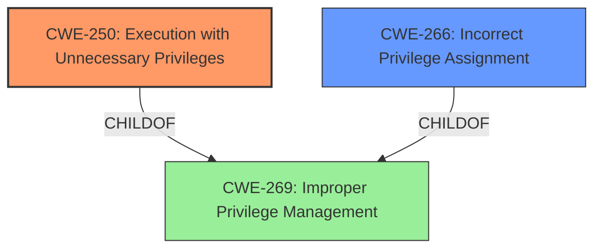

# Analysis Report for CVE-2024-4944

# Vulnerability Analysis Report: CVE-2024-4944

## Description

A local privilege escalation vlnerability in the WatchGuard Mobile VPN with SSL client on Windows enables a local user to execute arbitrary commands with elevated privileged.

## Vulnerability Description Key Phrases

- **Impact:** ['execute arbitrary commands with elevated privileged', 'privilege escalation']
- **Attacker:** local user
- **Product:** WatchGuard Mobile VPN with SSL client

## Analysis (with Relationship Data)

# Summary
| CWE ID | CWE Name | Confidence | CWE Abstraction Level | CWE Vulnerability Mapping Label | CWE-Vulnerability Mapping Notes |
|---|---|---|---|---|---|
| CWE-250 | Execution with Unnecessary Privileges | 0.8 | Base | Primary CWE | Allowed |
| CWE-266 | Incorrect Privilege Assignment | 0.6 | Base | Secondary Candidate | Allowed |
| CWE-269 | Improper Privilege Management | 0.4 | Class | Secondary Candidate | Discouraged |

## Evidence and Confidence

*   **Confidence Score:** 0.8
*   **Evidence Strength:** MEDIUM

## Relationship Analysis
The primary relationship that influenced my decision was the parent-child relationship, particularly in the context of privileges. The retriever results suggested CWE-269 (Improper Privilege Management), but the mapping guidance discourages its use because it's too high-level. Instead, it suggests using CWE-266 (Incorrect Privilege Assignment) or CWE-250 (Execution with Unnecessary Privileges) if the root cause is known. Based on the vulnerability description, a local user can execute arbitrary commands with elevated privileges, suggesting that the program is running with higher privileges than necessary. This aligns with CWE-250.



## Vulnerability Chain
The vulnerability chain starts with the WatchGuard Mobile VPN with SSL client running with unnecessary privileges (CWE-250). This allows a local user with low privileges to execute arbitrary commands with elevated privileges, leading to a **privilege escalation** impact.

## Summary of Analysis
The initial assessment considered CWE-269 due to the mention of **privilege escalation**. However, the MITRE mapping guidance discourages using CWE-269 directly and suggests identifying the root cause. The evidence shows that the WatchGuard Mobile VPN with SSL client allows a local user to execute commands with elevated privileges. The client is likely running with more privileges than it needs, making CWE-250 (Execution with Unnecessary Privileges) the most appropriate primary CWE. CWE-266 is a possible but less likely secondary candidate; it would apply if the user were explicitly assigned the wrong privileges.

The vulnerability description mentions a local privilege escalation vulnerability, which could indicate that the application is running with higher privileges than necessary (CWE-250) or that the application incorrectly assigns privileges (CWE-266).

Relevant CWE Information:

# Enhanced Context (25 CWEs)
The following CWEs were identified as potentially relevant to this vulnerability:

## CWE-250: Execution with Unnecessary Privileges
**Abstraction Level**: Base
**Similarity Score**: 0.75
**Source**: dense

**Description**:
The product performs an operation at a privilege level that is higher than the minimum level required, which creates new weaknesses or amplifies the consequences of other weaknesses.

**Mapping Guidance**:
- Usage: Allowed
- Rationale: This CWE entry is at the Base level of abstraction, which is a preferred level of abstraction for mapping to the root causes of vulnerabilities.

## CWE-266: Incorrect Privilege Assignment
**Abstraction Level**: Base
**Similarity Score**: 0.79
**Source**: dense

**Description**:
A product incorrectly assigns a privilege to a particular actor, creating an unintended sphere of control for that actor.

**Mapping Guidance**:
- Usage: Allowed
- Rationale: This CWE entry is at the Base level of abstraction, which is a preferred level of abstraction for mapping to the root causes of vulnerabilities.

## CWE-269: Improper Privilege Management
**Abstraction Level**: Class
**Similarity Score**: 1753.73
**Source**: sparse

**Description**:
The product does not properly assign, modify, track, or check privileges for an actor, creating an unintended sphere of control for that actor.

**Mapping Guidance**:
- Usage: Discouraged
- Rationale: CWE-269 is commonly misused. It can be conflated with "privilege escalation," which is a technical impact that is listed in many low-information vulnerability reports [REF-1287]. It is not useful for trend analysis.

The "Vulnerability Description Key Phrases" mentions "execute arbitrary commands with elevated privileged" and "privilege escalation". The "CVE Reference Links Content Summary" confirms the root cause is a local privilege escalation vulnerability. This evidence supports the selection of CWE-250.


## CWE Relationship Analysis

Current CWEs represent these abstraction levels: .


### Vulnerability Chain Analysis

**Chain starting from CWE-266:**
- 266 (Incorrect Privilege Assignment) - ROOT


**Chain starting from CWE-269:**
- 269 (Improper Privilege Management) - ROOT


### CWE Relationship Diagram

```mermaid
graph TD
    classDef primary fill:#f96,stroke:#333,stroke-width:2px
    classDef secondary fill:#69f,stroke:#333
    classDef tertiary fill:#9e9,stroke:#333
```


*Report generated on 2025-07-13 19:25:25*
