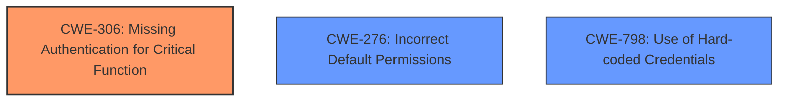

# Enhanced Analysis for CVE-2024-49504

# Summary
| CWE ID | CWE Name | Confidence | CWE Abstraction Level | CWE Vulnerability Mapping Label | CWE-Vulnerability Mapping Notes |
|---|---|---|---|---|---|
| **CWE-306** | **Missing Authentication for Critical Function** | 0.6 | Base | Primary | Allowed |
| CWE-276 | Incorrect Default Permissions | 0.3 | Base | Secondary | Allowed |
| CWE-798 | Use of Hard-coded Credentials | 0.3 | Base | Secondary | Allowed |

## Evidence and Confidence

*   **Confidence Score:** 0.6
*   **Evidence Strength:** LOW

## Relationship Analysis
The primary relationship considered was the ChildOf relationship, particularly how CWE-306 (Missing Authentication for Critical Function) falls under CWE-287 (Improper Authentication). However, given the limited information, the base CWE-306 was deemed more appropriate. Other potential relationships, such as those involving credential-related weaknesses, were considered but ultimately not selected due to lack of specific evidence.



## Vulnerability Chain
The vulnerability chain, based on available information, starts with **missing authentication** (**CWE-306**), which allows an attacker to access the grub shell. This access then leads to the **impact:** accessing files on encrypted disks.

## Summary of Analysis
The analysis is heavily constrained by the lack of detailed information about the vulnerability, as the CVE reference link requires authentication. The primary selection, CWE-306 (Missing Authentication for Critical Function), is based on the description indicating that attackers with access to the grub shell can access files on encrypted disks. This suggests a failure to properly authenticate access to critical functions within grub2.

The selection of CWE-306 is based on the sparse retriever result and the vulnerability description: "grub2 allowed attackers with access to the grub shell to access files on the encrypted disks."

Several other CWEs were considered but ultimately not chosen due to insufficient evidence. For example, while credential-related CWEs like CWE-798 (Use of Hard-coded Credentials) and CWE-321 (Use of Hard-coded Cryptographic Key) were considered, there's no direct evidence of hard-coded credentials being the root cause. Similarly, CWE-276 (Incorrect Default Permissions) was considered as a potential secondary weakness, but the primary issue appears to be the missing authentication step.

Relevant CWE Information:

# Enhanced Context (25 CWEs)
The following CWEs were identified as potentially relevant to this vulnerability:

## CWE-276: Incorrect Default Permissions
**Abstraction Level**: Base
**Similarity Score**: 0.71
**Source**: dense

**Description**:
During installation, installed file permissions are set to allow anyone to modify those files.

**Mapping Guidance**:
- Usage: Allowed
- Rationale: This CWE entry is at the Base level of abstraction, which is a preferred level of abstraction for mapping to the root causes of vulnerabilities.

*Technical Explanation:* Could be related to how grub2 is installed and configured, leading to insecure defaults allowing access to the grub shell.
*Security Implications:* Attackers could exploit misconfigured permissions to gain unauthorized access.
*Relationship Analysis:* This CWE could be a contributing factor, but not the primary cause. It might describe how attackers initially gain access to the grub shell.

## CWE-1391: Use of Weak Credentials
**Abstraction Level**: Class
**Similarity Score**: 0.68
**Source**: dense

**Description**:
The product uses weak credentials (such as a default key or hard-coded password) that can be calculated, derived, reused, or guessed by an attacker.

**Mapping Guidance**:
- Usage: Allowed-with-Review
- Rationale: This CWE entry is a Class and might have Base-level children that would be more appropriate

*Technical Explanation:* If the grub shell uses weak or default credentials, it could allow unauthorized access.
*Security Implications:* Attackers could easily bypass authentication using known or easily guessed credentials.
*Relationship Analysis:* While possible, there is no direct evidence to support this. It is a more generic weakness compared to missing authentication.

## CWE-267: Privilege Defined With Unsafe Actions
**Abstraction Level**: Base
**Similarity Score**: 0.68
**Source**: dense

**Description**:
A particular privilege, role, capability, or right can be used to perform unsafe actions that were not intended, even when it is assigned to the correct entity.

**Mapping Guidance**:
- Usage: Allowed
- Rationale: This CWE entry is at the Base level of abstraction, which is a preferred level of abstraction for mapping to the root causes of vulnerabilities.

*Technical Explanation:* Possibly related if certain grub shell privileges inadvertently allow access to encrypted disks.
*Security Implications:* Users with specific privileges could perform unintended actions, compromising the system.
*Relationship Analysis:* Could be a contributing factor, but the description points more directly to missing authentication.

## CWE-538: Insertion of Sensitive Information into Externally-Accessible File or Directory
**Abstraction Level**: Base
**Similarity Score**: 0.68
**Source**: dense

**Description**:
The product places sensitive information into files or directories that are accessible to actors who are allowed to have access to the files, but not to the sensitive information.

**Mapping Guidance**:
- Usage: Allowed
- Rationale: This CWE entry is at the Base level of abstraction, which is a preferred level of abstraction for mapping to the root causes of vulnerabilities.

*Technical Explanation:* Not directly applicable, as the vulnerability focuses on access to encrypted disks rather than exposure of sensitive information.
*Security Implications:* Sensitive information could be exposed to unauthorized users.
*Relationship Analysis:* This CWE is not directly related to the vulnerability description.

## CWE-280: Improper Handling of Insufficient Permissions or Privileges
**Abstraction Level**: Base
**Similarity Score**: 0.68
**Source**: dense

**Description**:
The product does not handle or incorrectly handles when it has insufficient privileges to access resources or functionality as specified by their permissions. This may cause it to follow unexpected code paths that may leave the product in an invalid state.

**Mapping Guidance**:
- Usage: Allowed
- Rationale: This CWE entry is at the Base level of abstraction, which is a preferred level of abstraction for mapping to the root causes of vulnerabilities.

*Technical Explanation:* Not a primary factor. Focus is on the lack of authentication, rather than improper handling of privileges once accessed.
*Security Implications:* Product may enter an invalid state due to incorrect permission handling.
*Relationship Analysis:* Less relevant than missing authentication, as the issue is about gaining initial access.

## CWE-497: Exposure of Sensitive System Information to an Unauthorized Control Sphere
**Abstraction Level**: Base
**Similarity Score**: 0.68
**Source**: dense

**Description**:
The product does not properly prevent sensitive system-level information from being accessed by unauthorized actors who do not have the same level of access to the underlying system as the product does.

**Mapping Guidance**:
- Usage: Allowed
- Rationale: This CWE entry is at the Base level of abstraction, which is a preferred level of abstraction for mapping to the root causes of vulnerabilities.

*Technical Explanation:* Not directly related, as the description is about accessing encrypted disks, not exposing system information.
*Security Implications:* Sensitive system information can be accessed by unauthorized actors.
*Relationship Analysis:* This CWE does not fit the vulnerability's primary characteristic.

## CWE-321: Use of Hard-coded Cryptographic Key
**Abstraction Level**: Variant
**Similarity Score**: 0.67
**Source**: dense

**Description**:
The use of a hard-coded cryptographic key significantly increases the possibility that encrypted data may be recovered.

**Mapping Guidance**:
- Usage: Allowed
- Rationale: This CWE entry is at the Variant level of abstraction, which is a preferred level of abstraction for mapping to the root causes of vulnerabilities.

*Technical Explanation:* Could be a contributing factor if the encryption keys are hard-coded, but there is no direct evidence.
*Security Implications:* Encrypted data could be easily decrypted if keys are compromised.
*Relationship Analysis:* Less probable than missing authentication, given the information provided.

## CWE-522: Insufficiently Protected Credentials
**Abstraction Level**: Class
**Similarity Score**: 0.67
**Source**: dense

**Description**:
The product transmits or stores authentication credentials, but it uses an insecure method that is susceptible to unauthorized interception and/or retrieval.

**Mapping Guidance**:
- Usage: Allowed-with-Review
- Rationale: This CWE entry is a Class and might have Base-level children that would be more appropriate

*Technical Explanation:* If credentials are used to access the grub shell but are stored insecurely, this could contribute.
*Security Implications:* Credentials could be intercepted, leading to unauthorized access.
*Relationship Analysis:* Less direct than missing authentication


## CWE Relationship Analysis

Current CWEs represent these abstraction levels: .


### Vulnerability Chain Analysis

**Chain starting from CWE-321:**
- 321 (Use of Hard-coded Cryptographic Key) - ROOT


**Chain starting from CWE-280:**
- 280 (Improper Handling of Insufficient Permissions or Privileges ) - ROOT


### CWE Relationship Diagram

```mermaid
graph TD
    classDef primary fill:#f96,stroke:#333,stroke-width:2px
    classDef secondary fill:#69f,stroke:#333
    classDef tertiary fill:#9e9,stroke:#333
```