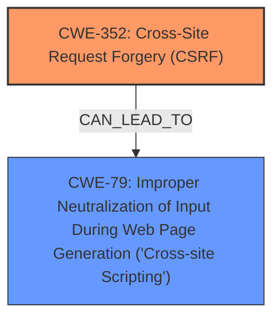

# Enhanced Analysis for CVE-2024-49605

# Summary
| CWE ID  | CWE Name                                                                | Confidence | CWE Abstraction Level | CWE Vulnerability Mapping Label | CWE-Vulnerability Mapping Notes |
| :-------- | :---------------------------------------------------------------------- | :--------- | :-------------------- | :------------------------------ | :------------------------------ |
| CWE-352   | Cross-Site Request Forgery (CSRF)                                     | 0.9        | Compound              | Primary                         | Allowed                         |
| CWE-79    | Improper Neutralization of Input During Web Page Generation ('Cross-site Scripting') | 0.8        | Base                  | Secondary                       | Allowed                         |

## Evidence and Confidence

*   **Confidence Score:** 0.85
*   **Evidence Strength:** MEDIUM

## Relationship Analysis
The primary relationship is that the **lack of CSRF protection** (CWE-352) allows for **XSS** (CWE-79). CWE-352 is a compound weakness, while CWE-79 is a base weakness. CWE-352 can lead to various impacts, including XSS if input validation is also missing. CWE-79 focuses on the **improper neutralization** of input, which is the direct cause of the **XSS** vulnerability.



## Vulnerability Chain
The vulnerability chain starts with the **lack of CSRF protection** (CWE-352). Because of this **lack of CSRF protection**, an attacker can trick a user into unknowingly making requests that inject malicious scripts. This leads to **improper neutralization of input** (CWE-79), resulting in Stored **XSS**.

## Summary of Analysis
The initial assessment identified both CWE-352 and CWE-79 as potential candidates based on the key phrases **lack of CSRF protection** and **XSS**. The final decision is to classify this as a combination of CWE-352 and CWE-79. The primary weakness is the **lack of CSRF protection** (CWE-352), which enables the **XSS** vulnerability (CWE-79) due to the **improper neutralization of input**.

The evidence from the vulnerability description is: "Cross-Site Request Forgery (CSRF) vulnerability in Avchat.Net AVChat Video Chat allows Stored **XSS**."

The graph relationships influenced the selection by clarifying the relationship between CSRF and **XSS**, where the **lack of CSRF protection** can enable **XSS** if input is not properly neutralized.

CWE-352 is at the Compound level, representing the **lack of CSRF protection**, while CWE-79 is at the Base level, representing the specific **improper neutralization of input** that leads to **XSS**. Both are at appropriate levels of specificity.

Other CWEs Considered and Rejected:

*   CWE-116: Improper Encoding or Escaping of Output - While encoding issues can contribute to **XSS**, the description emphasizes the **lack of CSRF protection** and the resulting **XSS**, making CWE-79 a more direct fit.
*   CWE-434: Unrestricted Upload of File with Dangerous Type - This is not relevant since the vulnerability is related to CSRF and XSS, not file uploads.
*   CWE-862: Missing Authorization - While authorization issues could be present, the description specifically highlights CSRF as the primary issue that enables **XSS**.
*   CWE-80: Improper Neutralization of Script-Related HTML Tags in a Web Page (Basic XSS) - While this is related to **XSS**, CWE-79 is more general and appropriately captures the weakness.
*   CWE-1004: Sensitive Cookie Without 'HttpOnly' Flag - This is not directly related to the **XSS** or CSRF described.
*   CWE-22: Improper Limitation of a Pathname to a Restricted Directory ('Path Traversal') - This is not related to the described vulnerability.
*   CWE-708: Incorrect Ownership Assignment - This is not related to the described vulnerability.


## CWE Relationship Analysis

Current CWEs represent these abstraction levels: .


### Vulnerability Chain Analysis

**Chain starting from CWE-116:**
- 116 (Improper Encoding or Escaping of Output) - ROOT


**Chain starting from CWE-862:**
- 862 (Missing Authorization) - ROOT


### CWE Relationship Diagram

```mermaid
graph TD
    classDef primary fill:#f96,stroke:#333,stroke-width:2px
    classDef secondary fill:#69f,stroke:#333
    classDef tertiary fill:#9e9,stroke:#333
```