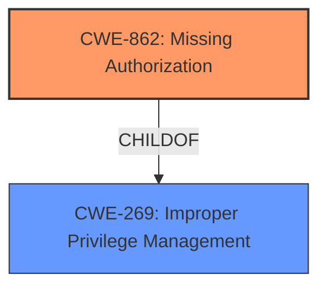

# Raw Analyzer Response for CVE-2024-49742

# Summary
| CWE ID | CWE Name | Confidence | CWE Abstraction Level | CWE Vulnerability Mapping Label | CWE-Vulnerability Mapping Notes |
|---|---|---|---|---|---|
| CWE-862 | Missing Authorization | 1.0 | Class | Primary CWE | Allowed-with-Review |
| CWE-269 | Improper Privilege Management | 0.7 | Class | Secondary Candidate | Discouraged |

## Evidence and Confidence

*   **Confidence Score:** 0.9
*   **Evidence Strength:** HIGH

## Relationship Analysis
The primary relationship influencing the decision is the parent-child relationship between CWE-287 (Improper Authentication) and CWE-862 (Missing Authorization), where CWE-862 is a more specific child. While CWE-269 (Improper Privilege Management) was considered, it is a higher-level class and its usage is discouraged. CWE-862 is more precise, directly reflecting the **missing permission check**.

## Vulnerability Chain
The vulnerability chain starts with the **missing permission check** (CWE-862), leading to a local escalation of privilege.
  - Root Cause: CWE-862 (Missing Authorization)
  - Impact: Local escalation of privilege

## Summary of Analysis
The analysis strongly points to CWE-862 (Missing Authorization) as the primary weakness. The vulnerability description explicitly states a "**missing permission check**" in the `onCreate` method of `NotificationAccessConfirmationActivity.java`, which directly aligns with the definition of CWE-862. This **missing check** allows an app with notification access to be hidden in Settings, leading to a local escalation of privilege.

The Retriever Results also list CWE-862 with a high score. While other CWEs like CWE-269 (Improper Privilege Management) and CWE-285 (Improper Authorization) were considered, they are less specific. CWE-269 is discouraged, and CWE-285 implies an existing authorization check that is performed incorrectly, which is not the case here.

The choice of CWE-862 is based on the direct evidence of a **missing permission check**, its alignment with the CWE definition, and the MITRE mapping guidance favoring specific CWEs over generic ones. The abstraction level (Class) is appropriate as there is no further specificity available in the provided context.

Relevant CWE Information:

# Enhanced Context (25 CWEs)
The following CWEs were identified as potentially relevant to this vulnerability:

## CWE-862: Missing Authorization
**Abstraction Level**: Class
**Similarity Score**: 1468.17
**Source**: sparse

**Description**:
The product does not perform an authorization check when an actor attempts to access a resource or perform an action.

**Mapping Guidance**:
- Usage: Allowed-with-Review
- Rationale: This CWE entry is a Class and might have Base-level children that would be more appropriate

## CWE-269: Improper Privilege Management
**Abstraction Level**: Class
**Similarity Score**: 1478.68
**Source**: sparse

**Description**:
The product does not properly assign, modify, track, or check privileges for an actor, creating an unintended sphere of control for that actor.

**Mapping Guidance**:
- Usage: Discouraged
- Rationale: CWE-269 is commonly misused. It can be conflated with "privilege escalation," which is a technical impact that is listed in many low-information vulnerability reports [REF-1287]. It is not useful for trend analysis.