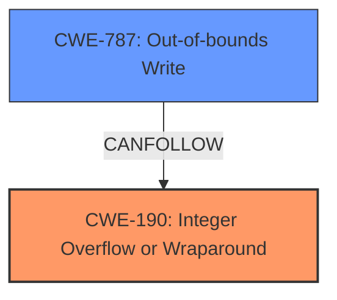

# Analysis Report for CVE-2024-49749

# Vulnerability Analysis Report: CVE-2024-49749

## Description

In DGifSlurp of dgif_lib.c, there is a possible **out of bounds write** due to an **integer overflow**. This could lead to remote code execution with no additional execution privileges needed. User interaction is not needed for exploitation.

## Vulnerability Description Key Phrases

- **Component:** DGifSlurp of dgif_lib.c
- **Rootcause:** integer overflow
- **Weakness:** out of bounds write
- **Impact:** remote code execution, out of bounds write

## Analysis (with Relationship Data)

# Summary
| CWE ID | CWE Name | Confidence | CWE Abstraction Level | CWE Vulnerability Mapping Label | CWE-Vulnerability Mapping Notes |
|---|---|---|---|---|---|
| **CWE-190** | **Integer Overflow or Wraparound** | 1.0 | Base | Primary | Allowed |
| CWE-787 | Out-of-bounds Write | 0.9 | Base | Secondary | Allowed |

## Evidence and Confidence

*   **Confidence Score:** 0.95
*   **Evidence Strength:** HIGH

## Relationship Analysis
The primary relationship is that the **Integer Overflow** can lead to an **Out-of-bounds Write**. CWE-190 is a Base level CWE, which is appropriate. CWE-787 is a base level CWE, which is appropriate. The chain relationship shows the progression of the vulnerability from the initial integer overflow to the final out-of-bounds write.



## Vulnerability Chain
The vulnerability chain starts with an **integer overflow** (CWE-190). This **integer overflow** then leads to an **out of bounds write** (CWE-787).

## Summary of Analysis
The vulnerability description clearly states that there is a possible **out of bounds write** due to an **integer overflow**. The CVE Reference Links Content Summary also points to the root cause being in the giflib library and the weakness being remote code execution. The retriever results identify CWE-190 and CWE-787 as potential matches.

The selection of CWE-190 as the primary CWE is based on the explicit mention of "**integer overflow**" as the root cause in the vulnerability description. The subsequent **out of bounds write** is a consequence of the overflow, making CWE-787 a secondary CWE.

The selected CWEs are at the optimal level of specificity. Both are at the Base level.

Relevant CWE Information:

# Enhanced Context (25 CWEs)
The following CWEs were identified as potentially relevant to this vulnerability:

## CWE-131: Incorrect Calculation of Buffer Size
**Abstraction Level**: Base
**Similarity Score**: 0.77
**Source**: dense

**Description**:
The product does not correctly calculate the size to be used when allocating a buffer, which could lead to a buffer overflow.

**Mapping Guidance**:
- Usage: Allowed
- Rationale: This CWE entry is at the Base level of abstraction, which is a preferred level of abstraction for mapping to the root causes of vulnerabilities.

## CWE-190: Integer Overflow or Wraparound
**Abstraction Level**: Base
**Similarity Score**: 1408.92
**Source**: sparse

**Description**:
The product performs a calculation that can produce an **integer overflow** or wraparound when the logic assumes that the resulting value will always be larger than the original value. This occurs when an integer value is incremented to a value that is too large to store in the associated representation. When this occurs, the value may become a very small or negative number.

**Mapping Guidance**:
- Usage: Allowed
- Rationale: This CWE entry is at the Base level of abstraction, which is a preferred level of abstraction for mapping to the root causes of vulnerabilities.

### CWE Selection:

*   **CWE-190: Integer Overflow or Wraparound**
    *   **Technical Explanation:** The vulnerability description explicitly mentions an "**integer overflow**" as the root cause. This aligns perfectly with the description of CWE-190, where a calculation results in a value exceeding the maximum storable value, leading to wraparound.
    *   **Security Implications:** Integer overflows can lead to unexpected program behavior, memory corruption, and potentially remote code execution.
    *   **Relationship Analysis:** CWE-190 can lead to CWE-787 (Out-of-bounds Write) because the wraparound can cause incorrect memory access calculations.
    *   **Mapping Guidance Influence:** The usage is "Allowed" and the rationale confirms that it's a preferred Base level of abstraction.
    *   **Primary/Secondary:** Primary, as it's the root cause.
*   **CWE-787: Out-of-bounds Write**
    *   **Technical Explanation:** The vulnerability description mentions a possible "**out of bounds write**" as the weakness. This aligns with CWE-787, where the product writes data past the end, or before the beginning, of the intended buffer.
    *   **Security Implications:** Out-of-bounds writes can overwrite critical program data or execute arbitrary code.
    *   **Relationship Analysis:** CWE-787 is a consequence of the **integer overflow** (CWE-190).
    *   **Mapping Guidance Influence:** Not explicitly in retriever results, but it aligns with the impact described.
    *   **Primary/Secondary:** Secondary, as it's a consequence of the integer overflow.

### CWEs Considered but Not Used:

*   **CWE-131: Incorrect Calculation of Buffer Size:** While related to buffer overflows, the root cause is an **integer overflow**, not an incorrect calculation of the buffer size itself. Therefore, CWE-131 is not as directly relevant.
*   **CWE-125: Out-of-bounds Read:** The description specifies an "**out of bounds write**," not a read.
*   **CWE-191: Integer Underflow:** The description specifies an **integer overflow**, not underflow.
*   **CWE-754: Improper Check for Unusual or Exceptional Conditions** The description doesn't imply a missing check, instead the arithmetic calculation that is flawed.
*   **CWE-863: Incorrect Authorization**: The description doesn't mention anything about incorrect authorization.


## CWE Relationship Analysis

Current CWEs represent these abstraction levels: .


### Vulnerability Chain Analysis

**Chain starting from CWE-863:**
- 863 (Incorrect Authorization) - ROOT


**Chain starting from CWE-125:**
- 125 (Out-of-bounds Read) - ROOT


### CWE Relationship Diagram

```mermaid
graph TD
    classDef primary fill:#f96,stroke:#333,stroke-width:2px
    classDef secondary fill:#69f,stroke:#333
    classDef tertiary fill:#9e9,stroke:#333
```


*Report generated on 2025-07-13 19:32:57*
