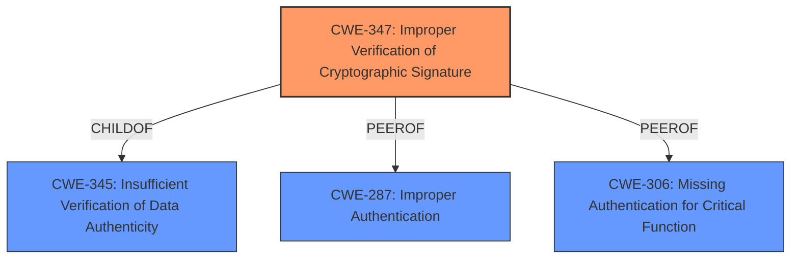

# Analysis Report for CVE-2024-49755

# Vulnerability Analysis Report: CVE-2024-49755

## Description

Duende IdentityServer is an OpenID Connect and OAuth 2.x framework for ASP.NET Core. IdentityServers local API authentication handler performs **insufficient validation of the cnf claim in DPoP access tokens**. This allows an attacker to use leaked DPoP access tokens at local api endpoints even without possessing the private key for signing proof tokens. Note that this only impacts custom endpoints within an IdentityServer implementation that have explicitly used the LocalApiAuthenticationHandler for authentication. This vulnerability is patched in IdentityServer 7.0.8. Version 6.3 and below are unaffected, as they do not support DPoP in Local APIs.

## Vulnerability Description Key Phrases

- **Rootcause:** insufficient validation of the cnf claim in DPoP access tokens
- **Impact:** use leaked DPoP access tokens at local api endpoints
- **Attacker:** attacker
- **Product:** Duende IdentityServer
- **Version:** prior to 7.0.8
- **Component:** IdentityServers local API authentication handler

## Analysis (with Relationship Data)

# Summary
| CWE ID | CWE Name | Confidence | CWE Abstraction Level | CWE Vulnerability Mapping Label | CWE-Vulnerability Mapping Notes |
|---|---|---|---|---|---|
| CWE-347 | Improper Verification of Cryptographic Signature | 0.9 | Base | Allowed | Primary CWE. The **root cause** is the **insufficient validation of the cnf claim in DPoP access tokens**, which involves cryptographic signatures. |
| CWE-287 | Improper Authentication | 0.7 | Class | Discouraged | Secondary candidate. The vulnerability involves a failure in authentication due to **insufficient validation**. However, CWE-347 is more specific. |
| CWE-306 | Missing Authentication for Critical Function | 0.6 | Base | Allowed | Secondary candidate. The vulnerability is due to **insufficient validation**, not a complete absence of authentication, making CWE-347 a better fit. |

## Evidence and Confidence

*   **Confidence Score:** 0.9
*   **Evidence Strength:** HIGH

## Relationship Analysis
The primary CWE is CWE-347 (Improper Verification of Cryptographic Signature). CWE-347 is a child of CWE-345 (Insufficient Verification of Data Authenticity), indicating a hierarchical relationship. CWE-287 (Improper Authentication) and CWE-306 (Missing Authentication for Critical Function) were considered as potential candidates, but CWE-347 was chosen due to its specificity regarding cryptographic signatures and its alignment with the root cause.



## Vulnerability Chain
The chain of events is as follows:
1.  **Root Cause:** **Insufficient validation of the cnf claim in DPoP access tokens** (CWE-347)
2.  **Impact:** Allows an attacker to use leaked DPoP access tokens at local API endpoints
The chain highlights how the initial flaw in validating cryptographic signatures leads directly to the exploitation of leaked tokens.

## Summary of Analysis
The primary CWE selected is CWE-347 (Improper Verification of Cryptographic Signature). This selection is based on the evidence in the vulnerability description, which explicitly mentions **insufficient validation of the cnf claim in DPoP access tokens**. The CVE Reference Links Content Summary further supports this by stating that the handler does not properly verify if the `jkt` (JWK thumbprint) within the `cnf` claim of the access token matches the thumbprint of the key used to sign the DPoP proof token.

The choice of CWE-347 is further justified by its base level abstraction, which aligns with the detailed root cause of the vulnerability. Alternative CWEs, such as CWE-287 and CWE-306, were considered but deemed less specific as they represent more general authentication failures, rather than the specific issue of cryptographic signature verification.

The graph relationships influenced the final selection by clarifying the hierarchical structure. CWE-347 is more specific than its parent CWE-345, thus providing a more accurate representation of the vulnerability. The relationships also helped eliminate candidates like CWE-287 and CWE-306, which are related to authentication but do not directly address the cryptographic aspect of the vulnerability.
The selected CWEs are at the optimal level of specificity because CWE-347 accurately captures the technical flaw in cryptographic signature verification, which is the root cause of the vulnerability.


## CWE Relationship Analysis

Current CWEs represent these abstraction levels: .


### Vulnerability Chain Analysis

**Chain starting from CWE-306:**
- 306 (Missing Authentication for Critical Function) - ROOT


**Chain starting from CWE-287:**
- 287 (Improper Authentication) - ROOT


### CWE Relationship Diagram

```mermaid
graph TD
    classDef primary fill:#f96,stroke:#333,stroke-width:2px
    classDef secondary fill:#69f,stroke:#333
    classDef tertiary fill:#9e9,stroke:#333
```


*Report generated on 2025-07-13 19:33:33*
