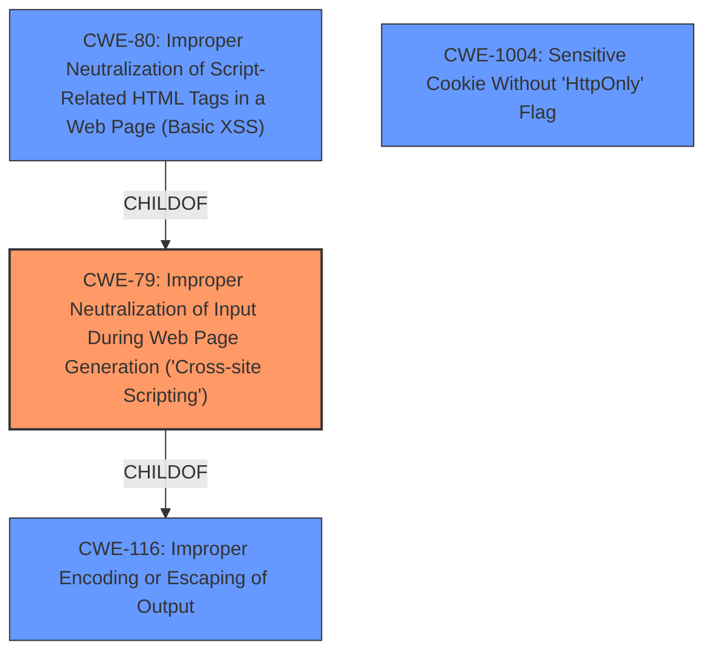

# Analysis Report for CVE-2024-49764

# Vulnerability Analysis Report: CVE-2024-49764

## Description

LibreNMS is an open-source, PHP/MySQL/SNMP-based network monitoring system. A **Stored Cross-Site Scripting** (XSS) vulnerability in the Capture Debug Information page allows authenticated users to inject arbitrary JavaScript through the hostname parameter when creating a new device. This vulnerability results in the execution of malicious code when the Capture Debug Information page is visited, redirecting the user and sending non-httponly cookies to an attacker-controlled domain. This vulnerability is fixed in 24.10.0.

## Vulnerability Description Key Phrases

- **Weakness:** Stored Cross-Site Scripting
- **Impact:** ['inject arbitrary JavaScript', 'redirect user to attacker-controlled domain', 'send non-httponly cookies']
- **Vector:** hostname parameter
- **Attacker:** authenticated users
- **Product:** LibreNMS
- **Version:** before 24.10.0
- **Component:** Capture Debug Information page

## Analysis (with Relationship Data)

# Summary
| CWE ID | CWE Name | Confidence | CWE Abstraction Level | CWE Vulnerability Mapping Label | CWE-Vulnerability Mapping Notes |
|---|---|---|---|---|---|
| CWE-79 | Improper Neutralization of Input During Web Page Generation ('Cross-site Scripting') | 1.0 | Base | Allowed | Primary CWE |
| CWE-1004 | Sensitive Cookie Without 'HttpOnly' Flag | 0.7 | Variant | Allowed | Secondary Candidate |

## Evidence and Confidence

*   **Confidence Score:** 0.9
*   **Evidence Strength:** HIGH

## Relationship Analysis
The primary relationship that influenced the decision was the parent-child relationship between CWE-116 (Improper Encoding or Escaping of Output) and CWE-79 (Improper Neutralization of Input During Web Page Generation ('Cross-site Scripting')). While CWE-116 is a broader class, CWE-79 is a more specific base class that directly addresses the vulnerability described. CWE-80 (Improper Neutralization of Script-Related HTML Tags in a Web Page (Basic XSS)) is a variant of CWE-79 but applies specifically to script-related HTML tags, which is pertinent to the XSS nature of the vulnerability, but CWE-79 describes the issue more accurately. The chain relationship of CanPrecede connects CWE-184 to CWE-79, but this is a less direct mapping for this vulnerability description. CWE-1004 is related to the impact and is a good secondary candidate.



## Vulnerability Chain
The vulnerability chain starts with the **improper** or **insufficient sanitization** of the `hostname` parameter (CWE-79). This leads to the ability to inject arbitrary JavaScript. The injected script can then redirect users to an attacker-controlled domain and steal non-HttpOnly cookies (CWE-1004).

## Summary of Analysis
The initial analysis strongly points to CWE-79 (Improper Neutralization of Input During Web Page Generation ('Cross-site Scripting')) as the primary weakness. The vulnerability description explicitly mentions a "Stored Cross-Site Scripting" vulnerability, and the CVE Reference Links Content Summary confirms the root cause as insufficient sanitization of the `hostname` parameter. The provided evidence includes the vulnerable code location and the mitigation implemented, solidifying the choice of CWE-79. The relationship analysis further supports this decision, considering the parent-child relationships with other CWEs like CWE-116 and CWE-80, but selecting CWE-79 as the most specific and relevant base class. The inclusion of CWE-1004 (Sensitive Cookie Without 'HttpOnly' Flag) is based on the impact of the vulnerability, where the attacker can steal non-HttpOnly cookies.

Relevant CWE Information:

# Enhanced Context (25 CWEs)
The following CWEs were identified as potentially relevant to this vulnerability:

## CWE-74: Improper Neutralization of Special Elements in Output Used by a Downstream Component ('Injection')
**Abstraction Level**: Class
**Similarity Score**: 0.74
**Source**: dense

**Description**:
The product constructs all or part of a command, data structure, or record using externally-influenced input from an upstream component, but it does not neutralize or incorrectly neutralizes special elements that could modify how it is parsed or interpreted when it is sent to a downstream component.

**Mapping Guidance**:
- Usage: Discouraged
- Rationale: CWE-74 is high-level and often misused when lower-level weaknesses are more appropriate.

## CWE-294: Authentication Bypass by Capture-replay
**Abstraction Level**: Base
**Similarity Score**: 0.74
**Source**: dense

**Description**:
A capture-replay flaw exists when the design of the product makes it possible for a malicious user to sniff network traffic and bypass authentication by replaying it to the server in question to the same effect as the original message (or with minor changes).

**Mapping Guidance**:
- Usage: Allowed
- Rationale: This CWE entry is at the Base level of abstraction, which is a preferred level of abstraction for mapping to the root causes of vulnerabilities.

## CWE-80: Improper Neutralization of Script-Related HTML Tags in a Web Page (Basic XSS)
**Abstraction Level**: Variant
**Similarity Score**: 0.74
**Source**: dense

**Description**:
The product receives input from an upstream component, but it does not neutralize or incorrectly neutralizes special characters such as "<", ">", and "&" that could be interpreted as web-scripting elements when they are sent to a downstream component that processes web pages.

**Mapping Guidance**:
- Usage: Allowed
- Rationale: This CWE entry is at the Variant level of abstraction, which is a preferred level of abstraction for mapping to the root causes of vulnerabilities.

## CWE-79: Improper Neutralization of Input During Web Page Generation ('Cross-site Scripting')
**Abstraction Level**: Base
**Similarity Score**: 0.74
**Source**: dense

**Description**:
The product does not neutralize or incorrectly neutralizes user-controllable input before it is placed in output that is used as a web page that is served to other users.

**Mapping Guidance**:
- Usage: Allowed
- Rationale: This CWE entry is at the Base level of abstraction, which is a preferred level of abstraction for mapping to the root causes of vulnerabilities.

## CWE-212: Improper Removal of Sensitive Information Before Storage or Transfer
**Abstraction Level**: Base
**Similarity Score**: 0.73
**Source**: dense

**Description**:
The product stores, transfers, or shares a resource that contains sensitive information, but it does not properly remove that information before the product makes the resource available to unauthorized actors.

**Mapping Guidance**:
- Usage: Allowed
- Rationale: This CWE entry is at the Base level of abstraction, which is a preferred level of abstraction for mapping to the root causes of vulnerabilities.

## CWE-116: Improper Encoding or Escaping of Output
**Abstraction Level**: Class
**Similarity Score**: 0.73
**Source**: dense

**Description**:
The product prepares a structured message for communication with another component, but encoding or escaping of the data is either missing or done incorrectly. As a result, the intended structure of the message is not preserved.

**Mapping Guidance**:
- Usage: Allowed-with-Review
- Rationale: This CWE entry is a Class and might have Base-level children that would be more appropriate

## CWE-93: Improper Neutralization of CRLF Sequences ('CRLF Injection')
**Abstraction Level**: Base
**Similarity Score**: 0.73
**Source**: dense

**Description**:
The product uses CRLF (carriage return line feeds) as a special element, e.g. to separate lines or records, but it does not neutralize or incorrectly neutralizes CRLF sequences from inputs.

**Mapping Guidance**:
- Usage: Allowed
- Rationale: This CWE entry is at the Base level of abstraction, which is a preferred level of abstraction for mapping to the root causes of vulnerabilities.

## CWE-1286: Improper Validation of Syntactic Correctness of Input
**Abstraction Level**: Base
**Similarity Score**: 0.73
**Source**: dense

**Description**:
The product receives input that is expected to be well-formed - i.e., to comply with a certain syntax - but it does not validate or incorrectly validates that the input complies with the syntax.

**Mapping Guidance**:
- Usage: Allowed
- Rationale: This CWE entry is at the Base level of abstraction, which is a preferred level of abstraction for mapping to the root causes of vulnerabilities.

## CWE-138: Improper Neutralization of Special Elements
**Abstraction Level**: Class
**Similarity Score**: 0.73
**Source**: dense

**Description**:
The product receives input from an upstream component, but it does not neutralize or incorrectly neutralizes special elements that could be interpreted as control elements or syntactic markers when they are sent to a downstream component.

**Mapping Guidance**:
- Usage: Discouraged
- Rationale: This CWE entry is a level-1 Class (i.e., a child of a Pillar). It might have lower-level children that would be more appropriate

## CWE-918: Server-Side Request Forgery (SSRF)
**Abstraction Level**: Base
**Similarity Score**: 0.72
**Source**: dense

**Description**:
The web server receives a URL or


## CWE Relationship Analysis

Current CWEs represent these abstraction levels: .


### Vulnerability Chain Analysis

**Chain starting from CWE-116:**
- 116 (Improper Encoding or Escaping of Output) - ROOT


**Chain starting from CWE-93:**
- 93 (Improper Neutralization of CRLF Sequences ('CRLF Injection')) - ROOT


### CWE Relationship Diagram

```mermaid
graph TD
    classDef primary fill:#f96,stroke:#333,stroke-width:2px
    classDef secondary fill:#69f,stroke:#333
    classDef tertiary fill:#9e9,stroke:#333
```


*Report generated on 2025-07-13 19:34:31*
