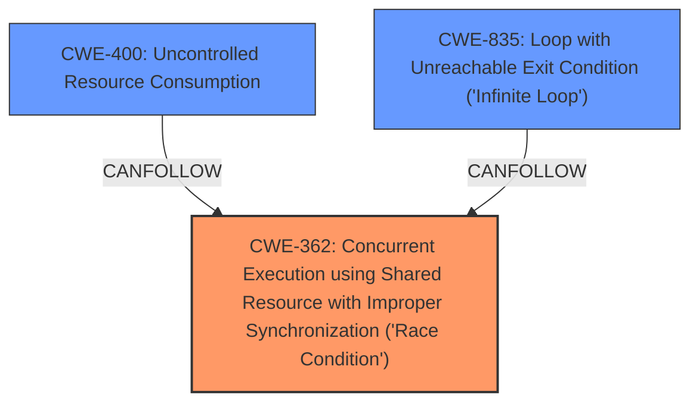

# Raw Analyzer Response for CVE-2024-49769

# Summary
| CWE ID | CWE Name | Confidence | CWE Abstraction Level | CWE Vulnerability Mapping Label | CWE-Vulnerability Mapping Notes |
|---|---|---|---|---|---|
| CWE-362 | Concurrent Execution using Shared Resource with Improper Synchronization ('**Race Condition**') | 0.9 | Class | Allowed-with-Review | Primary CWE |
| CWE-400 | Uncontrolled Resource Consumption | 0.7 | Class | Allowed | Secondary Candidate |
| CWE-835 | Loop with Unreachable Exit Condition ('**Infinite Loop**') | 0.6 | Base | Allowed | Secondary Candidate |

## Evidence and Confidence

*   **Confidence Score:** 0.8
*   **Evidence Strength:** HIGH

## Relationship Analysis
The primary CWE is CWE-362, which is a Class-level CWE. While it is generally preferred to choose Base or Variant level CWEs, the description of CWE-362 aligns well with the vulnerability description, which highlights a **race condition**. CWE-362 has child relationships with CWE-367 (Time-of-check Time-of-use (TOCTOU) Race Condition), but the vulnerability described is not a TOCTOU vulnerability. The vulnerability can lead to CWE-400 (Uncontrolled Resource Consumption) or CWE-835 (Loop with Unreachable Exit Condition ('**Infinite Loop**')), as an impact.

## Vulnerability Chain
The vulnerability chain starts with the **race condition** (CWE-362) that occurs when the client closes the connection before the server can retrieve the peer name. This leads to an inconsistent state, resulting in a busy loop, which causes uncontrolled resource consumption (CWE-400) or an infinite loop (CWE-835), eventually leading to a denial of service.

## Summary of Analysis
The vulnerability is primarily due to a **race condition** (CWE-362) where the server attempts to write to a socket that is no longer valid, because the client closed the connection before the server could finish setting up the channel. This leads to a busy loop, consuming excessive CPU resources (CWE-400) or an infinite loop (CWE-835).

The evidence from the vulnerability description includes:
*   "When a remote client closes the connection before waitress has had the opportunity to call getpeername() waitress wont correctly clean up the connection leading to the main thread attempting to write to a socket that no longer exists"
*   "This leads to a busy-loop calling the write function"
*   "A remote attacker could run waitress out of available sockets with very little resources required."
*   "Waitress 3.0.1 contains fixes that remove the **race condition**"

The retriever results also indicate CWE-362 as the top candidate. The relationship analysis shows that CWE-362 can lead to CWE-400 and CWE-835.

The selected CWEs are at an appropriate level of specificity: CWE-362 captures the root cause of the vulnerability. CWE-400 and CWE-835 describe the impacts of the vulnerability, which are the uncontrolled resource consumption or the **infinite loop**.

**CWEs Considered But Not Used:**

*   CWE-367 (Time-of-check Time-of-use (TOCTOU) Race Condition): While a **race condition** is present, it's not specifically a TOCTOU vulnerability. The check and use of the socket are not separated in time in the classic TOCTOU sense.
*   CWE-476 (NULL Pointer Dereference): Not applicable, as the vulnerability doesn't involve NULL pointer dereferences.
*   CWE-667 (Improper Locking): Not applicable, as the vulnerability is not related to locking mechanisms.
*   CWE-833 (Deadlock): Not applicable, as the vulnerability does not involve multiple threads waiting for each other.
*   CWE-770 (Allocation of Resources Without Limits or Throttling): While the server runs out of sockets, the root cause is the **race condition** and busy-loop, not the lack of limits or throttling.
* CWE-404 (Improper Resource Shutdown or Release): This is close, but the **race condition** is a more precise and direct description of the problem.