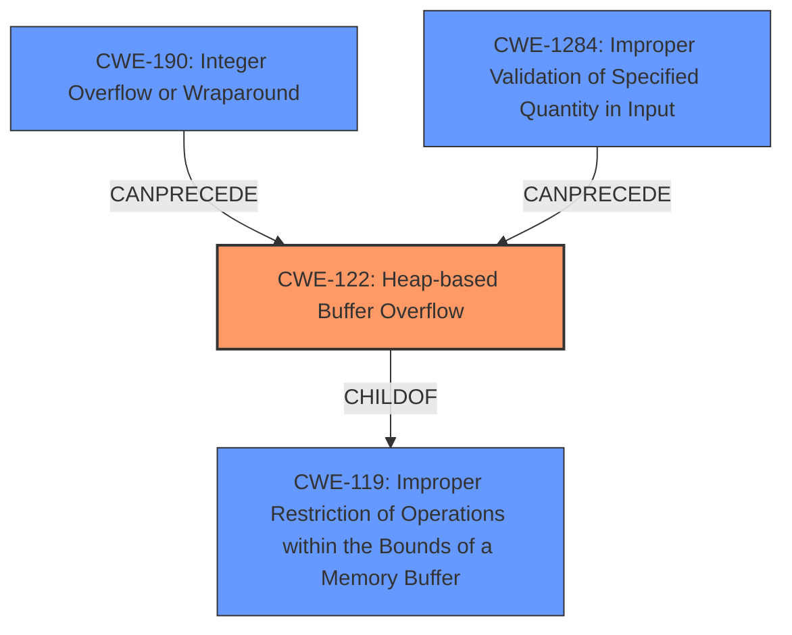

# Analysis Report for CVE-2024-49778

# Vulnerability Analysis Report: CVE-2024-49778

## Description

A **heap-based buffer overflow** in tsMuxer version nightly-2024-05-12-02-01-18 allows attackers to cause Denial of Service (DoS) and Code Execution via a crafted MOV video file.

## Vulnerability Description Key Phrases

- **Weakness:** heap-based buffer overflow
- **Impact:** ['Denial of Service (DoS)', 'Code Execution']
- **Vector:** crafted MOV video file
- **Attacker:** attackers
- **Product:** tsMuxer
- **Version:** nightly-2024-05-12-02-01-18

## Analysis (with Relationship Data)

# Summary
| CWE ID | CWE Name | Confidence | CWE Abstraction Level | CWE Vulnerability Mapping Label | CWE-Vulnerability Mapping Notes |
|---|---|---|---|---|---|
| CWE-122 | Heap-based Buffer Overflow | 1.0 | Variant | Primary | Allowed |
| CWE-190 | Integer Overflow or Wraparound | 0.6 | Base | Secondary | Allowed |
| CWE-1284 | Improper Validation of Specified Quantity in Input | 0.5 | Base | Secondary | Allowed |

## Evidence and Confidence

*   **Confidence Score:** 0.9
*   **Evidence Strength:** HIGH

## Relationship Analysis
The primary weakness is a heap-based buffer overflow (CWE-122), which is a variant of the more general class CWE-119 (Improper Restriction of Operations within the Bounds of a Memory Buffer). Integer overflows (CWE-190) and improper validation of input quantities (CWE-1284) could potentially precede the buffer overflow, leading to the allocation of a buffer that is too small.



## Vulnerability Chain
The vulnerability chain starts with a crafted MOV file, which, when processed by tsMuxer, leads to an unbounded increment of `num_tracks`. This may be preceded by an integer overflow or improper validation of input, resulting in a **heap-based buffer overflow** (CWE-122). The overflow allows attackers to cause Denial of Service (DoS) and potentially execute arbitrary code.

## Summary of Analysis
The primary CWE is CWE-122 (Heap-based Buffer Overflow) because the vulnerability description explicitly mentions a **heap-based buffer overflow**. The "CVE Reference Links Content Summary" confirms this by stating "Heap buffer overflow in `movDemuxer.cpp` due to unbounded increment of `num_tracks` when parsing a crafted MOV file" and "The code lacks proper bounds checking when creating new tracks in the `tracks` array. The `num_tracks` variable is incremented without checking if it exceeds the `MAX_STREAMS` limit.". This aligns perfectly with the definition of CWE-122.

CWE-190 (Integer Overflow or Wraparound) and CWE-1284 (Improper Validation of Specified Quantity in Input) are included as secondary CWEs because the unbounded increment of `num_tracks` could be caused by an integer overflow when calculating the number of tracks or by improper validation of the number of tracks specified in the MOV file. The lack of bounds checking suggests that input validation is missing.

CWE-125 (Out-of-bounds Read) was considered because it was listed as the Primary CWE Match in the "CWE for similar CVE Descriptions" section and in the Retriever Results. However, since the vulnerability is explicitly described as a **heap-based buffer overflow**, CWE-122 is a more accurate and specific classification.

CWE-119 (Improper Restriction of Operations within the Bounds of a Memory Buffer) was also considered, but it is a class-level CWE and CWE-122 provides more specific information about the vulnerability type. The mapping guidance for CWE-119 discourages its use when lower-level CWEs are available.

# Enhanced Context (25 CWEs)
The following CWEs were identified as potentially relevant to this vulnerability:

## CWE-125: Out-of-bounds Read
**Abstraction Level**: Base
**Similarity Score**: 0.69
**Source**: dense

**Description**:
The product reads data past the end, or before the beginning, of the intended buffer.

**Mapping Guidance**:
- Usage: Allowed
- Rationale: This CWE entry is at the Base level of abstraction, which is a preferred level of abstraction for mapping to the root causes of vulnerabilities.


## CWE-789: Memory Allocation with Excessive Size Value
**Abstraction Level**: Variant
**Similarity Score**: 0.68
**Source**: dense

**Description**:
The product allocates memory based on an untrusted, large size value, but it does not ensure that the size is within expected limits, allowing arbitrary amounts of memory to be allocated.

**Mapping Guidance**:
- Usage: Allowed
- Rationale: This CWE entry is at the Variant level of abstraction, which is a preferred level of abstraction for mapping to the root causes of vulnerabilities.


## CWE-190: Integer Overflow or Wraparound
**Abstraction Level**: Base
**Similarity Score**: 0.68
**Source**: dense

**Description**:
The product performs a calculation that can
         produce an integer overflow or wraparound when the logic
         assumes that the resulting value will always be larger than
         the original value. This occurs when an integer value is
         incremented to a value that is too large to store in the
         associated representation. When this occurs, the value may
         become a very small or negative number.

**Mapping Guidance**:
- Usage: Allowed
- Rationale: This CWE entry is at the Base level of abstraction, which is a preferred level of abstraction for mapping to the root causes of vulnerabilities.


## CWE-122: Heap-based Buffer Overflow
**Abstraction Level**: Variant
**Similarity Score**: 0.68
**Source**: dense

**Description**:
A heap overflow condition is a buffer overflow, where the buffer that can be overwritten is allocated in the heap portion of memory, generally meaning that the buffer was allocated using a routine such as malloc().

**Mapping Guidance**:
- Usage: Allowed
- Rationale: This CWE entry is at the Variant level of abstraction, which is a preferred level of abstraction for mapping to the root causes of vulnerabilities.


## CWE-131: Incorrect Calculation of Buffer Size
**Abstraction Level**: Base
**Similarity Score**: 0.67
**Source**: dense

**Description**:
The product does not correctly calculate the size to be used when allocating a buffer, which could lead to a buffer overflow.

**Mapping Guidance**:
- Usage: Allowed
- Rationale: This CWE entry is at the Base level of abstraction, which is a preferred level of abstraction for mapping to the root causes of vulnerabilities.


## CWE-126: Buffer Over-read
**Abstraction Level**: Variant
**Similarity Score**: 0.67
**Source**: dense

**Description**:
The product reads from a buffer using buffer access mechanisms such as indexes or pointers that reference memory locations after the targeted buffer.

**Mapping Guidance**:
- Usage: Allowed
- Rationale: This CWE entry is at the Variant level of abstraction, which is a preferred level of abstraction for mapping to the root causes of vulnerabilities.


## CWE-193: Off-by-one Error
**Abstraction Level**: Base
**Similarity Score**: 0.66
**Source**: dense

**Description**:
A product calculates or uses an incorrect maximum or minimum value that is 1 more, or 1 less, than the correct value.

**Mapping Guidance**:
- Usage: Allowed
- Rationale: This CWE entry is at the Base level of abstraction, which is a preferred level of abstraction for mapping to the root causes of vulnerabilities.


## CWE-119: Improper Restriction of Operations within the Bounds of a Memory Buffer
**Abstraction Level**: Class
**Similarity Score**: 0.66
**Source**: dense

**Description**:
The product performs operations on a memory buffer, but it reads from or writes to a memory location outside the buffer's intended boundary. This may result in read or write operations on unexpected memory locations that could be linked to other variables, data structures, or internal program data.

**Mapping Guidance**:
- Usage: Discouraged
- Rationale: CWE-119 is commonly misused in low-information vulnerability reports when lower-level CWEs could be used instead, or when more details about the vulnerability are available.


## CWE-1285: Improper Validation of Specified Index, Position, or Offset in Input
**Abstraction Level**: Base
**Similarity Score**: 0.65
**Source**: dense

**Description**:
The product receives input that is expected to specify an index, position, or offset into an indexable resource such as a buffer or file, but it does not validate or incorrectly validates that the specified index/position/offset has the required properties.

**Mapping Guidance**:
- Usage: Allowed
- Rationale: This CWE entry is at the Base level


## CWE Relationship Analysis

Current CWEs represent these abstraction levels: .


### Vulnerability Chain Analysis

**Chain starting from CWE-1284:**
- 1284 (Improper Validation of Specified Quantity in Input) - ROOT


**Chain starting from CWE-125:**
- 125 (Out-of-bounds Read) - ROOT


### CWE Relationship Diagram

```mermaid
graph TD
    classDef primary fill:#f96,stroke:#333,stroke-width:2px
    classDef secondary fill:#69f,stroke:#333
    classDef tertiary fill:#9e9,stroke:#333
```


*Report generated on 2025-07-13 19:36:21*
