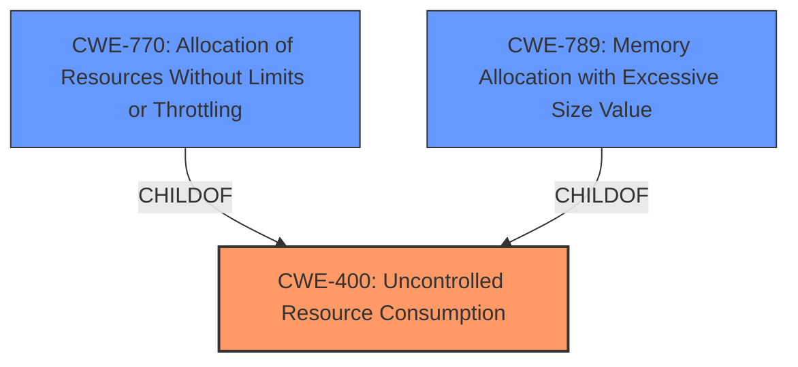

# Raw Analyzer Response for CVE-2024-49823

# Summary
| CWE ID | CWE Name | Confidence | CWE Abstraction Level | CWE Vulnerability Mapping Label | CWE-Vulnerability Mapping Notes |
|---|---|---|---|---|---|
| CWE-400 | Uncontrolled Resource Consumption | 0.8 | Class | Primary | Allowed-with-Review |

## Evidence and Confidence

*   **Confidence Score:** 0.8
*   **Evidence Strength:** MEDIUM

## Relationship Analysis
The primary identified CWE is CWE-400 [Uncontrolled Resource Consumption], which is a Class-level CWE. No child CWEs were identified that were a more precise match given the information provided. CWE-400 relates to other potential weaknesses like CWE-770 [Allocation of Resources Without Limits or Throttling] and CWE-789 [Memory Allocation with Excessive Size Value], however there is no direct evidence in the vulnerability description.

## Vulnerability Chain
The vulnerability chain starts with a **specially crafted sequence of valid requests** from an **authenticated user** leading to **denial of service**. The root cause is the IBM Common Cryptographic Architecture's **uncontrolled resource consumption** when processing the requests. The impact is a denial of service in the Hardware Security Module (HSM).

## Summary of Analysis
The vulnerability description states that an authenticated user can cause a denial of service in the Hardware Security Module (HSM) using a **specially crafted sequence of valid requests**. The CVE Reference Links Content Summary indicates the same, stating "CVE-2024-49823 is described as a vulnerability that "could allow a remote user to cause a denial of service"". This suggests that the system does not properly manage the resources consumed by these requests, leading to a denial-of-service condition.

The Retriever Results suggested several CWEs, including CWE-799 [Improper Control of Interaction Frequency], CWE-20 [Improper Input Validation], CWE-327 [Use of a Broken or Risky Cryptographic Algorithm], CWE-248 [Uncaught Exception], CWE-755 [Improper Handling of Exceptional Conditions], CWE-23 [Relative Path Traversal], CWE-400 [Uncontrolled Resource Consumption], CWE-476 [NULL Pointer Dereference], and CWE-1240 [Use of a Cryptographic Primitive with a Risky Implementation].

Based on the vulnerability description, CWE-400 [Uncontrolled Resource Consumption] is the most appropriate because the vulnerability results in a denial of service, which is a direct consequence of uncontrolled resource consumption. The other CWEs were not selected because they do not directly address the root cause of the denial of service. The **specially crafted sequence of valid requests** is the attack vector and CWE-400 explains the **root cause** of the vulnerability.

The selection of CWE-400 is at the optimal level of specificity because it directly addresses the uncontrolled resource consumption leading to the denial of service. While more specific CWEs related to resource management exist (e.g., CWE-770 [Allocation of Resources Without Limits or Throttling], CWE-789 [Memory Allocation with Excessive Size Value]), the provided information does not provide sufficient detail to pinpoint the exact type of resource that is being consumed without control. Thus, CWE-400 provides the best balance of accuracy and generality.

Relevant CWE Information:

# Enhanced Context (25 CWEs)
The following CWEs were identified as potentially relevant to this vulnerability:

## CWE-1391: Use of Weak Credentials
**Abstraction Level**: Class
**Similarity Score**: 0.75
**Source**: dense

**Description**:
The product uses weak credentials (such as a default key or hard-coded password) that can be calculated, derived, reused, or guessed by an attacker.

**Mapping Guidance**:
- Usage: Allowed-with-Review
- Rationale: This CWE entry is a Class and might have Base-level children that would be more appropriate

## CWE-327: Use of a Broken or Risky Cryptographic Algorithm
**Abstraction Level**: Class
**Similarity Score**: 0.75
**Source**: dense

**Description**:
The product uses a broken or risky cryptographic algorithm or protocol.

**Mapping Guidance**:
- Usage: Allowed-with-Review
- Rationale: This CWE entry is a Class and might have Base-level children that would be more appropriate

## CWE-303: Incorrect Implementation of Authentication Algorithm
**Abstraction Level**: Base
**Similarity Score**: 0.74
**Source**: dense

**Description**:
The requirements for the product dictate the use of an established authentication algorithm, but the implementation of the algorithm is incorrect.

**Mapping Guidance**:
- Usage: Allowed
- Rationale: This CWE entry is at the Base level of abstraction, which is a preferred level of abstraction for mapping to the root causes of vulnerabilities.

## CWE-755: Improper Handling of Exceptional Conditions
**Abstraction Level**: Class
**Similarity Score**: 0.74
**Source**: dense

**Description**:
The product does not handle or incorrectly handles an exceptional condition.

**Mapping Guidance**:
- Usage: Discouraged
- Rationale: This CWE entry is a level-1 Class (i.e., a child of a Pillar). It might have lower-level children that would be more appropriate

## CWE-696: Incorrect Behavior Order
**Abstraction Level**: Class
**Similarity Score**: 0.74
**Source**: dense

**Description**:
The product performs multiple related behaviors, but the behaviors are performed in the wrong order in ways which may produce resultant weaknesses.

**Mapping Guidance**:
- Usage: Allowed-with-Review
- Rationale: This CWE entry is a Class and might have Base-level children that would be more appropriate

## CWE-326: Inadequate Encryption Strength
**Abstraction Level**: Class
**Similarity Score**: 0.74
**Source**: dense

**Description**:
The product stores or transmits sensitive data using an encryption scheme that is theoretically sound, but is not strong enough for the level of protection required.

**Mapping Guidance**:
- Usage: Allowed-with-Review
- Rationale: This CWE entry is a Class and might have Base-level children that would be more appropriate

## CWE-345: Insufficient Verification of Data Authenticity
**Abstraction Level**: Class
**Similarity Score**: 0.74
**Source**: dense

**Description**:
The product does not sufficiently verify the origin or authenticity of data, in a way that causes it to accept invalid data.

**Mapping Guidance**:
- Usage: Discouraged
- Rationale: This CWE entry is a level-1 Class (i.e., a child of a Pillar). It might have lower-level children that would be more appropriate

## CWE-807: Reliance on Untrusted Inputs in a Security Decision
**Abstraction Level**: Base
**Similarity Score**: 0.74
**Source**: dense

**Description**:
The product uses a protection mechanism that relies on the existence or values of an input, but the input can be modified by an untrusted actor in a way that bypasses the protection mechanism.

**Mapping Guidance**:
- Usage: Allowed
- Rationale: This CWE entry is at the Base level of abstraction, which is a preferred level of abstraction for mapping to the root causes of vulnerabilities.

## CWE-328: Use of Weak Hash
**Abstraction Level**: Base
**Similarity Score**: 0.73
**Source**: dense

**Description**:
The product uses an algorithm that produces a digest (output value) that does not meet security expectations for a hash function that allows an adversary to reasonably determine the original input (preimage attack), find another input that can produce the same hash (2nd preimage attack), or find multiple inputs that evaluate to the same hash (birthday attack).

**Mapping Guidance**:
- Usage: Allowed
- Rationale: This CWE entry is at the Base level of abstraction, which is a preferred level of abstraction for mapping to the root causes of vulnerabilities.

## CWE-657: Violation of Secure Design Principles
**Abstraction Level**: Class
**Similarity Score**: 0.73
**Source**: dense

**Description**:
The product violates well-established principles for secure design.

**Mapping Guidance**:
- Usage: Discouraged
- Rationale: This CWE entry is a level-1 Class (i.e., a child of a Pillar). It might have lower-level children that would be more appropriate

## CWE-327: Use of a Broken or Risky Cryptographic Algorithm
**Abstraction Level**: Class
**Similarity Score**: 706.63
**Source**: sparse

**Description**:
The product uses a broken or risky cryptographic algorithm or