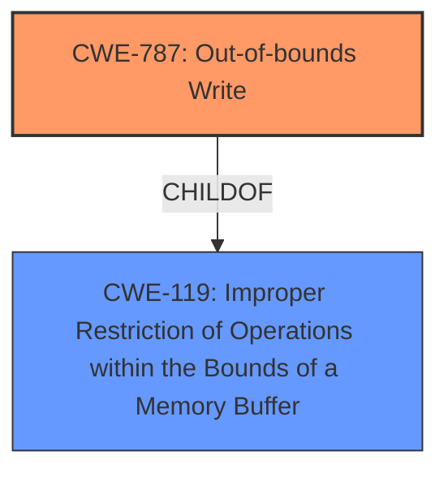

# Raw Analyzer Response for CVE-2024-49845

# Summary
| CWE ID | CWE Name | Confidence | CWE Abstraction Level | CWE Vulnerability Mapping Label | CWE-Vulnerability Mapping Notes |
|---|---|---|---|---|---|
| CWE-787 | Out-of-bounds Write | 0.7 | Base | Primary | Allowed |

## Evidence and Confidence

*   **Confidence Score:** 0.7
*   **Evidence Strength:** LOW

## Relationship Analysis
The primary relationship considered here is the parent-child relationship, with CWE-787 being a specific type of **improper** memory access. Though other CWEs related to memory corruption are present, without additional information, a specific out-of-bounds write is the most appropriate.

## Vulnerability Chain
The vulnerability chain starts with unspecified **memory corruption** during the FRS UDS generation process, leading to potential out-of-bounds write.
  - The root cause is the **memory corruption** itself (unspecified).
  - The weakness is manifested as an out-of-bounds write.
  - The final impact is not explicitly stated, but it could be code execution, denial of service, or information disclosure.

## Summary of Analysis
Based on the limited information, the most suitable CWE is CWE-787 (Out-of-bounds Write). The vulnerability description mentions "**Memory corruption**", which is a broad term, but the retriever results point to CWE-787 as the most relevant. Without more details, it's difficult to pinpoint the exact nature of the **memory corruption**, but an out-of-bounds write is a plausible manifestation. My assessment is based primarily on the retriever results, as the vulnerability description is extremely brief.

Relevant CWE Information:

**CWE-787: Out-of-bounds Write**

*   How the vulnerability's details match the CWE's characteristics: The vulnerability involves "**Memory corruption**" during a specific process, which can lead to an out-of-bounds write condition if data is written beyond the allocated buffer.
*   The security implications and potential impact: Out-of-bounds writes can lead to code execution, denial of service, or information disclosure.
*   Any parent-child relationships or chain patterns that influenced your mapping: CWE-787 is a child of CWE-119 (Improper Restriction of Operations within the Bounds of a Memory Buffer), indicating a broader class of buffer-related vulnerabilities.
*   Whether the weakness is primary or secondary in the vulnerability: CWE-787 is the primary weakness based on the available information.
*   How the official MITRE mapping guidance influenced your decision: The mapping guidance for CWE-787 allows its usage, and it is a base-level CWE, which is preferred.

Other CWEs Considered but Not Used:

*   CWE-415 (Double Free) and CWE-416 (Use After Free): These are memory management issues, but there is no specific mention of freeing memory, so they are less likely.
*   CWE-190 (Integer Overflow or Wraparound) and CWE-197 (Numeric Truncation Error): These relate to integer handling, but are not explicitly mentioned.
*   CWE-908 (Use of Uninitialized Resource): This is a possibility, but not specifically indicated in the description.
*   CWE-704 (Incorrect Type Conversion or Cast): Type conversions are not mentioned in the description.
*   CWE-476 (NULL Pointer Dereference): This is also possible but there is no specific information to support it.
*   CWE-123 (Write-what-where Condition): This is another memory corruption issue that can occur after an out-of-bounds write (CanFollow). But it is less specific, so not used.