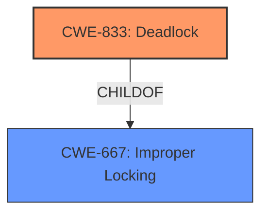

# Enhanced Analysis for CVE-2024-49946

# Summary
| CWE ID  | CWE Name                                                                                                 | Confidence | CWE Abstraction Level | CWE Vulnerability Mapping Label | CWE-Vulnerability Mapping Notes |
| :------- | :------------------------------------------------------------------------------------------------------- | :--------- | :---------------------- | :------------------------------ | :------------------------------ |
| CWE-833 | Deadlock                                                                                                 | 0.95       | Base                    | Primary                         | Allowed                         |
| CWE-667 | Improper Locking                                                                                         | 0.80       | Class                   | Secondary                       | Allowed-with-Review           |

## Evidence and Confidence

*   **Confidence Score:** 0.90
*   **Evidence Strength:** HIGH

## Relationship Analysis

The primary weakness is **CWE-833 Deadlock**, which is caused by **improper locking** as described in **CWE-667**. **CWE-667** is a Class, and **CWE-833** is a Base, making **CWE-833** the more specific choice. The relationship is that **CWE-833** is a child of **CWE-667**.



## Vulnerability Chain

The vulnerability chain starts with the **improper locking** (**CWE-667**) in `ppp_channel_bridge_input()`, which leads to a **deadlock** (**CWE-833**) when the function is called from both process and softirq context.
  - **Root Cause:** **Improper locking** (**CWE-667**) due to an incorrect assumption about the execution context.
  - **Weakness:** **Deadlock** (**CWE-833**) caused by re-entrancy of the lock.
  - **Impact:** Denial of service due to system unresponsiveness.

## Summary of Analysis

The primary cause of the vulnerability is the potential for deadlock in `ppp_channel_bridge_input()` because it **incorrectly assumes** it's always called from a bottom half (BH) context. The code attempts to acquire a spinlock (`pch->downl`) without properly accounting for the possibility of being called in a process context. This leads to a re-entrancy issue and ultimately a deadlock.

The **Vulnerability Description** states that:
"ppp do not assume bh is held in ppp_channel_bridge_input()" and "ppp was not considering this case in ppp_channel_bridge_input() WARNING inconsistent lock state" which supports the deadlock condition.

The **CVE Reference Links Content Summary** states that:
"The `ppp_channel_bridge_input()` function in the Linux kernel's PPP (Point-to-Point Protocol) implementation **incorrectly assumed** that it was always called from a bottom half (BH) context. However, certain network protocols might cause the function to be invoked from a process context, leading to a locking conflict." and "A **deadlock** could occur due to the incorrect locking, leading to a denial-of-service."

**CWE-833 Deadlock** is the most appropriate primary CWE because the vulnerability's root cause directly leads to a deadlock scenario. The function's incorrect assumption about the execution context and subsequent improper locking creates a situation where the system can become unresponsive due to threads waiting for each other indefinitely. **CWE-667 Improper Locking** is a secondary CWE that describes the underlying cause of the deadlock.

Other CWEs considered:

*   **CWE-362 Concurrent Execution using Shared Resource with Improper Synchronization ('Race Condition')**: While a race condition might be present, the ultimate outcome is a deadlock, making **CWE-833** a more precise classification.
*   **CWE-476 NULL Pointer Dereference**: There is no mention of NULL pointer dereference in the description.
*   **CWE-770 Allocation of Resources Without Limits or Throttling**: There is no mention of resource allocation limits.
*   **CWE-911 Improper Update of Reference Count**: There is no mention of reference counts.

The selected CWEs are at the optimal level of specificity. **CWE-833** is a Base level CWE that directly describes the deadlock condition, while **CWE-667** is a Class level CWE that describes the general category of improper locking.


## CWE Relationship Analysis

Current CWEs represent these abstraction levels: .


### Vulnerability Chain Analysis

**Chain starting from CWE-476:**
- 476 (NULL Pointer Dereference) - ROOT


**Chain starting from CWE-911:**
- 911 (Improper Update of Reference Count) - ROOT


### CWE Relationship Diagram

```mermaid
graph TD
    classDef primary fill:#f96,stroke:#333,stroke-width:2px
    classDef secondary fill:#69f,stroke:#333
    classDef tertiary fill:#9e9,stroke:#333
```