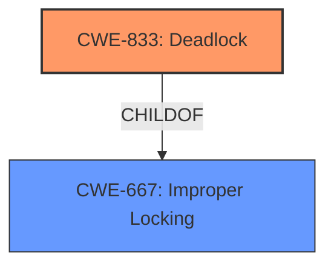

# Analysis Report for CVE-2024-49946

# Vulnerability Analysis Report: CVE-2024-49946

## Description

In the Linux kernel, the following vulnerability has been resolved ppp do not assume bh is held in ppp_channel_bridge_input() Networking receive path is usually handled from BH handler. However, some protocols need to acquire the socket lock, and packets might be stored in the socket backlog is the socket was owned by a user process. In this case, release_sock(), __release_sock(), and sk_backlog_rcv() might call the sk->sk_backlog_rcv() handler in process context. sybot caught ppp was not considering this case in ppp_channel_bridge_input() WARNING inconsistent lock state 6.11.0-rc7-syzkaller-g5f5673607153 #0 Not tainted -------------------------------- inconsistent {SOFTIRQ-ON-W} -> {IN-SOFTIRQ-W} usage. ksoftirqd/1/24 [HC0[0]SC1[1]HE1SE0] takes ffff0000db7f11e0 (&pch->downl){+.?.}-{22}, at spin_lock include/linux/spinlock.h351 [inline] ffff0000db7f11e0 (&pch->downl){+.?.}-{22}, at ppp_channel_bridge_input drivers/net/ppp/ppp_generic.c2272 [inline] ffff0000db7f11e0 (&pch->downl){+.?.}-{22}, at ppp_input+0x16c/0x854 drivers/net/ppp/ppp_generic.c2304 {SOFTIRQ-ON-W} state was registered at lock_acquire+0x240/0x728 kernel/locking/lockdep.c5759 __raw_spin_lock include/linux/spinlock_api_smp.h133 [inline] _raw_spin_lock+0x48/0x60 kernel/locking/spinlock.c154 spin_lock include/linux/spinlock.h351 [inline] ppp_channel_bridge_input drivers/net/ppp/ppp_generic.c2272 [inline] ppp_input+0x16c/0x854 drivers/net/ppp/ppp_generic.c2304 pppoe_rcv_core+0xfc/0x314 drivers/net/ppp/pppoe.c379 sk_backlog_rcv include/net/sock.h1111 [inline] __release_sock+0x1a8/0x3d8 net/core/sock.c3004 release_sock+0x68/0x1b8 net/core/sock.c3558 pppoe_sendmsg+0xc8/0x5d8 drivers/net/ppp/pppoe.c903 sock_sendmsg_nosec net/socket.c730 [inline] __sock_sendmsg net/socket.c745 [inline] __sys_sendto+0x374/0x4f4 net/socket.c2204 __do_sys_sendto net/socket.c2216 [inline] __se_sys_sendto net/socket.c2212 [inline] __arm64_sys_sendto+0xd8/0xf8 net/socket.c2212 __invoke_syscall arch/arm64/kernel/syscall.c35 [inline] invoke_syscall+0x98/0x2b8 arch/arm64/kernel/syscall.c49 el0_svc_common+0x130/0x23c arch/arm64/kernel/syscall.c132 do_el0_svc+0x48/0x58 arch/arm64/kernel/syscall.c151 el0_svc+0x54/0x168 arch/arm64/kernel/entry-common.c712 el0t_64_sync_handler+0x84/0xfc arch/arm64/kernel/entry-common.c730 el0t_64_sync+0x190/0x194 arch/arm64/kernel/entry.S598 irq event stamp 282914 hardirqs last enabled at (282914) [] __raw_spin_unlock_irqrestore include/linux/spinlock_api_smp.h151 [inline] hardirqs last enabled at (282914) [] _raw_spin_unlock_irqrestore+0x38/0x98 kernel/locking/spinlock.c194 hardirqs last disabled at (282913) [] __raw_spin_lock_irqsave include/linux/spinlock_api_smp.h108 [inline] hardirqs last disabled at (282913) [] _raw_spin_lock_irqsave+0x2c/0x7c kernel/locking/spinlock.c162 softirqs last enabled at (282904) [] softirq_handle_end kernel/softirq.c400 [inline] softirqs last enabled at (282904) [] handle_softirqs+0xa3c/0xbfc kernel/softirq.c582 softirqs last disabled at (282909) [] run_ksoftirqd+0x70/0x158 kernel/softirq.c928 other info that might help us debug this Possible unsafe locking scenario CPU0 ---- lock(&pch->downl) lock(&pch->downl) *** DEADLOCK *** 1 lock held by ksoftirqd/1/24 #0 ffff80008f74dfa0 (rcu_read_lock){....}-{12}, at rcu_lock_acquire+0x10/0x4c include/linux/rcupdate.h325 stack backtrace CPU 1 UID 0 PID 24 Comm ksoftirqd/1 Not tainted 6.11.0-rc7-syzkaller-g5f5673607153 #0 Hardware name Google Google Compute Engine/Google Compute Engine, BIOS Google 08/06/2024 Call trace dump_backtrace+0x1b8/0x1e4 arch/arm64/kernel/stacktrace.c319 show_stack+0x2c/0x3c arch/arm64/kernel/stacktrace.c326 __dump_sta ---truncated---

## Vulnerability Description Key Phrases

- **Rootcause:** The ppp_channel_bridge_input function in the Linux kernel's PPP implementation does not properly handle cases where it is called from a process context, leading to a potential lock state inconsistency and deadlock.
- **Weakness:** The ppp_channel_bridge_input function assumes it is always called from a bottom half (BH) handler, which is not always the case. This function uses a spinlock (`pch->downl`) without considering that it might be called in a process context, which leads to re-entrancy of the lock and deadlock
- **Impact:** A deadlock can occur, leading to a denial of service. The system may become unresponsive as the ksoftirqd process is stuck waiting for a lock it already holds.
- **Vector:** The vulnerability is triggered through the network stack when receiving a PPP packet, especially when the socket is owned by a user process. The vulnerability is reachable by sending a crafted PPP packet.
- **Attacker:** A remote attacker who can send crafted PPP packets or a malicious local process.
- **Product:** Linux Kernel
- **Version:** 6.11.0-rc7
- **Component:** PPP implementation in drivers/net/ppp/ppp_generic.c and drivers/net/ppp/pppoe.c

## Analysis (with Relationship Data)

# Summary
| CWE ID  | CWE Name                                                                                                 | Confidence | CWE Abstraction Level | CWE Vulnerability Mapping Label | CWE-Vulnerability Mapping Notes |
| :------- | :------------------------------------------------------------------------------------------------------- | :--------- | :---------------------- | :------------------------------ | :------------------------------ |
| CWE-833 | Deadlock                                                                                                 | 0.95       | Base                    | Primary                         | Allowed                         |
| CWE-667 | Improper Locking                                                                                         | 0.80       | Class                   | Secondary                       | Allowed-with-Review           |

## Evidence and Confidence

*   **Confidence Score:** 0.90
*   **Evidence Strength:** HIGH

## Relationship Analysis

The primary weakness is **CWE-833 Deadlock**, which is caused by **improper locking** as described in **CWE-667**. **CWE-667** is a Class, and **CWE-833** is a Base, making **CWE-833** the more specific choice. The relationship is that **CWE-833** is a child of **CWE-667**.



## Vulnerability Chain

The vulnerability chain starts with the **improper locking** (**CWE-667**) in `ppp_channel_bridge_input()`, which leads to a **deadlock** (**CWE-833**) when the function is called from both process and softirq context.
  - **Root Cause:** **Improper locking** (**CWE-667**) due to an incorrect assumption about the execution context.
  - **Weakness:** **Deadlock** (**CWE-833**) caused by re-entrancy of the lock.
  - **Impact:** Denial of service due to system unresponsiveness.

## Summary of Analysis

The primary cause of the vulnerability is the potential for deadlock in `ppp_channel_bridge_input()` because it **incorrectly assumes** it's always called from a bottom half (BH) context. The code attempts to acquire a spinlock (`pch->downl`) without properly accounting for the possibility of being called in a process context. This leads to a re-entrancy issue and ultimately a deadlock.

The **Vulnerability Description** states that:
"ppp do not assume bh is held in ppp_channel_bridge_input()" and "ppp was not considering this case in ppp_channel_bridge_input() WARNING inconsistent lock state" which supports the deadlock condition.

The **CVE Reference Links Content Summary** states that:
"The `ppp_channel_bridge_input()` function in the Linux kernel's PPP (Point-to-Point Protocol) implementation **incorrectly assumed** that it was always called from a bottom half (BH) context. However, certain network protocols might cause the function to be invoked from a process context, leading to a locking conflict." and "A **deadlock** could occur due to the incorrect locking, leading to a denial-of-service."

**CWE-833 Deadlock** is the most appropriate primary CWE because the vulnerability's root cause directly leads to a deadlock scenario. The function's incorrect assumption about the execution context and subsequent improper locking creates a situation where the system can become unresponsive due to threads waiting for each other indefinitely. **CWE-667 Improper Locking** is a secondary CWE that describes the underlying cause of the deadlock.

Other CWEs considered:

*   **CWE-362 Concurrent Execution using Shared Resource with Improper Synchronization ('Race Condition')**: While a race condition might be present, the ultimate outcome is a deadlock, making **CWE-833** a more precise classification.
*   **CWE-476 NULL Pointer Dereference**: There is no mention of NULL pointer dereference in the description.
*   **CWE-770 Allocation of Resources Without Limits or Throttling**: There is no mention of resource allocation limits.
*   **CWE-911 Improper Update of Reference Count**: There is no mention of reference counts.

The selected CWEs are at the optimal level of specificity. **CWE-833** is a Base level CWE that directly describes the deadlock condition, while **CWE-667** is a Class level CWE that describes the general category of improper locking.


## CWE Relationship Analysis

Current CWEs represent these abstraction levels: .


### Vulnerability Chain Analysis

**Chain starting from CWE-476:**
- 476 (NULL Pointer Dereference) - ROOT


**Chain starting from CWE-911:**
- 911 (Improper Update of Reference Count) - ROOT


### CWE Relationship Diagram

```mermaid
graph TD
    classDef primary fill:#f96,stroke:#333,stroke-width:2px
    classDef secondary fill:#69f,stroke:#333
    classDef tertiary fill:#9e9,stroke:#333
```


*Report generated on 2025-07-13 19:41:40*
