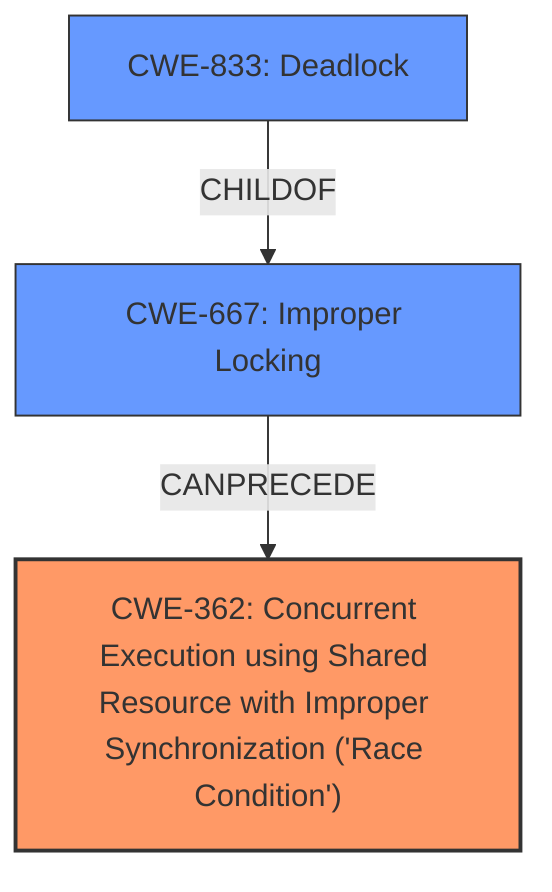

# Analysis Report for CVE-2024-49980

# Vulnerability Analysis Report: CVE-2024-49980

## Description

In the Linux kernel, the following vulnerability has been resolved vrf revert vrf Remove unnecessary RCU-bh critical section This reverts commit 504fc6f4f7f681d2a03aa5f68aad549d90eab853. dev_queue_xmit_nit is expected to be called with BH disabled. __dev_queue_xmit has the following /* Disable soft irqs for various locks below. Also * stops preemption for RCU. */ rcu_read_lock_bh() VRF must follow this invariant. The referenced commit removed this protection. Which triggered a lockdep warning ================================ WARNING inconsistent lock state 6.11.0 #1 Tainted G W -------------------------------- inconsistent {IN-SOFTIRQ-W} -> {SOFTIRQ-ON-W} usage. btserver/134819 [HC0[0]SC0[0]HE1SE1] takes ffff8882da30c118 (rlock-AF_PACKET){+.?.}-{22}, at tpacket_rcv+0x863/0x3b30 {IN-SOFTIRQ-W} state was registered at lock_acquire+0x19a/0x4f0 _raw_spin_lock+0x27/0x40 packet_rcv+0xa33/0x1320 __netif_receive_skb_core.constprop.0+0xcb0/0x3a90 __netif_receive_skb_list_core+0x2c9/0x890 netif_receive_skb_list_internal+0x610/0xcc0 [...] other info that might help us debug this Possible unsafe locking scenario CPU0 ---- lock(rlock-AF_PACKET) lock(rlock-AF_PACKET) *** DEADLOCK *** Call Trace dump_stack_lvl+0x73/0xa0 mark_lock+0x102e/0x16b0 __lock_acquire+0x9ae/0x6170 lock_acquire+0x19a/0x4f0 _raw_spin_lock+0x27/0x40 tpacket_rcv+0x863/0x3b30 dev_queue_xmit_nit+0x709/0xa40 vrf_finish_direct+0x26e/0x340 [vrf] vrf_l3_out+0x5f4/0xe80 [vrf] __ip_local_out+0x51e/0x7a0 [...]

## Vulnerability Description Key Phrases

- **Rootcause:** The commit 504fc6f4f7f681d2a03aa5f68aad549d90eab853 removed the protection of disabling softirqs when calling rcu_read_lock_bh() in VRF. This caused a lockdep warning because dev_queue_xmit_nit is expected to be called with BH disabled.
- **Weakness:** The commit removed a necessary protection (disabling softirqs) before calling rcu_read_lock_bh() in the VRF implementation, leading to a race condition.
- **Impact:** Lockdep warning and potential deadlock in the kernel. The system may become unstable and crash.
- **Vector:** The vulnerability is triggered by network traffic flowing through the VRF device and using the packet socket.
- **Attacker:** An attacker could trigger this issue by sending network packets to the vulnerable VRF interface.
- **Product:** Linux Kernel
- **Version:** 6.11.0
- **Component:** VRF

## Analysis (with Relationship Data)

# Summary
| CWE ID | CWE Name | Confidence | CWE Abstraction Level | CWE Vulnerability Mapping Label | CWE-Vulnerability Mapping Notes |
|---|---|---|---|---|---|
| CWE-362 | Concurrent Execution using Shared Resource with Improper Synchronization ('Race Condition') | 0.9 | Class | Allowed-with-Review | Primary CWE |
| CWE-667 | Improper Locking | 0.7 | Class | Allowed-with-Review | Secondary Candidate |
| CWE-833 | Deadlock | 0.6 | Base | Allowed | Secondary Candidate |

## Evidence and Confidence

*   **Confidence Score:** 0.8
*   **Evidence Strength:** HIGH

## Relationship Analysis
The primary relationship that impacted the decision was the parent-child relationship between CWE-362 and more specific race condition types. While the description does point to a race condition leading to a potential deadlock, the information provided does not give enough information to map to a lower level CWE, so CWE-362 is the best fit. Additionally, CWE-667, Improper Locking, is a parent of several locking related CWEs including CWE-833 Deadlock, which is the impact of this race condition.



## Vulnerability Chain
The vulnerability chain starts with a **missing protection** (`rcu_read_lock_bh()`) leading to a **race condition** due to concurrent execution and improper synchronization, which ultimately results in a **potential deadlock**.
  - **Root Cause:** The **removal of necessary protection (disabling softirqs)** before calling `rcu_read_lock_bh()`.
  - **Weakness:** **Race condition** in VRF implementation.
  - **Impact:** Potential deadlock and system instability.

## Summary of Analysis
The analysis indicates that the primary weakness is a **race condition** caused by a **missing protection** mechanism when accessing a shared resource. This is evidenced by the lockdep warning and the description of the removed commit. The **race condition** can lead to a deadlock.

The initial assessment focused on identifying the root cause and the resulting weakness. The selection of CWE-362, Concurrent Execution using Shared Resource with Improper Synchronization ('Race Condition'), is based on the evidence that the vulnerability involves concurrent execution without proper synchronization, leading to a race condition.

The graph relationships influenced the decision by highlighting the connection between improper locking (CWE-667) and potential deadlocks (CWE-833). However, the primary focus remains on the race condition that triggers the deadlock.

The selected CWEs are at the optimal level of specificity because they accurately represent the **root cause** and the immediate weakness. While more specific CWEs related to locking or resource management could be considered, the current evidence points to a broader **race condition** scenario.

Relevant CWE Information:

# Enhanced Context (25 CWEs)
The following CWEs were identified as potentially relevant to this vulnerability:

## CWE-667: Improper Locking
**Abstraction Level**: Class
**Similarity Score**: 0.76
**Source**: dense

**Description**:
The product does not properly acquire or release a lock on a resource, leading to unexpected resource state changes and behaviors.

**Mapping Guidance**:
- Usage: Allowed-with-Review
- Rationale: This CWE entry is a Class and might have Base-level children that would be more appropriate


## CWE-362: Concurrent Execution using Shared Resource with Improper Synchronization ('Race Condition')
**Abstraction Level**: Class
**Similarity Score**: 0.76
**Source**: dense

**Description**:
The product contains a concurrent code sequence that requires temporary, exclusive access to a shared resource, but a timing window exists in which the shared resource can be modified by another code sequence operating concurrently.

**Mapping Guidance**:
- Usage: Allowed-with-Review
- Rationale: This CWE entry is a Class and might have Base-level children that would be more appropriate


## CWE-755: Improper Handling of Exceptional Conditions
**Abstraction Level**: Class
**Similarity Score**: 0.75
**Source**: dense

**Description**:
The product does not handle or incorrectly handles an exceptional condition.

**Mapping Guidance**:
- Usage: Discouraged
- Rationale: This CWE entry is a level-1 Class (i.e., a child of a Pillar). It might have lower-level children that would be more appropriate


## CWE-824: Access of Uninitialized Pointer
**Abstraction Level**: Base
**Similarity Score**: 0.74
**Source**: dense

**Description**:
The product accesses or uses a pointer that has not been initialized.

**Mapping Guidance**:
- Usage: Allowed
- Rationale: This CWE entry is at the Base level of abstraction, which is a preferred level of abstraction for mapping to the root causes of vulnerabilities.


## CWE-833: Deadlock
**Abstraction Level**: Base
**Similarity Score**: 0.74
**Source**: dense

**Description**:
The product contains multiple threads or executable segments that are waiting for each other to release a necessary lock, resulting in deadlock.

**Mapping Guidance**:
- Usage: Allowed
- Rationale: This CWE entry is at the Base level of abstraction, which is a preferred level of abstraction for mapping to the root causes of vulnerabilities.


## CWE-252: Unchecked Return Value
**Abstraction Level**: Base
**Similarity Score**: 0.73
**Source**: dense

**Description**:
The product does not check the return value from a method or function, which can prevent it from detecting unexpected states and conditions.

**Mapping Guidance**:
- Usage: Allowed
- Rationale: This CWE entry is at the Base level of abstraction, which is a preferred level of abstraction for mapping to the root causes of vulnerabilities.


## CWE-1285: Improper Validation of Specified Index, Position, or Offset in Input
**Abstraction Level**: Base
**Similarity Score**: 0.73
**Source**: dense

**Description**:
The product receives input that is expected to specify an index, position, or offset into an indexable resource such as a buffer or file, but it does not validate or incorrectly validates that the specified index/position/offset has the required properties.

**Mapping Guidance**:
- Usage: Allowed
- Rationale: This CWE entry is at the Base level of abstraction, which is a preferred level of abstraction for mapping to the root causes of vulnerabilities.


## CWE-367: Time-of-check Time-of-use (TOCTOU) Race Condition
**Abstraction Level**: Base
**Similarity Score**: 0.73
**Source**: dense

**Description**:
The product checks the state of a resource before using that resource, but the resource's state can change between the check and the use in a way that invalidates the results of the check. This can cause the product to perform invalid actions when the resource is in an unexpected state.

**Mapping Guidance**:
- Usage: Allowed
- Rationale: This CWE entry is at the Base level of abstraction, which is a preferred level of abstraction for mapping to the root causes of vulnerabilities.


## CWE-909: Missing Initialization of Resource
**Abstraction Level**: Class
**Similarity Score**: 0.73
**Source**: dense

**Description**:
The product does not initialize a critical resource.

**Mapping Guidance**:
- Usage: Allowed-with-Review
- Rationale: This CWE entry is a Class and might have Base-level children that would be more appropriate


## CWE-754: Improper Check for Unusual or Exceptional Conditions
**Abstraction Level**: Class
**Similarity Score**: 0.72
**Source**: dense

**Description**:
The product does not check or incorrectly checks for unusual or exceptional conditions that are not expected to occur frequently during day to day operation of the product.

**Mapping Guidance**:
- Usage: Allowed-with-Review
- Rationale: This CWE entry is a Class and might have Base-level children that would be more appropriate


## CWE-667: Improper Locking
**Abstraction Level**: Class
**Similarity Score**: 1106.20
**Source**: sparse

**Description**:
The product does not properly acquire or release a lock on a resource, leading to unexpected resource state changes and behaviors.

**Mapping Guidance**:
- Usage: Allowed-with-Review
- Rationale: This CWE entry is a Class and might have Base-level children that would be more appropriate


## CWE-362: Concurrent Execution using Shared Resource with Improper Synchronization ('Race Condition')
**Abstraction Level**: Class
**Similarity Score**: 1062.75


## CWE Relationship Analysis

Current CWEs represent these abstraction levels: .


### Vulnerability Chain Analysis

**Chain starting from CWE-667:**
- 667 (Improper Locking) - ROOT


**Chain starting from CWE-833:**
- 833 (Deadlock) - ROOT


### CWE Relationship Diagram

```mermaid
graph TD
    classDef primary fill:#f96,stroke:#333,stroke-width:2px
    classDef secondary fill:#69f,stroke:#333
    classDef tertiary fill:#9e9,stroke:#333
```


*Report generated on 2025-07-13 19:43:14*
