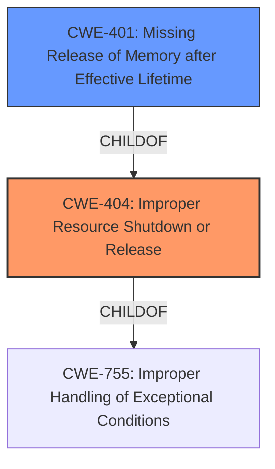

# Analysis Report for CVE-2024-50001

# Vulnerability Analysis Report: CVE-2024-50001

## Description

In the Linux kernel, the following vulnerability has been resolved net/mlx5 Fix error path in multi-packet WQE transmit Remove the **erroneous unmap in case no DMA mapping was established** The multi-packet WQE transmit code attempts to obtain a DMA mapping for the skb. This could fail, e.g. under memory pressure, when the IOMMU driver just cant allocate more memory for page tables. While the code tries to handle this in the path below the err_unmap label it erroneously unmaps one entry from the sqs FIFO list of active mappings. Since the current map attempt failed this unmap is removing some random DMA mapping that might still be required. If the PCI function now presents that IOVA, the IOMMU may assumes a rogue DMA access and e.g. on s390 puts the PCI function in error state. The erroneous behavior was seen in a stress-test environment that created memory pressure.

## Vulnerability Description Key Phrases

- **Rootcause:** erroneous unmap in case no DMA mapping was established
- **Impact:** PCI function in error state
- **Product:** Linux kernel
- **Component:** net/mlx5 multi-packet WQE transmit

## Analysis (with Relationship Data)

# Summary
| CWE ID | CWE Name | Confidence | CWE Abstraction Level | CWE Vulnerability Mapping Label | CWE-Vulnerability Mapping Notes |
|---|---|---|---|---|---|
| CWE-404 | Improper Resource Shutdown or Release | 0.9 | Class | Primary | Allowed-with-Review |
| CWE-401 | Missing Release of Memory after Effective Lifetime | 0.7 | Variant | Secondary | Allowed |

## Evidence and Confidence

*   **Confidence Score:** 0.8
*   **Evidence Strength:** HIGH

## Relationship Analysis
The primary relationship impacting the decision is the hierarchical relationship between CWE-404 and CWE-401. CWE-401 is a variant of CWE-404, representing a more specific case where memory is the resource that is not released. The evidence points towards a resource not being released which fits CWE-404 and could fit CWE-401. Choosing CWE-404 as primary and CWE-401 as secondary reflects the core issue (improper resource shutdown) and the specific type of resource involved (memory).



## Vulnerability Chain
The vulnerability chain starts with a failed DMA mapping, which triggers an error path. The **erroneous unmap in case no DMA mapping was established** within this error path leads to the improper release of a DMA mapping, potentially causing a rogue DMA access and putting the PCI function in an error state.
  - Root Cause: **erroneous unmap in case no DMA mapping was established**
  - Weakness: Improper Resource Shutdown or Release (CWE-404) and Missing Release of Memory after Effective Lifetime (CWE-401)
  - Impact: PCI function in error state.

## Summary of Analysis
The primary focus is on identifying the root cause and the immediate weakness that results from it. The core issue is the **erroneous unmap in case no DMA mapping was established** which leads to an incorrect release of a resource. This aligns with CWE-404 (Improper Resource Shutdown or Release). The fact that it's specifically memory that's not released after its lifetime leads to the secondary consideration of CWE-401 (Missing Release of Memory after Effective Lifetime).

The evidence from the vulnerability description supports this assessment: "While the code tries to handle this in the path below the err_unmap label it erroneously unmaps one entry from the sqs FIFO list of active mappings."

The graph relationships, especially the parent-child relationship between CWE-404 and CWE-401, guided the decision to include both CWEs, with CWE-404 as the primary due to its broader applicability and CWE-401 as a secondary CWE providing more specific context about the type of resource involved.

The chosen CWEs are at the optimal level of specificity. CWE-404 is a Class, and while it has Base-level children, none of them precisely capture the act of erroneously unmapping a DMA entry. CWE-401, as a Variant of CWE-404, adds more specificity without being overly narrow.

Relevant CWE Information:

# Enhanced Context (25 CWEs)
The following CWEs were identified as potentially relevant to this vulnerability:

## CWE-1285: Improper Validation of Specified Index, Position, or Offset in Input
**Abstraction Level**: Base
**Similarity Score**: 0.74
**Source**: dense

**Description**:
The product receives input that is expected to specify an index, position, or offset into an indexable resource such as a buffer or file, but it does not validate or incorrectly validates that the specified index/position/offset has the required properties.

**Mapping Guidance**:
- Usage: Allowed
- Rationale: This CWE entry is at the Base level of abstraction, which is a preferred level of abstraction for mapping to the root causes of vulnerabilities.

## CWE-824: Access of Uninitialized Pointer
**Abstraction Level**: Base
**Similarity Score**: 0.73
**Source**: dense

**Description**:
The product accesses or uses a pointer that has not been initialized.

**Mapping Guidance**:
- Usage: Allowed
- Rationale: This CWE entry is at the Base level of abstraction, which is a preferred level of abstraction for mapping to the root causes of vulnerabilities.

## CWE-696: Incorrect Behavior Order
**Abstraction Level**: Class
**Similarity Score**: 0.73
**Source**: dense

**Description**:
The product performs multiple related behaviors, but the behaviors are performed in the wrong order in ways which may produce resultant weaknesses.

**Mapping Guidance**:
- Usage: Allowed-with-Review
- Rationale: This CWE entry is a Class and might have Base-level children that would be more appropriate

## CWE-755: Improper Handling of Exceptional Conditions
**Abstraction Level**: Class
**Similarity Score**: 0.73
**Source**: dense

**Description**:
The product does not handle or incorrectly handles an exceptional condition.

**Mapping Guidance**:
- Usage: Discouraged
- Rationale: This CWE entry is a level-1 Class (i.e., a child of a Pillar). It might have lower-level children that would be more appropriate

## CWE-362: Concurrent Execution using Shared Resource with Improper Synchronization ('Race Condition')
**Abstraction Level**: Class
**Similarity Score**: 0.72
**Source**: dense

**Description**:
The product contains a concurrent code sequence that requires temporary, exclusive access to a shared resource, but a timing window exists in which the shared resource can be modified by another code sequence operating concurrently.

**Mapping Guidance**:
- Usage: Allowed-with-Review
- Rationale: This CWE entry is a Class and might have Base-level children that would be more appropriate

## CWE-667: Improper Locking
**Abstraction Level**: Class
**Similarity Score**: 0.72
**Source**: dense

**Description**:
The product does not properly acquire or release a lock on a resource, leading to unexpected resource state changes and behaviors.

**Mapping Guidance**:
- Usage: Allowed-with-Review
- Rationale: This CWE entry is a Class and might have Base-level children that would be more appropriate

## CWE-119: Improper Restriction of Operations within the Bounds of a Memory Buffer
**Abstraction Level**: Class
**Similarity Score**: 0.72
**Source**: dense

**Description**:
The product performs operations on a memory buffer, but it reads from or writes to a memory location outside the buffer's intended boundary. This may result in read or write operations on unexpected memory locations that could be linked to other variables, data structures, or internal program data.

**Mapping Guidance**:
- Usage: Discouraged
- Rationale: CWE-119 is commonly misused in low-information vulnerability reports when lower-level CWEs could be used instead, or when more details about the vulnerability are available.

## CWE-909: Missing Initialization of Resource
**Abstraction Level**: Class
**Similarity Score**: 0.72
**Source**: dense

**Description**:
The product does not initialize a critical resource.

**Mapping Guidance**:
- Usage: Allowed-with-Review
- Rationale: This CWE entry is a Class and might have Base-level children that would be more appropriate

## CWE-131: Incorrect Calculation of Buffer Size
**Abstraction Level**: Base
**Similarity Score**: 0.72
**Source**: dense

**Description**:
The product does not correctly calculate the size to be used when allocating a buffer, which could lead to a buffer overflow.

**Mapping Guidance**:
- Usage: Allowed
- Rationale: This CWE entry is at the Base level of abstraction, which is a preferred level of abstraction for mapping to the root causes of vulnerabilities.

## CWE-789: Memory Allocation with Excessive Size Value
**Abstraction Level**: Variant
**Similarity Score**: 0.71
**Source**: dense

**Description**:
The product allocates memory based on an untrusted, large size value, but it does not ensure that the size is within expected limits, allowing arbitrary amounts of memory to be allocated.

**Mapping Guidance**:
- Usage: Allowed
- Rationale: This CWE entry is at the Variant level of abstraction, which is a preferred level of abstraction for mapping to the root causes of vulnerabilities.

## CWE-367: Time-of-check Time-of-use (TOCTOU) Race Condition
**Abstraction Level**: Base
**Similarity Score**: 1233.39
**Source**: sparse

**Description**:
The product checks the state of a resource before using that resource, but the


## CWE Relationship Analysis

Current CWEs represent these abstraction levels: .


### Vulnerability Chain Analysis

**Chain starting from CWE-404:**
- 404 (Improper Resource Shutdown or Release) - ROOT


**Chain starting from CWE-131:**
- 131 (Incorrect Calculation of Buffer Size) - ROOT


### CWE Relationship Diagram

```mermaid
graph TD
    classDef primary fill:#f96,stroke:#333,stroke-width:2px
    classDef secondary fill:#69f,stroke:#333
    classDef tertiary fill:#9e9,stroke:#333
```


*Report generated on 2025-07-13 19:44:48*
