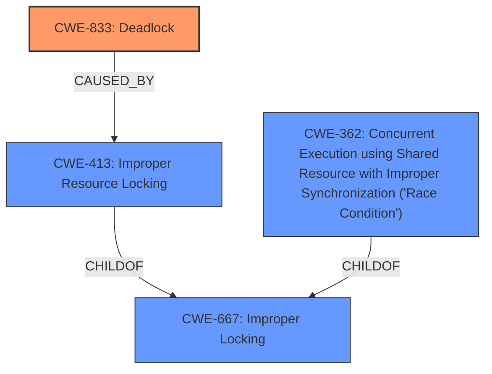

# Analysis Report for CVE-2024-50006

# Vulnerability Analysis Report: CVE-2024-50006

## Description

In the Linux kernel, the following vulnerability has been resolved ext4 fix **i_data_sem unlock order in ext4_ind_migrate()** Fuzzing reports a possible **deadlock** in jbd2_log_wait_commit. This issue is triggered when an EXT4_IOC_MIGRATE ioctl is set to require synchronous updates because the file descriptor is opened with O_SYNC. This can lead to the jbd2_journal_stop() function calling jbd2_might_wait_for_commit(), potentially causing a **deadlock** if the EXT4_IOC_MIGRATE call races with a write(2) system call. This problem only arises when CONFIG_PROVE_LOCKING is enabled. In this case, the jbd2_might_wait_for_commit macro locks jbd2_handle in the jbd2_journal_stop function while i_data_sem is locked. This triggers lockdep because the jbd2_journal_start function might also lock the same jbd2_handle simultaneously. Found by Linux Verification Center (linuxtesting.org) with syzkaller. Rule add

## Vulnerability Description Key Phrases

- **Rootcause:** i_data_sem unlock order in ext4_ind_migrate()
- **Weakness:** deadlock
- **Product:** Linux kernel
- **Component:** ext4

## Analysis (with Relationship Data)

# Summary
| CWE ID | CWE Name | Confidence | CWE Abstraction Level | CWE Vulnerability Mapping Label | CWE-Vulnerability Mapping Notes |
|---|---|---|---|---|---|
| CWE-833 | Deadlock | 1 | Base |  Primary CWE | Allowed |
| CWE-413 | Improper Resource Locking | 0.7 | Base | Secondary Candidate | Allowed |
| CWE-362 | Concurrent Execution using Shared Resource with Improper Synchronization ('Race Condition') | 0.6 | Class | Secondary Candidate | Allowed-with-Review |
| CWE-667 | Improper Locking | 0.5 | Class | Secondary Candidate | Allowed-with-Review |

## Evidence and Confidence

*   **Confidence Score:** 0.9
*   **Evidence Strength:** HIGH

## Relationship Analysis
The primary weakness is a **deadlock** (CWE-833), which arises from **improper resource locking** (CWE-413). The **improper resource locking** can be viewed as a specific instance of **concurrent execution with improper synchronization** (CWE-362), often referred to as a race condition. **Improper locking** (CWE-667) is a broader category that encompasses the root cause.



## Vulnerability Chain
The vulnerability chain starts with the **improper locking order** within the `ext4_ind_migrate()` function. This leads to a race condition where the `EXT4_IOC_MIGRATE` ioctl and a `write(2)` system call contend for the same resources. The race condition, in turn, results in a **deadlock**, causing a system hang and denial of service.

Improper Locking Order -> Race Condition -> Deadlock -> System Hang (DoS)

## Summary of Analysis
The primary CWE is CWE-833 (**Deadlock**), as the vulnerability description explicitly states a potential **deadlock** in `jbd2_log_wait_commit`. This **deadlock** occurs due to a race condition and **improper locking** order, specifically within the `ext4_ind_migrate()` function when the `EXT4_IOC_MIGRATE` ioctl races with a `write(2)` system call.

Supporting evidence:
- "Fuzzing reports a possible **deadlock** in jbd2_log_wait_commit."
- "This issue is triggered when an EXT4_IOC_MIGRATE ioctl is set to require synchronous updates because the file descriptor is opened with O_SYNC."
- "This can lead to the jbd2_journal_stop() function calling jbd2_might_wait_for_commit(), potentially causing a **deadlock** if the EXT4_IOC_MIGRATE call races with a write(2) system call."

CWE-413 (**Improper Resource Locking**) is also a relevant CWE, as the root cause of the **deadlock** is an **incorrect locking order** in the `ext4_ind_migrate()` function.

CWE-362 (**Concurrent Execution using Shared Resource with Improper Synchronization ('Race Condition')**) is considered because the **deadlock** is triggered by a race condition between the `EXT4_IOC_MIGRATE` ioctl and the `write(2)` system call.

CWE-667 (**Improper Locking**) is also considered as a more general description of the **locking** issue but is not as specific as CWE-413 or CWE-833.

I am confident in this assessment because of the explicit mention of a **deadlock** and supporting evidence of the **improper locking** conditions that trigger it. The selected CWEs are at the optimal level of specificity, with CWE-833 representing the direct vulnerability and CWE-413 explaining the root cause.

Relevant CWE Information:

# Enhanced Context (25 CWEs)
The following CWEs were identified as potentially relevant to this vulnerability:

## CWE-667: Improper Locking
**Abstraction Level**: Class
**Similarity Score**: 0.78
**Source**: dense

**Description**:
The product does not properly acquire or release a lock on a resource, leading to unexpected resource state changes and behaviors.

**Mapping Guidance**:
- Usage: Allowed-with-Review
- Rationale: This CWE entry is a Class and might have Base-level children that would be more appropriate

## CWE-833: Deadlock
**Abstraction Level**: Base
**Similarity Score**: 0.77
**Source**: dense

**Description**:
The product contains multiple threads or executable segments that are waiting for each other to release a necessary lock, resulting in deadlock.

**Mapping Guidance**:
- Usage: Allowed
- Rationale: This CWE entry is at the Base level of abstraction, which is a preferred level of abstraction for mapping to the root causes of vulnerabilities.

## CWE-362: Concurrent Execution using Shared Resource with Improper Synchronization ('Race Condition')
**Abstraction Level**: Class
**Similarity Score**: 0.74
**Source**: dense

**Description**:
The product contains a concurrent code sequence that requires temporary, exclusive access to a shared resource, but a timing window exists in which the shared resource can be modified by another code sequence operating concurrently.

**Mapping Guidance**:
- Usage: Allowed-with-Review
- Rationale: This CWE entry is a Class and might have Base-level children that would be more appropriate

## CWE-755: Improper Handling of Exceptional Conditions
**Abstraction Level**: Class
**Similarity Score**: 0.72
**Source**: dense

**Description**:
The product does not handle or incorrectly handles an exceptional condition.

**Mapping Guidance**:
- Usage: Discouraged
- Rationale: This CWE entry is a level-1 Class (i.e., a child of a Pillar). It might have lower-level children that would be more appropriate

## CWE-413: Improper Resource Locking
**Abstraction Level**: Base
**Similarity Score**: 0.72
**Source**: dense

**Description**:
The product does not lock or does not correctly lock a resource when the product must have exclusive access to the resource.

**Mapping Guidance**:
- Usage: Allowed
- Rationale: This CWE entry is at the Base level of abstraction, which is a preferred level of abstraction for mapping to the root causes of vulnerabilities.

## CWE-252: Unchecked Return Value
**Abstraction Level**: Base
**Similarity Score**: 0.71
**Source**: dense

**Description**:
The product does not check the return value from a method or function, which can prevent it from detecting unexpected states and conditions.

**Mapping Guidance**:
- Usage: Allowed
- Rationale: This CWE entry is at the Base level of abstraction, which is a preferred level of abstraction for mapping to the root causes of vulnerabilities.

## CWE-1285: Improper Validation of Specified Index, Position, or Offset in Input
**Abstraction Level**: Base
**Similarity Score**: 0.71
**Source**: dense

**Description**:
The product receives input that is expected to specify an index, position, or offset into an indexable resource such as a buffer or file, but it does not validate or incorrectly validates that the specified index/position/offset has the required properties.

**Mapping Guidance**:
- Usage: Allowed
- Rationale: This CWE entry is at the Base level of abstraction, which is a preferred level of abstraction for mapping to the root causes of vulnerabilities.

## CWE-367: Time-of-check Time-of-use (TOCTOU) Race Condition
**Abstraction Level**: Base
**Similarity Score**: 0.71
**Source**: dense

**Description**:
The product checks the state of a resource before using that resource, but the resource's state can change between the check and the use in a way that invalidates the results of the check. This can cause the product to perform invalid actions when the resource is in an unexpected state.

**Mapping Guidance**:
- Usage: Allowed
- Rationale: This CWE entry is at the Base level of abstraction, which is a preferred level of abstraction for mapping to the root causes of vulnerabilities.

## CWE-754: Improper Check for Unusual or Exceptional Conditions
**Abstraction Level**: Class
**Similarity Score**: 0.71
**Source**: dense

**Description**:
The product does not check or incorrectly checks for unusual or exceptional conditions that are


## CWE Relationship Analysis

Current CWEs represent these abstraction levels: .


### Vulnerability Chain Analysis

**Chain starting from CWE-667:**
- 667 (Improper Locking) - ROOT


**Chain starting from CWE-833:**
- 833 (Deadlock) - ROOT


### CWE Relationship Diagram

```mermaid
graph TD
    classDef primary fill:#f96,stroke:#333,stroke-width:2px
    classDef secondary fill:#69f,stroke:#333
    classDef tertiary fill:#9e9,stroke:#333
```


*Report generated on 2025-07-13 19:45:30*
