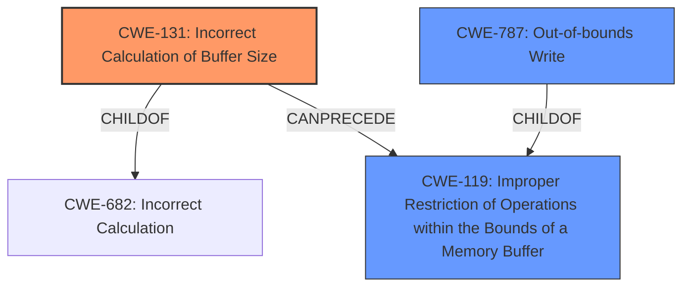

# Analysis for CVE-2024-50022

# Summary
| CWE ID | CWE Name | Confidence | CWE Abstraction Level | CWE Vulnerability Mapping Label | CWE-Vulnerability Mapping Notes |
|---|---|---|---|---|---|
| CWE-131 | Incorrect Calculation of Buffer Size | 0.8 | Base |  Primary CWE | Allowed |
| CWE-787 | Out-of-bounds Write | 0.7 | Base | Secondary Candidate | Allowed |
| CWE-119 | Improper Restriction of Operations within the Bounds of a Memory Buffer | 0.6 | Class | Secondary Candidate | Discouraged |

## Evidence and Confidence

*   **Confidence Score:** 0.7
*   **Evidence Strength:** MEDIUM

## Relationship Analysis
The primary relationship influencing the CWE selection is the chain relationship where an incorrect calculation of buffer size (CWE-131) can lead to an out-of-bounds write (CWE-787). CWE-131 is a child of CWE-682 (Incorrect Calculation) and can precede CWE-119 (Improper Restriction of Operations within the Bounds of a Memory Buffer). CWE-787 is a child of CWE-119.

## Vulnerability Chain
The vulnerability chain starts with an **incorrect address alignment** in `dax_set_mapping()`, caused by using `ALIGN()` instead of `ALIGN_DOWN()`. This **incorrect calculation of buffer size** (CWE-131) leads to an out-of-bounds write (CWE-787) when `page_mapped_in_vma()` is called with the **wrong address**, ultimately leading to a memory failure and system panic.

## Summary of Analysis
The primary root cause of the vulnerability is the **incorrect calculation of the page offset** in the `dax_set_mapping()` function. The use of `ALIGN()` instead of `ALIGN_DOWN()` leads to the function using the **wrong address**, resulting in a misaligned `pgoff` value. This aligns well with CWE-131 (Incorrect Calculation of Buffer Size). The subsequent memory corruption and system panic are consequences of this initial error, making CWE-787 (Out-of-bounds Write) and CWE-119 (Improper Restriction of Operations within the Bounds of a Memory Buffer) secondary considerations.

The evidence from the CVE description includes the following key phrases:
- **"weakness: wrong alignment in dax_set_mapping()"**
- **"pgoff should be aligned using ALIGN_DOWN() instead of ALIGN(). Otherwise, vmf->address not aligned to fault_size will be aligned to the next alignment, that can result in memory failure getting the wrong address."**

These phrases directly support the classification of CWE-131 as the primary weakness, as they highlight the **incorrect calculation** leading to memory errors.

CWE-131 is chosen over other candidates because it specifically addresses the root cause – the **incorrect calculation** of the buffer size due to using the wrong alignment function.

Other CWEs Considered:

*   CWE-787 (Out-of-bounds Write): While the vulnerability ultimately leads to memory corruption, the root cause is the incorrect calculation, not the write operation itself. Therefore, CWE-787 is a secondary consequence.
*   CWE-119 (Improper Restriction of Operations within the Bounds of a Memory Buffer): This is a more general CWE and less specific than CWE-131 and CWE-787. It describes the symptom (memory corruption) but not the root cause.
*   CWE-1285 (Improper Validation of Specified Index, Position, or Offset in Input): This CWE is related to validating input but doesn't directly apply because the issue is with the calculation of the offset, not the validation of an external input.
*   CWE-789 (Memory Allocation with Excessive Size Value): This CWE is related to allocating memory based on an untrusted, large size value, but the issue here is the incorrect calculation of the address, not an excessive size value.