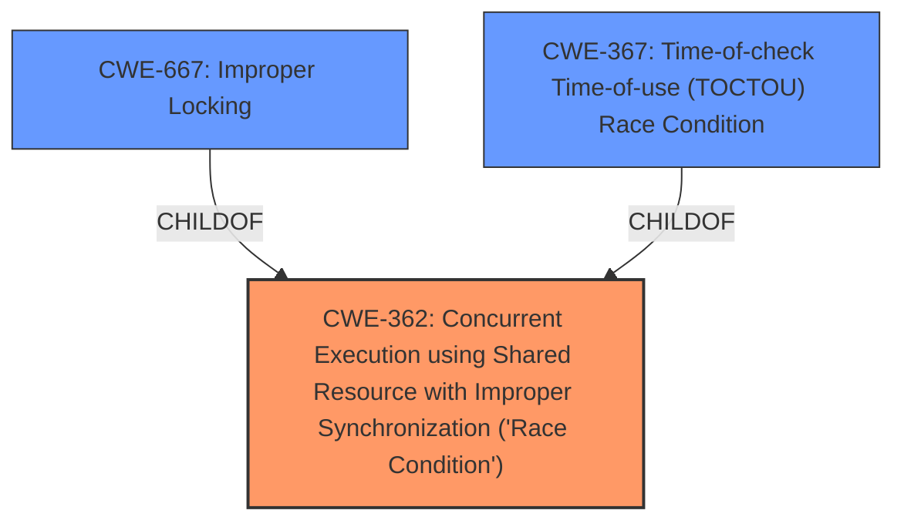

# Enhanced Analysis for CVE-2024-50032

# Summary
| CWE ID  | CWE Name   | Confidence | CWE Abstraction Level | CWE Vulnerability Mapping Label | CWE-Vulnerability Mapping Notes |
|--------------|------------------------------------------------------------------------------------------------------------------------------------------------------------------------------------------------------------------------------------------------------------------------------------------|------------|-----------------------|------------------------------------|---------------------------------------------------------------------------------------------------------------------------------------------------------------------------------------------------------------------------------------------------------------------------------------------------------------------------------------------------------------------------------------------------------------------------------|
| CWE-362 | Concurrent Execution using Shared Resource with **Improper Synchronization** ('**Race Condition**') | 0.9 | Class  | Allowed-with-Review  | This is the primary root cause due to the **improper synchronization** when taking a CPU offline and enqueueing RCU callbacks leading to a race condition. |
| CWE-667 | **Improper Locking** | 0.7 | Class  | Allowed-with-Review  | The vulnerability description says, "the product does not properly acquire or release a lock on a resource, leading to unexpected resource state changes and behaviors". This is similar to the **improper synchronization** in CWE-362.   |
| CWE-367 | Time-of-check Time-of-use (TOCTOU) **Race Condition**  | 0.6 | Base  | Allowed  | The vulnerability description says, "The product checks the state of a resource before using that resource, but the resource's state can change between the check and the use in a way that invalidates the results of the check." This occurs during the CPU offline process when the CPU state can change between checking its status and using it for RCU callbacks. |

## Evidence and Confidence

*   **Confidence Score:** 0.8
*   **Evidence Strength:** HIGH

## Relationship Analysis
The primary weakness is CWE-362, "Concurrent Execution using Shared Resource with Improper Synchronization ('Race Condition')". This is a Class-level CWE. CWE-667, "Improper Locking," and CWE-367, "Time-of-check Time-of-use (TOCTOU) Race Condition" are related to CWE-362. CWE-667 is a class level weakness. CWE-367 is a base level weakness and a more specific type of **race condition**, involving a check and subsequent use of a resource where the state can change in between. Although CWE-367 is more specific, the description provided is more general to **improper synchronization** and doesn't perfectly fit the TOCTOU scenario, I am choosing to use the higher level Class CWE-362.



## Vulnerability Chain
The vulnerability chain starts with **improper synchronization** (CWE-362) when a CPU is being taken offline and RCU callbacks are enqueued. This leads to a race condition where an unsafe IPI is triggered from a softirq context, potentially resulting in a kernel crash.
  - The root cause is the **improper synchronization** during the CPU offline process.
  - The consequence is the attempt to send a synchronized IPI from within a softirq, which is unsafe.

## Summary of Analysis
The initial analysis focused on identifying the root cause of the vulnerability. The evidence clearly points to a **race condition** due to **improper synchronization** (CWE-362) during the CPU offline procedure. The retriever results and vulnerability descriptions support this classification. While CWE-367 (TOCTOU) is a related, more specific type of **race condition**, the general nature of the **improper synchronization** makes CWE-362 a better fit. The graph relationships highlight the connections between these CWEs, with CWE-367 being a child of CWE-362, but I opted for the higher level Class due to the more general description of the vulnerability.

Relevant CWE Information:

# Enhanced Context (25 CWEs)
The following CWEs were identified as potentially relevant to this vulnerability:

## CWE-667: Improper Locking
**Abstraction Level**: Class
**Similarity Score**: 0.78
**Source**: dense

**Description**:
The product does not properly acquire or release a lock on a resource, leading to unexpected resource state changes and behaviors.

**Mapping Guidance**:
- Usage: Allowed-with-Review
- Rationale: This CWE entry is a Class and might have Base-level children that would be more appropriate

*This was added as a secondary CWE.*

## CWE-362: Concurrent Execution using Shared Resource with Improper Synchronization ('Race Condition')
**Abstraction Level**: Class
**Similarity Score**: 0.78
**Source**: dense

**Description**:
The product contains a concurrent code sequence that requires temporary, exclusive access to a shared resource, but a timing window exists in which the shared resource can be modified by another code sequence operating concurrently.

**Mapping Guidance**:
- Usage: Allowed-with-Review
- Rationale: This CWE entry is a Class and might have Base-level children that would be more appropriate

*This was added as the primary CWE.*

## CWE-367: Time-of-check Time-of-use (TOCTOU) Race Condition
**Abstraction Level**: Base
**Similarity Score**: 0.77
**Source**: dense

**Description**:
The product checks the state of a resource before using that resource, but the resource's state can change between the check and the use in a way that invalidates the results of the check. This can cause the product to perform invalid actions when the resource is in an unexpected state.

**Mapping Guidance**:
- Usage: Allowed
- Rationale: This CWE entry is at the Base level of abstraction, which is a preferred level of abstraction for mapping to the root causes of vulnerabilities.

*This was added as a secondary CWE.*

## CWE-366: Race Condition within a Thread
**Abstraction Level**: Base
**Similarity Score**: 0.76
**Source**: dense

**Description**:
If two threads of execution use a resource simultaneously, there exists the possibility that resources may be used while invalid, in turn making the state of execution undefined.

**Mapping Guidance**:
- Usage: Allowed
- Rationale: This CWE entry is at the Base level of abstraction, which is a preferred level of abstraction for mapping to the root causes of vulnerabilities.

*This was considered but not used because the evidence did not point to this level of detail.*

## CWE-755: Improper Handling of Exceptional Conditions
**Abstraction Level**: Class
**Similarity Score**: 0.75
**Source**: dense

**Description**:
The product does not handle or incorrectly handles an exceptional condition.

**Mapping Guidance**:
- Usage: Discouraged
- Rationale: This CWE entry is a level-1 Class (i.e., a child of a Pillar). It might have lower-level children that would be more appropriate

*This was considered but not used because the evidence did not point to this level of detail.*

## CWE-824: Access of Uninitialized Pointer
**Abstraction Level**: Base
**Similarity Score**: 0.74
**Source**: dense

**Description**:
The product accesses or uses a pointer that has not been initialized.

**Mapping Guidance**:
- Usage: Allowed
- Rationale: This CWE entry is at the Base level of abstraction, which is a preferred level of abstraction for mapping to the root causes of vulnerabilities.

*This was considered but not used because the evidence did not point to this level of detail.*

## CWE-703: Improper Check or Handling of Exceptional Conditions
**Abstraction Level**: Pillar
**Similarity Score**: 0.74
**Source**: dense

**Description**:
The product does not properly anticipate or handle exceptional conditions that rarely occur during normal operation of the product.

**Mapping Guidance**:
- Usage: Discouraged
- Rationale: This CWE entry is extremely high-level, a Pillar.

*This was considered but not used because the evidence did not point to this level of detail.*

## CWE-407: Inefficient Algorithmic Complexity
**Abstraction Level**: Class
**Similarity Score**: 0.74
**Source**: dense

**Description**:
An algorithm in a product has an inefficient worst-case computational complexity that may be detrimental to system performance and can be triggered by an attacker, typically using crafted manipulations that ensure that the worst case is being reached.

**Mapping Guidance**:
- Usage: Allowed-with-Review
- Rationale: This CWE entry is a Class and might have Base-level children that would be more appropriate

*This was considered but not


## CWE Relationship Analysis

Current CWEs represent these abstraction levels: .


### Vulnerability Chain Analysis

**Chain starting from CWE-407:**
- 407 (Inefficient Algorithmic Complexity) - ROOT


**Chain starting from CWE-667:**
- 667 (Improper Locking) - ROOT


### CWE Relationship Diagram

```mermaid
graph TD
    classDef primary fill:#f96,stroke:#333,stroke-width:2px
    classDef secondary fill:#69f,stroke:#333
    classDef tertiary fill:#9e9,stroke:#333
```