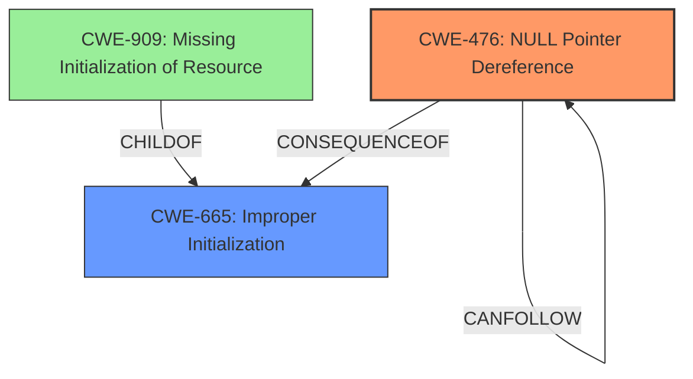

# Analysis for CVE-2024-50037

# Summary
| CWE ID | CWE Name | Confidence | CWE Abstraction Level | CWE Vulnerability Mapping Label | CWE-Vulnerability Mapping Notes |
|---|---|---|---|---|---|
| CWE-476 | NULL Pointer Dereference | 1.0 | Base | Allowed | Primary CWE |
| CWE-665 | Improper Initialization | 0.6 | Class | Discouraged | Secondary Candidate |

## Evidence and Confidence

*   **Confidence Score:** 0.9
*   **Evidence Strength:** HIGH

## Relationship Analysis
The primary CWE is CWE-476, which is a Base level CWE. The secondary CWE, CWE-665, is a Class level CWE and a parent of CWE-909 (Missing Initialization of Resource). CWE-476 can be a consequence of CWE-665 if a pointer is not initialized and then dereferenced.

## Vulnerability Chain
The vulnerability chain starts with a **missing initialization** (or perhaps improper conditional initialization) of the `fbdefio` member of the `fb_info` struct. This leads to a **NULL pointer dereference** when `fb_deferred_io_cleanup()` is called unconditionally, resulting in a kernel crash.

## Summary of Analysis
The vulnerability is a **NULL pointer dereference** because the `fb_deferred_io_cleanup()` function is called unconditionally, even when the associated `fb_info.fbdefio` member is NULL.

The **rootcause** is that the code **does not check if deferred I/O is initialized before attempting to clean it up.** This aligns well with CWE-476 (NULL Pointer Dereference), which occurs when the product dereferences a pointer that it expects to be valid but is NULL.

CWE-665 (Improper Initialization) was considered as a possible root cause because the issue arises from a failure to properly initialize the `fbdefio` member. However, since the immediate cause of the crash is the dereference of a NULL pointer, CWE-476 is a more precise classification.

The evidence from the vulnerability description key phrases indicates the **rootcause** is the unconditional calling of `fb_deferred_io_cleanup()` when `fb_info.fbdefio` is NULL. The crash occurs because of this **NULL pointer dereference**.

Relevant CWE Information:

# Enhanced Context (25 CWEs)
The following CWEs were identified as potentially relevant to this vulnerability:

## CWE-667: Improper Locking
**Abstraction Level**: Class
**Similarity Score**: 0.80
**Source**: dense

**Description**:
The product does not properly acquire or release a lock on a resource, leading to unexpected resource state changes and behaviors.

**Mapping Guidance**:
- Usage: Allowed-with-Review
- Rationale: This CWE entry is a Class and might have Base-level children that would be more appropriate

This is not the correct CWE because the described vulnerability does not involve improper locking.

## CWE-1285: Improper Validation of Specified Index, Position, or Offset in Input
**Abstraction Level**: Base
**Similarity Score**: 0.78
**Source**: dense

**Description**:
The product receives input that is expected to specify an index, position, or offset into an indexable resource such as a buffer or file, but it does not validate or incorrectly validates that the specified index/position/offset has the required properties.

**Mapping Guidance**:
- Usage: Allowed
- Rationale: This CWE entry is at the Base level of abstraction, which is a preferred level of abstraction for mapping to the root causes of vulnerabilities.

This is not the correct CWE because the described vulnerability does not involve improper validation of input.

## CWE-362: Concurrent Execution using Shared Resource with Improper Synchronization ('Race Condition')
**Abstraction Level**: Class
**Similarity Score**: 0.78
**Source**: dense

**Description**:
The product contains a concurrent code sequence that requires temporary, exclusive access to a shared resource, but a timing window exists in which the shared resource can be modified by another code sequence operating concurrently.

**Mapping Guidance**:
- Usage: Allowed-with-Review
- Rationale: This CWE entry is a Class and might have Base-level children that would be more appropriate

This is not the correct CWE because the described vulnerability does not involve race conditions.

## CWE-125: Out-of-bounds Read
**Abstraction Level**: Base
**Similarity Score**: 0.78
**Source**: dense

**Description**:
The product reads data past the end, or before the beginning, of the intended buffer.

**Mapping Guidance**:
- Usage: Allowed
- Rationale: This CWE entry is at the Base level of abstraction, which is a preferred level of abstraction for mapping to the root causes of vulnerabilities.

This is not the correct CWE because the described vulnerability does not involve out-of-bounds reads.

## CWE-252: Unchecked Return Value
**Abstraction Level**: Base
**Similarity Score**: 0.77
**Source**: dense

**Description**:
The product does not check the return value from a method or function, which can prevent it from detecting unexpected states and conditions.

**Mapping Guidance**:
- Usage: Allowed
- Rationale: This CWE entry is at the Base level of abstraction, which is a preferred level of abstraction for mapping to the root causes of vulnerabilities.

This is not the correct CWE because the described vulnerability does not involve an unchecked return value.

## CWE-476: NULL Pointer Dereference
**Abstraction Level**: Base
**Similarity Score**: 0.77
**Source**: dense

**Description**:
The product dereferences a pointer that it expects to be valid but is NULL.

**Mapping Guidance**:
- Usage: Allowed
- Rationale: This CWE entry is at the Base level of abstraction, which is a preferred level of abstraction for mapping to the root causes of vulnerabilities.

This is the correct CWE because the described vulnerability occurs because `fb_deferred_io_cleanup()` is called unconditionally when `fb_info.fbdefio` is NULL, causing a **NULL pointer dereference**.

## CWE-119: Improper Restriction of Operations within the Bounds of a Memory Buffer
**Abstraction Level**: Class
**Similarity Score**: 0.77
**Source**: dense

**Description**:
The product performs operations on a memory buffer, but it reads from or writes to a memory location outside the buffer's intended boundary. This may result in read or write operations on unexpected memory locations that could be linked to other variables, data structures, or internal program data.

**Mapping Guidance**:
- Usage: Discouraged
- Rationale: CWE-119 is commonly misused in low-information vulnerability reports when lower-level CWEs could be used instead, or when more details about the vulnerability are available.

This is not the correct CWE because the described vulnerability does not involve memory buffer operations or out-of-bounds reads/writes.

## CWE-665: Improper Initialization
**Abstraction Level**: Class
**Similarity Score**: 0.77
**Source**: dense

**Description**:
The product does not initialize or incorrectly initializes a resource, which might leave the resource in an unexpected state when it is accessed or used.

**Mapping Guidance**:
- Usage: Discouraged
- Rationale: This CWE entry is a level-1 Class (i.e., a child of a Pillar). It might have lower-level children that would be more appropriate

This is a plausible secondary CWE. The **rootcause** could be due to **improper initialization**, but the immediate cause of the crash is the **NULL pointer dereference** due to the unconditional call to the cleanup function.

## CWE-909: Missing Initialization of Resource
**Abstraction Level**: Class
**Similarity Score**: 0.77
**Source**: dense

**Description**:
The product does not initialize a critical resource.

**Mapping Guidance**:
- Usage: Allowed-with-Review
- Rationale: This CWE entry is a Class and might have Base-level children that would be more appropriate

This is not as precise as CWE-476.

## CWE-755: Improper Handling of Exceptional Conditions
**Abstraction Level**: Class
**Similarity Score**: 0.77
**Source**: dense

**Description**:
The product does not handle or incorrectly handles an exceptional condition.

**Mapping Guidance**:
- Usage: Discouraged
- Rationale: This CWE entry is a level-1 Class (i.e., a child of a Pillar). It might have lower-level children that would