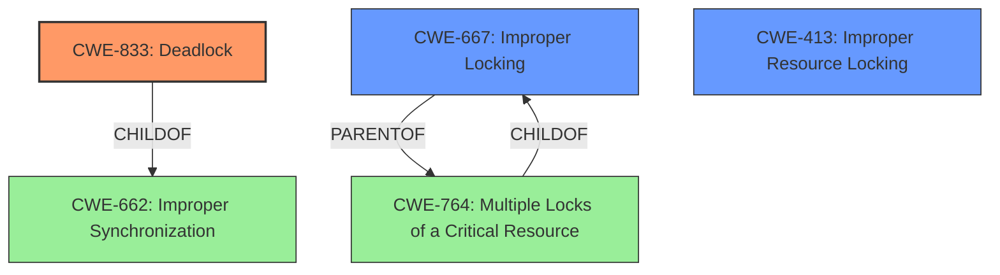

# Analysis Report for CVE-2024-50044

# Vulnerability Analysis Report: CVE-2024-50044

## Description

In the Linux kernel, the following vulnerability has been resolved Bluetooth RFCOMM FIX possible deadlock in rfcomm_sk_state_change rfcomm_sk_state_change attempts to use sock_lock so it must never be called with it locked but rfcomm_sock_ioctl always attempt to lock it causing the following trace ====================================================== WARNING possible **circular locking dependency** detected 6.8.0-syzkaller-08951-gfe46a7dd189e #0 Not tainted ------------------------------------------------------ syz-executor386/5093 is trying to acquire lock ffff88807c396258 (sk_lock-AF_BLUETOOTH-BTPROTO_RFCOMM){+.+.}-{00}, at lock_sock include/net/sock.h1671 [inline] ffff88807c396258 (sk_lock-AF_BLUETOOTH-BTPROTO_RFCOMM){+.+.}-{00}, at rfcomm_sk_state_change+0x5b/0x310 net/bluetooth/rfcomm/sock.c73 but task is already holding lock ffff88807badfd28 (&d->lock){+.+.}-{33}, at __rfcomm_dlc_close+0x226/0x6a0 net/bluetooth/rfcomm/core.c491

## Vulnerability Description Key Phrases

- **Rootcause:** circular locking dependency
- **Product:** Linux kernel
- **Version:** 6.8.0-syzkaller-08951-gfe46a7dd189e
- **Component:** Bluetooth RFCOMM

## Analysis (with Relationship Data)

# Summary
| CWE ID | CWE Name | Confidence | CWE Abstraction Level | CWE Vulnerability Mapping Label | CWE-Vulnerability Mapping Notes |
|---|---|---|---|---|---|
| CWE-833 | Deadlock | 0.9 | Base | Primary | Allowed |
| CWE-667 | Improper Locking | 0.7 | Class | Secondary Candidate | Allowed-with-Review |
| CWE-413 | Improper Resource Locking | 0.6 | Base | Secondary Candidate | Allowed |

## Evidence and Confidence

*   **Confidence Score:** 0.8
*   **Evidence Strength:** HIGH

## Relationship Analysis
The primary CWE, CWE-833 [Deadlock], represents the core issue described in the vulnerability: a situation where multiple threads are blocked indefinitely, waiting for each other. CWE-667 [Improper Locking] and CWE-413 [Improper Resource Locking] are related, as they describe the **improper** management of locks that can lead to deadlocks. CWE-833 [Deadlock] is a child of CWE-662 [Improper Synchronization], while CWE-667 [Improper Locking] is a parent of CWE-764 [Multiple Locks of a Critical Resource]. The choice of CWE-833 [Deadlock] as the primary CWE is due to its specificity in describing the vulnerability's outcome, while CWE-667 [Improper Locking] and CWE-413 [Improper Resource Locking] capture the **improper** locking root cause.



## Vulnerability Chain
The vulnerability chain begins with the **improper** locking mechanism in the RFCOMM implementation, specifically the potential **circular locking dependency** between `rfcomm_sk_state_change` and `rfcomm_sock_ioctl`. This leads to a deadlock, where the system becomes unresponsive.

Root Cause: **Improper Locking** (CWE-667 [Improper Locking] or CWE-413 [Improper Resource Locking])
Weakness: **Circular Locking Dependency**
Impact: **Deadlock** (CWE-833 [Deadlock])

## Summary of Analysis
The analysis indicates a **circular locking dependency** leading to a deadlock in the Linux kernel's Bluetooth RFCOMM implementation. The `rfcomm_sk_state_change` function attempts to acquire the `sock_lock` which is already held by the calling task, leading to a deadlock.

The evidence from the vulnerability description is: "WARNING possible **circular locking dependency** detected... task is already holding lock...". The CVE Reference Links Content Summary says, "Root cause of vulnerability: A locking issue in the Linux kernel's Bluetooth RFCOMM implementation... leading to a deadlock."

The graph relationships show that CWE-833 [Deadlock] is a child of the more general CWE-662 [Improper Synchronization], while CWE-667 [Improper Locking] is a parent of CWE-764 [Multiple Locks of a Critical Resource]. While the root cause is **improper locking**, the actual vulnerability is the resulting deadlock.

CWE-833 [Deadlock] is the most specific and appropriate CWE because the vulnerability description explicitly mentions a deadlock condition caused by a **circular locking dependency**. While other CWEs like CWE-667 [Improper Locking] and CWE-413 [Improper Resource Locking] describe potential causes, CWE-833 [Deadlock] accurately reflects the final outcome and security impact of the vulnerability.

Relevant CWE Information:

# Enhanced Context (25 CWEs)
The following CWEs were identified as potentially relevant to this vulnerability:

## CWE-833: Deadlock
**Abstraction Level**: Base
**Similarity Score**: 0.77
**Source**: dense

**Description**:
The product contains multiple threads or executable segments that are waiting for each other to release a necessary lock, resulting in deadlock.

**Mapping Guidance**:
- Usage: Allowed
- Rationale: This CWE entry is at the Base level of abstraction, which is a preferred level of abstraction for mapping to the root causes of vulnerabilities.


## CWE-667: Improper Locking
**Abstraction Level**: Class
**Similarity Score**: 0.75
**Source**: dense

**Description**:
The product does not properly acquire or release a lock on a resource, leading to unexpected resource state changes and behaviors.

**Mapping Guidance**:
- Usage: Allowed-with-Review
- Rationale: This CWE entry is a Class and might have Base-level children that would be more appropriate


## CWE-362: Concurrent Execution using Shared Resource with Improper Synchronization ('Race Condition')
**Abstraction Level**: Class
**Similarity Score**: 0.73
**Source**: dense

**Description**:
The product contains a concurrent code sequence that requires temporary, exclusive access to a shared resource, but a timing window exists in which the shared resource can be modified by another code sequence operating concurrently.

**Mapping Guidance**:
- Usage: Allowed-with-Review
- Rationale: This CWE entry is a Class and might have Base-level children that would be more appropriate


## CWE-755: Improper Handling of Exceptional Conditions
**Abstraction Level**: Class
**Similarity Score**: 0.71
**Source**: dense

**Description**:
The product does not handle or incorrectly handles an exceptional condition.

**Mapping Guidance**:
- Usage: Discouraged
- Rationale: This CWE entry is a level-1 Class (i.e., a child of a Pillar). It might have lower-level children that would be more appropriate


## CWE-824: Access of Uninitialized Pointer
**Abstraction Level**: Base
**Similarity Score**: 0.71
**Source**: dense

**Description**:
The product accesses or uses a pointer that has not been initialized.

**Mapping Guidance**:
- Usage: Allowed
- Rationale: This CWE entry is at the Base level of abstraction, which is a preferred level of abstraction for mapping to the root causes of vulnerabilities.


## CWE-413: Improper Resource Locking
**Abstraction Level**: Base
**Similarity Score**: 0.70
**Source**: dense

**Description**:
The product does not lock or does not correctly lock a resource when the product must have exclusive access to the resource.

**Mapping Guidance**:
- Usage: Allowed
- Rationale: This CWE entry is at the Base level of abstraction, which is a preferred level of abstraction for mapping to the root causes of vulnerabilities.


## CWE-754: Improper Check for Unusual or Exceptional Conditions
**Abstraction Level**: Class
**Similarity Score**: 0.70
**Source**: dense

**Description**:
The product does not check or incorrectly checks for unusual or exceptional conditions that are not expected to occur frequently during day to day operation of the product.

**Mapping Guidance**:
- Usage: Allowed-with-Review
- Rationale: This CWE entry is a Class and might have Base-level children that would be more appropriate


## CWE-367: Time-of-check Time-of-use (TOCTOU) Race Condition
**Abstraction Level**: Base
**Similarity Score**: 0.70
**Source**: dense

**Description**:
The product checks the state of a resource before using that resource, but the resource's state can change between the check and the use in a way that invalidates the results of the check. This can cause the product to perform invalid actions when the resource is in an unexpected state.

**Mapping Guidance**:
- Usage: Allowed
- Rationale: This CWE entry is at the Base level of abstraction, which is a preferred level of abstraction for mapping to the root causes of vulnerabilities.


## CWE-1285: Improper Validation of Specified Index, Position, or Offset in Input
**Abstraction Level**: Base
**Similarity Score**: 0.70
**Source**: dense

**Description**:
The product receives input that is expected to specify an index, position, or offset into an indexable resource such as a buffer or file, but it does not validate or incorrectly validates that the specified index/position/offset has the required properties.

**Mapping Guidance**:
- Usage: Allowed
- Rationale: This CWE entry is at the Base level of abstraction, which is a preferred level of abstraction for mapping to the root causes of vulnerabilities.


## CWE-843: Access of Resource Using In


## CWE Relationship Analysis

Current CWEs represent these abstraction levels: .


### Vulnerability Chain Analysis

**Chain starting from CWE-662:**
- 662 (Improper Synchronization) - ROOT


**Chain starting from CWE-667:**
- 667 (Improper Locking) - ROOT


### CWE Relationship Diagram

```mermaid
graph TD
    classDef primary fill:#f96,stroke:#333,stroke-width:2px
    classDef secondary fill:#69f,stroke:#333
    classDef tertiary fill:#9e9,stroke:#333
```


*Report generated on 2025-07-13 19:48:27*
