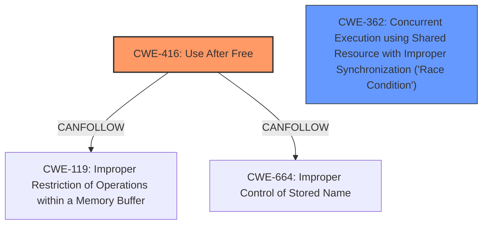

# Enhanced Analysis for CVE-2024-50061

# Summary
| CWE ID | CWE Name | Confidence | CWE Abstraction Level | CWE Vulnerability Mapping Label | CWE-Vulnerability Mapping Notes |
|---|---|---|---|---|---|
| CWE-416 | Use After Free | 0.9 | Variant |  Primary | Allowed |
| CWE-362 | Concurrent Execution using Shared Resource with Improper Synchronization ('Race Condition') | 0.8 | Class | Secondary | Allowed-with-Review |

## Evidence and Confidence

*   **Confidence Score:** 0.85
*   **Evidence Strength:** HIGH

## Relationship Analysis
The primary weakness is CWE-416 **Use After Free**, which occurs due to a **race condition**, CWE-362 Concurrent Execution using Shared Resource with Improper Synchronization ('Race Condition'). CWE-416 is a variant, while CWE-362 is a Class. The race condition allows the memory to be freed while it is still being used, leading to the use-after-free vulnerability.



## Vulnerability Chain
The vulnerability chain starts with a **race condition** (CWE-362), which allows the `master->base` memory to be freed prematurely. Subsequently, a thread attempts to access the freed memory (`master->base`), resulting in a **use-after-free** (CWE-416) vulnerability.

CWE-362 (Race Condition) -> CWE-416 (Use After Free)

## Summary of Analysis
The vulnerability is a **use-after-free** (CWE-416) caused by a **race condition** (CWE-362) in the cdns_i3c_master driver of the Linux kernel. The provided evidence clearly states: "Fix **use after free** vulnerability in cdns_i3c_master Driver Due to **Race Condition**". The sequence of operations leading to the vulnerability involves a race between the `cdns_i3c_master_hj` work function and the `cdns_i3c_master_remove` function, where the latter frees the `master->base` memory while the former might still be using it. This confirms that the **use-after-free** is a direct consequence of the **race condition**.

CWE-416 is chosen as the primary CWE because the vulnerability description explicitly mentions "**use after free** vulnerability". The description provides a clear sequence of events where the `master->base` memory is freed while a work function might still be accessing it, leading to the **use-after-free** condition. This aligns perfectly with the definition of CWE-416.

CWE-362 is chosen as a secondary CWE because the **use-after-free** is triggered by a **race condition**. The vulnerability description highlights the race between the `cdns_i3c_master_hj` work function and the `cdns_i3c_master_remove` function. This race allows the memory to be freed prematurely, leading to the **use-after-free** when the work function attempts to access the freed memory. The "Fix it by ensuring that the work is canceled before proceeding with the cleanup in cdns_i3c_master_remove." clearly indicates that the race condition is the underlying cause that must be addressed.

Other CWEs considered but not used:

*   CWE-61 (UNIX Symbolic Link (Symlink) Following): This CWE is not relevant because the vulnerability does not involve symbolic links.
*   CWE-415 (Double Free): This CWE is not relevant because the vulnerability involves freeing memory and then using it, not freeing the same memory twice.
*   CWE-367 (Time-of-check Time-of-use (TOCTOU) Race Condition): While a race condition is present, it is not a TOCTOU race condition where the state of a resource changes between a check and its use.
*   CWE-667 (Improper Locking): The provided description does not explicitly mention issues with locking mechanisms.

# Enhanced Context (25 CWEs)
The following CWEs were identified as potentially relevant to this vulnerability:

## CWE-667: Improper Locking
**Abstraction Level**: Class
**Similarity Score**: 0.75
**Source**: dense

**Description**:
The product does not properly acquire or release a lock on a resource, leading to unexpected resource state changes and behaviors.

**Mapping Guidance**:
- Usage: Allowed-with-Review
- Rationale: This CWE entry is a Class and might have Base-level children that would be more appropriate


## CWE-362: Concurrent Execution using Shared Resource with Improper Synchronization ('Race Condition')
**Abstraction Level**: Class
**Similarity Score**: 0.74
**Source**: dense

**Description**:
The product contains a concurrent code sequence that requires temporary, exclusive access to a shared resource, but a timing window exists in which the shared resource can be modified by another code sequence operating concurrently.

**Mapping Guidance**:
- Usage: Allowed-with-Review
- Rationale: This CWE entry is a Class and might have Base-level children that would be more appropriate


## CWE-366: Race Condition within a Thread
**Abstraction Level**: Base
**Similarity Score**: 0.74
**Source**: dense

**Description**:
If two threads of execution use a resource simultaneously, there exists the possibility that resources may be used while invalid, in turn making the state of execution undefined.

**Mapping Guidance**:
- Usage: Allowed
- Rationale: This CWE entry is at the Base level of abstraction, which is a preferred level of abstraction for mapping to the root causes of vulnerabilities.


## CWE-367: Time-of-check Time-of-use (TOCTOU) Race Condition
**Abstraction Level**: Base
**Similarity Score**: 0.73
**Source**: dense

**Description**:
The product checks the state of a resource before using that resource, but the resource's state can change between the check and the use in a way that invalidates the results of the check. This can cause the product to perform invalid actions when the resource is in an unexpected state.

**Mapping Guidance**:
- Usage: Allowed
- Rationale: This CWE entry is at the Base level of abstraction, which is a preferred level of abstraction for mapping to the root causes of vulnerabilities.


## CWE-703: Improper Check or Handling of Exceptional Conditions
**Abstraction Level**: Pillar
**Similarity Score**: 0.72
**Source**: dense

**Description**:
The product does not properly anticipate or handle exceptional conditions that rarely occur during normal operation of the product.

**Mapping Guidance**:
- Usage: Discouraged
- Rationale: This CWE entry is extremely high-level, a Pillar.


## CWE-824: Access of Uninitialized Pointer
**Abstraction Level**: Base
**Similarity Score**: 0.71
**Source**: dense

**Description**:
The product accesses or uses a pointer that has not been initialized.

**Mapping Guidance**:
- Usage: Allowed
- Rationale: This CWE entry is at the Base level of abstraction, which is a preferred level of abstraction for mapping to the root causes of vulnerabilities.


## CWE-754: Improper Check for Unusual or Exceptional Conditions
**Abstraction Level**: Class
**Similarity Score**: 0.71
**Source**: dense

**Description**:
The product does not check or incorrectly checks for unusual or exceptional conditions that are not expected to occur frequently during day to day operation of the product.

**Mapping Guidance**:
- Usage: Allowed-with-Review
- Rationale: This CWE entry is a Class and might have Base-level children that would be more appropriate


## CWE-665: Improper Initialization
**Abstraction Level**: Class
**Similarity Score**: 0.71
**Source**: dense

**Description**:
The product does not initialize or incorrectly initializes a resource, which might leave the resource in an unexpected state when it is accessed or used.

**Mapping Guidance**:
- Usage: Discouraged
- Rationale: This CWE entry is a level-1 Class (i.e., a child of a Pillar). It might have lower-level children that would be more appropriate


## CWE-696: Incorrect Behavior Order
**Abstraction Level**: Class
**Similarity Score**: 0.71
**Source**: dense

**Description**:
The product performs multiple related behaviors, but the behaviors are performed in the wrong order in ways which may produce resultant weaknesses.

**Mapping Guidance**:
-


## CWE Relationship Analysis

Current CWEs represent these abstraction levels: .


### Vulnerability Chain Analysis

**Chain starting from CWE-665:**
- 665 (Improper Initialization) - ROOT


**Chain starting from CWE-416:**
- 416 (Use After Free) - ROOT


### CWE Relationship Diagram

```mermaid
graph TD
    classDef primary fill:#f96,stroke:#333,stroke-width:2px
    classDef secondary fill:#69f,stroke:#333
    classDef tertiary fill:#9e9,stroke:#333
```