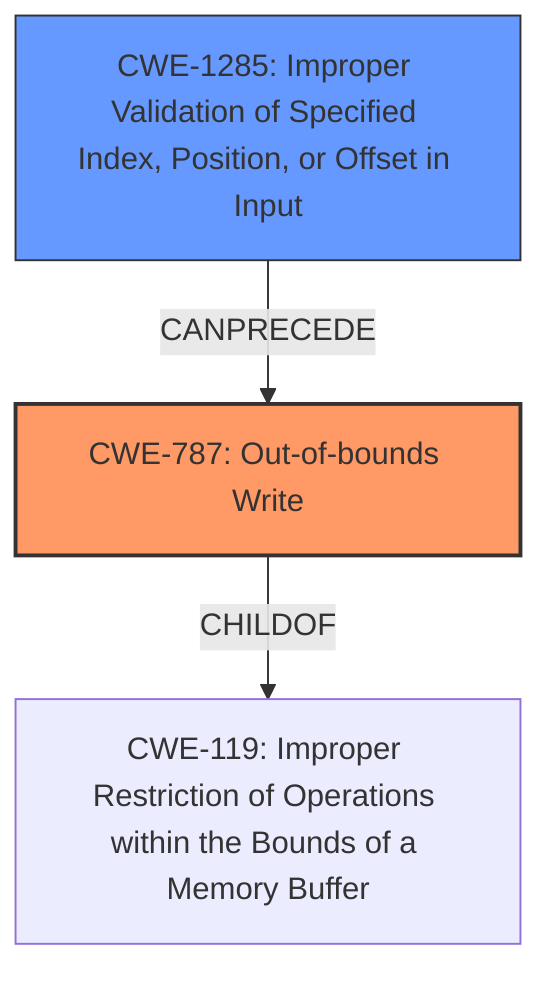

# Analysis Report for CVE-2024-50188

# Vulnerability Analysis Report: CVE-2024-50188

## Description

In the Linux kernel, the following vulnerability has been resolved net phy dp83869 fix **memory corruption** when enabling fiber When configuring the fiber port, the DP83869 PHY driver **incorrectly calls linkmode_set_bit() with a bit mask (1 << 10) rather than a bit number (10)**. This corrupts some other memory location -- in case of arm64 the priv pointer in the same structure. Since the advertising flags are updated from supported at the end of the function the incorrect line isnt needed at all and can be removed.

## Vulnerability Description Key Phrases

- **Rootcause:** incorrectly calls linkmode_set_bit() with a bit mask (1 << 10) rather than a bit number (10)
- **Weakness:** memory corruption
- **Product:** Linux kernel
- **Component:** DP83869 PHY driver

## Analysis (with Relationship Data)

# Summary
| CWE ID | CWE Name | Confidence | CWE Abstraction Level | CWE Vulnerability Mapping Label | CWE-Vulnerability Mapping Notes |
|---|---|---|---|---|---|
| CWE-787 | Out-of-bounds Write | 1.0 | Base | Primary | Allowed |
| CWE-1285 | Improper Validation of Specified Index, Position, or Offset in Input | 0.6 | Base | Secondary Candidate | Allowed |

## Evidence and Confidence

*   **Confidence Score:** 0.9
*   **Evidence Strength:** HIGH

## Relationship Analysis
The primary CWE is CWE-787, which represents the **memory corruption** due to writing outside the intended buffer. CWE-1285 is considered because the root cause involves an **incorrect** parameter when calling `linkmode_set_bit()`, suggesting a validation issue regarding the input index.



## Vulnerability Chain
The vulnerability chain starts with the **incorrect** call to `linkmode_set_bit()` (potentially related to CWE-1285), leading to an out-of-bounds write (CWE-787), and ultimately resulting in **memory corruption**.

## Summary of Analysis
The primary assessment is based on the provided evidence indicating that the driver **incorrectly calls linkmode_set_bit() with a bit mask (1 << 10) rather than a bit number (10)**, which leads to **memory corruption**. This directly corresponds to CWE-787 (Out-of-bounds Write). The retriever results also list CWE-787 as the top candidate.

The vulnerability description explicitly mentions **memory corruption** due to an incorrect parameter being passed to `linkmode_set_bit()`. The incorrect parameter causes an out-of-bounds write, leading to the observed memory corruption.

CWE-787 is selected because it accurately describes the **memory corruption** resulting from writing outside the intended buffer. It is a base-level CWE, providing a specific representation of the weakness.

Relevant CWE Information:

# Enhanced Context (25 CWEs)
The following CWEs were identified as potentially relevant to this vulnerability:

## CWE-1285: Improper Validation of Specified Index, Position, or Offset in Input
**Abstraction Level**: Base
**Similarity Score**: 0.74
**Source**: dense

**Description**:
The product receives input that is expected to specify an index, position, or offset into an indexable resource such as a buffer or file, but it does not validate or incorrectly validates that the specified index/position/offset has the required properties.

**Mapping Guidance**:
- Usage: Allowed
- Rationale: This CWE entry is at the Base level of abstraction, which is a preferred level of abstraction for mapping to the root causes of vulnerabilities.

## CWE-787: Out-of-bounds Write
**Abstraction Level**: base
**Similarity Score**: 4.33
**Source**: graph

**Description**:
CWE-787: Out-of-bounds Write

**Mapping Guidance**:
- Usage: Allowed
- Rationale: This CWE entry is at the Base level of abstraction, which is a preferred level of abstraction for mapping to the root causes of vulnerabilities.

**Relationships**:
- CANFOLLOW -> CWE-825
- CANFOLLOW -> CWE-824
- CANFOLLOW -> CWE-823
- CANFOLLOW -> CWE-822
- PARENTOF -> CWE-124

---

**CWE-787: Out-of-bounds Write**

*   **Technical Explanation:** The DP83869 PHY driver **incorrectly calls `linkmode_set_bit()` with a bit mask instead of a bit number.** This leads to writing data outside the intended memory region, causing **memory corruption**.
*   **Security Implications:** Out-of-bounds writes can lead to arbitrary code execution, denial of service, or information disclosure. In this specific case, the `priv` pointer is corrupted.
*   **Relationship Analysis:** CWE-787 is a base-level CWE and a child of CWE-119 (Improper Restriction of Operations within the Bounds of a Memory Buffer).
*   **Mapping Guidance Influence:** The MITRE mapping guidance allows the usage of CWE-787, as it is a base-level CWE.
*   **Primary/Secondary:** Primary

**CWE-1285: Improper Validation of Specified Index, Position, or Offset in Input**

*   **Technical Explanation:** The root cause mentions the driver **incorrectly calls linkmode_set_bit() with a bit mask (1 << 10) rather than a bit number (10)**. This can be interpreted as the function is not properly validating the input (bit mask vs bit number) which resulted in the out-of-bounds write (CWE-787)
*   **Security Implications:** Improper validation can allow attackers to manipulate indices and offsets, leading to unintended memory access.
*   **Relationship Analysis:** CWE-1285 is base-level CWE and is related to improper input validation.
*   **Mapping Guidance Influence:** The MITRE mapping guidance allows the usage of CWE-1285, as it is a base-level CWE.
*   **Primary/Secondary:** Secondary. It contributes to the root cause but doesn't directly describe the memory corruption.

**CWEs Considered But Not Used:**

*   CWE-119 (Improper Restriction of Operations within the Bounds of a Memory Buffer): This is a more general CWE. CWE-787 provides a more specific description of the vulnerability.
*   CWE-190 (Integer Overflow or Wraparound): Not directly related to the described **memory corruption**.
*   CWE-415 (Double Free), CWE-401 (Missing Release of Memory after Effective Lifetime): These are memory management issues, but they do not directly describe the **memory corruption** caused by the incorrect call to `linkmode_set_bit()`.
*   CWE-125 (Out-of-bounds Read): The vulnerability description focuses on **memory corruption** due to a write, not a read.
*   CWE-123 (Write-what-where Condition): While this could describe the impact, CWE-787 more accurately describes the root cause.


## CWE Relationship Analysis

Current CWEs represent these abstraction levels: .


### Vulnerability Chain Analysis

**Chain starting from CWE-123:**
- 123 (Write-what-where Condition) - ROOT


**Chain starting from CWE-823:**
- 823 (Use of Out-of-range Pointer Offset) - ROOT


### CWE Relationship Diagram

```mermaid
graph TD
    classDef primary fill:#f96,stroke:#333,stroke-width:2px
    classDef secondary fill:#69f,stroke:#333
    classDef tertiary fill:#9e9,stroke:#333
```


*Report generated on 2025-07-13 19:56:07*
