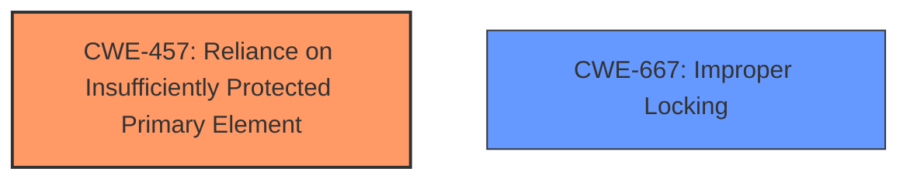

# Enhanced Analysis for CVE-2024-50220

# Summary
| CWE ID | CWE Name | Confidence | CWE Abstraction Level | CWE Vulnerability Mapping Label | CWE-Vulnerability Mapping Notes |
|---|---|---|---|---|---|
| CWE-457 | Reliance on Insufficiently Protected Primary Element | 0.7 | Base | Primary CWE | Allowed |
| CWE-667 | Improper Locking | 0.4 | Class | Secondary Candidate | Allowed-with-Review |

## Evidence and Confidence

*   **Confidence Score:** 0.7
*   **Evidence Strength:** MEDIUM

## Relationship Analysis
The primary identified weakness is CWE-457 (Reliance on Insufficiently Protected Primary Element), indicating a reliance on a memory region not adequately protected during a fork operation. This is influenced by the specific context of the vulnerability, where the virtual address space is exposed unconditionally.

CWE-667 (Improper Locking) was considered as a potential secondary issue due to the possibility of concurrent access to the shared memory region. However, the primary problem is the exposure itself, not necessarily a locking issue.



## Vulnerability Chain
The vulnerability chain starts with the fork operation. During this, the virtual address space can be in an inconsistent state. If an error occurs, the address space is still exposed to userland via `userfaultfd` due to the **unconditional exposure**.

1.  **Fork Operation:** Inconsistent state of virtual memory.
2.  **CWE-457: Reliance on Insufficiently Protected Primary Element** (**Root Cause**): Exposure of this memory to userland unconditionally.
3.  **Impact:** Potential undefined behavior or security vulnerabilities due to interaction with inconsistent memory.

## Summary of Analysis
The initial analysis focused on the **unconditional exposure** of the virtual address space. The key phrase "expose the virtual address space of a process to userland unconditionally if uffd is registered in VMAs" clearly points to a **weakness** related to insufficient protection. The evidence from the "CVE Reference Links Content Summary" confirms that the `dup_userfaultfd_complete()` function exposes an incomplete or invalid virtual address space to userland via `userfaultfd`. This is the primary reason for selecting CWE-457.

CWE-667 was considered because of the potential for race conditions when accessing shared resources during the fork operation. However, the core issue is the exposure of the memory in an inconsistent state, not necessarily the synchronization mechanisms. Therefore, CWE-457 is more appropriate as the primary weakness.

The selection of CWE-457 at the Base level is optimal because it specifically addresses the reliance on insufficiently protected elements, which is the direct cause of the vulnerability.

Relevant CWE Information:

# Enhanced Context (25 CWEs)
The following CWEs were identified as potentially relevant to this vulnerability:

## CWE-667: Improper Locking
**Abstraction Level**: Class
**Similarity Score**: 0.76
**Source**: dense

**Description**:
The product does not properly acquire or release a lock on a resource, leading to unexpected resource state changes and behaviors.

**Mapping Guidance**:
- Usage: Allowed-with-Review
- Rationale: This CWE entry is a Class and might have Base-level children that would be more appropriate

## CWE-457: Reliance on Insufficiently Protected Primary Element
**Abstraction Level**: Base
**Similarity Score**: Not available

**Description**: The software relies on a primary element (such as a file, data, resource, or functionality) that does not have sufficient protection. The lack of protection can cause security vulnerabilities if attackers are able to access or manipulate the element.

**Mapping Guidance**:
- Usage: Allowed
- Rationale: This CWE entry is at the Base level of abstraction, which is a preferred level of abstraction for mapping to the root causes of vulnerabilities.


## CWE Relationship Analysis

Current CWEs represent these abstraction levels: .


### Vulnerability Chain Analysis

**Chain starting from CWE-667:**
- 667 (Improper Locking) - ROOT


**Chain starting from CWE-457:**
- 457 (Use of Uninitialized Variable) - ROOT


### CWE Relationship Diagram

```mermaid
graph TD
    classDef primary fill:#f96,stroke:#333,stroke-width:2px
    classDef secondary fill:#69f,stroke:#333
    classDef tertiary fill:#9e9,stroke:#333
```