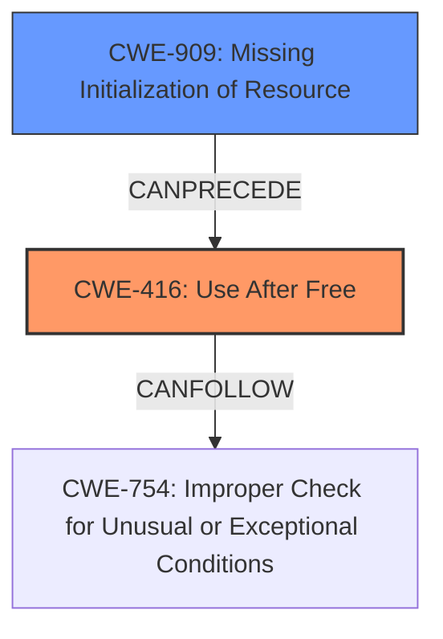

# Analysis for CVE-2024-50264

# Summary
| CWE ID  | CWE Name                                                                                                           | Confidence | CWE Abstraction Level | CWE Vulnerability Mapping Label | CWE-Vulnerability Mapping Notes |
| :-------- | :----------------------------------------------------------------------------------------------------------------- | :--------- | :---------------------- | :------------------------------ | :------------------------------ |
| CWE-416   | Use After Free                                                                                                     | 1.0        | Variant                 | Primary                         | Allowed                       |
| CWE-909   | Missing Initialization of Resource                                                                                 | 0.7        | Class                   | Secondary                       | Allowed-with-Review           |

## Evidence and Confidence

*   **Confidence Score:** 0.85
*   **Evidence Strength:** HIGH

## Relationship Analysis
The primary weakness is **CWE-416 (Use After Free)**, which results from **CWE-909 (Missing Initialization of Resource)**. Specifically, the dangling pointer in `vsk->trans` is not initialized, leading to a potential use-after-free condition. The relationship is that the missing initialization can precede the use-after-free.

## Vulnerability Chain
The vulnerability chain starts with a **missing initialization** (**CWE-909**), leading to a dangling pointer, and finally results in a **use-after-free** condition (**CWE-416**).
- Root Cause: **CWE-909 (Missing Initialization of Resource)**
- Weakness: Dangling Pointer
- Impact: **CWE-416 (Use After Free)**

## Summary of Analysis
The primary vulnerability is clearly a **Use-After-Free (CWE-416)** condition, as evidenced by the description and CVE details. The **root cause** of this UAF is the **missing initialization of the dangling pointer** `vsk->trans` (**CWE-909**). The analysis considered several other CWEs, especially related to resource management and pointer handling, but **CWE-416** and **CWE-909** were the most relevant and specific.

The evidence from the vulnerability description:
- "**Initialization of the dangling pointer** occurring in vsk->trans During loopback communication, a dangling pointer can be created in vsk->trans, potentially leading to a Use-After-Free condition."
- "This issue is resolved by initializing vsk->trans to NULL."

The evidence from the CVE Reference Links Content Summary:
- "The vulnerability stems from a dangling pointer in the `vsk->trans` member of the `vsock_sock` structure within the Linux kernel's VSOCK (Virtual Socket) implementation, specifically in the virtio transport layer. This pointer is not initialized to NULL and can become a dangling pointer after the `virtio_vsock_sock` structure it points to is freed."
- "**Use-After-Free (UAF):** The primary vulnerability is a use-after-free condition. After the `virtio_vsock_sock` structure is freed, `vsk->trans` is not set to NULL, leading to a potential use of a dangling pointer in subsequent operations."
- "The fix involves adding the line `vsk->trans = NULL;` in the `virtio_transport_destruct` function after freeing the `virtio_vsock_sock` structure. This ensures that the dangling pointer is cleared, preventing the use-after-free."

Relevant CWE Information:

**CWE-416: Use After Free**
The product reuses or references memory after it has been freed. At some point afterward, the memory may be allocated again and saved in another pointer, while the original pointer references a location somewhere within the new allocation. Any operations using the original pointer are no longer valid because the memory "belongs" to the code that operates on the new pointer.
- Usage: Allowed
- Rationale: This CWE entry is at the Variant level of abstraction, which is a preferred level of abstraction for mapping to the root causes of vulnerabilities.

**CWE-909: Missing Initialization of Resource**
The product does not initialize a critical resource.
- Usage: Allowed-with-Review
- Rationale: This CWE entry is a Class and might have Base-level children that would be more appropriate

**CWE-415 Double Free:**
Was considered, but the vulnerability is not a double free. It's a use of memory after it has been freed due to a dangling pointer, so it is **CWE-416**.

**CWE-476 NULL Pointer Dereference:**
Was considered, but a use-after-free is distinct from a null pointer dereference. In this case, the memory is freed, and then later accessed, rather than dereferencing a null pointer directly.

**CWE-824 Access of Uninitialized Pointer:**
Was considered, but the pointer is not necessarily uninitialized, but is a dangling pointer.

**CWE-665 Improper Initialization:**
Was considered, but **CWE-909 Missing Initialization of Resource** is preferred because it more clearly and accurately captures the **root cause** of the vulnerability.

**CWE-787 Out-of-bounds Write:**
Was not considered. There is no out-of-bounds write.