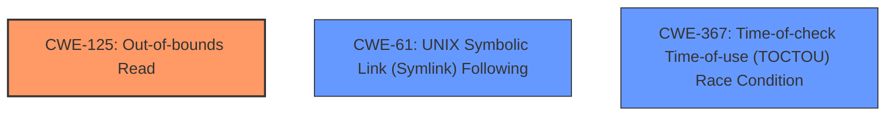

# Analysis for CVE-2024-50301

# Summary

| CWE ID   | CWE Name                                                                       | Confidence | CWE Abstraction Level | CWE Vulnerability Mapping Label | CWE-Vulnerability Mapping Notes |
| :------- | :----------------------------------------------------------------------------- | :--------- | :---------------------- | :------------------------------ | :------------------------------ |
| CWE-125  | Out-of-bounds Read                                                             | 1.0        | Base                    | Primary CWE                     | Allowed                       |
| CWE-61   | UNIX Symbolic Link (Symlink) Following                                         | 0.6        | Compound                  | Secondary Candidate             | Allowed                       |
| CWE-367  | Time-of-check Time-of-use (TOCTOU) Race Condition                               | 0.5        | Base                    | Secondary Candidate             | Allowed                       |

## Evidence and Confidence

*   **Confidence Score:** 0.9
*   **Evidence Strength:** HIGH

## Relationship Analysis

The primary weakness is an **out-of-bounds read**, represented by CWE-125. This is a **Base** level CWE and accurately reflects the **root cause** of the vulnerability, where a read operation accesses memory outside the intended boundaries.

CWE-61 (UNIX Symbolic Link (Symlink) Following) is considered a secondary candidate because the vulnerability involves a shortcut pointer which is similar to a symbolic link, but the description focuses more on the **incorrect handling** of this pointer leading to the out-of-bounds read rather than the symbolic link aspect itself.

CWE-367 (Time-of-check Time-of-use (TOCTOU) Race Condition) is also a secondary candidate, as the creation of the specific tree structure involves timing.

## Vulnerability Chain

1.  **Root Cause:** **Incorrect handling of shortcut pointers** in the keyring search function, leading to misidentification of the pointer type.
2.  **Weakness:** When a slot of the root points to a shortcut, **it may be mistakenly transferred to a key**.
3.  **Impact:** This leads to a read **out-of-bounds read**.

The chain starts with the **improper handling** of the shortcut pointer, resulting in the **out-of-bounds read**.

## Summary of Analysis

The initial assessment strongly points towards CWE-125 (Out-of-bounds Read) as the primary CWE. The vulnerability description includes key phrases such as "**slab-out-of-bounds**" and "**out-of-bounds read**", providing direct evidence. The **root cause** is the incorrect handling of shortcut pointers in the keyring search function, which leads to the **out-of-bounds read**.

The graph relationships and retriever scores support this selection, with CWE-125 consistently being the top match for various key phrases like "out-of-bounds read" and "slab-out-of-bounds".

CWE-125 is at the optimal level of specificity because it directly describes the **root cause** of the vulnerability - the **out-of-bounds read**.

Relevant CWE Information:

*   **CWE-125: Out-of-bounds Read:** The product reads data past the end, or before the beginning, of the intended buffer. This aligns perfectly with the vulnerability description, where a shortcut pointer is mistakenly treated as a key, leading to a read operation outside the valid memory region.
*   **CWE-61: UNIX Symbolic Link (Symlink) Following:** The product, when opening a file or directory, does not sufficiently account for when the file is a symbolic link that resolves to a target outside of the intended control sphere. This is related because the shortcut pointer can be seen as a type of symbolic link, but is less specific than CWE-125.
*   **CWE-367: Time-of-check Time-of-use (TOCTOU) Race Condition:** The product checks the state of a resource before using that resource, but the resource's state can change between the check and the use in a way that invalidates the results of the check. The race condition is related to how the keys are generated.